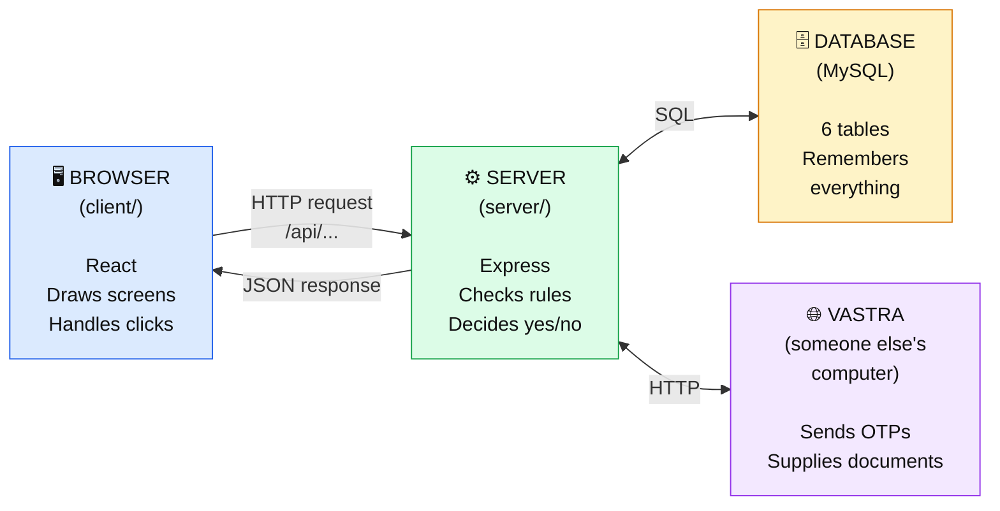
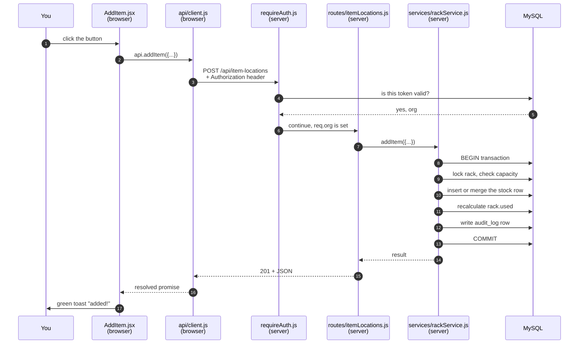

# 00 — Start Here

> **Who this is for:** you, with zero assumed knowledge. Not "zero knowledge of this project" — zero knowledge of code in general. Every technical word is explained the first time it appears.
>
> **The goal:** by the end of these files, if somebody points at any behaviour in the app and asks *"where is that code?"*, you can name the file, open it, and explain what it does and why.

---

## How to read this guide

Read them **in order**. They build on each other.

| # | File | What you'll be able to do after |
|---|------|--------------------------------|
| 00 | **Start Here** *(this file)* | Understand the vocabulary and the mental model |
| 01 | [The Big Picture](01-the-big-picture.md) | Draw the whole system on a whiteboard |
| 02 | [The File Map](02-the-file-map.md) | Answer "where is that code?" for any file |
| 03 | [The Database](03-the-database.md) | Explain every table and column |
| 04 | [Login & Auth](04-login-and-auth.md) | Explain how a user gets in and stays in |
| 05 | [Server Anatomy](05-server-anatomy.md) | Explain how a request becomes a response |
| 06 | [Client Anatomy](06-client-anatomy.md) | Explain how a click becomes a screen |
| 07 | [Flow A — Putaway](07-flow-A-putaway.md) | Trace "add stock" from click to database |
| 08 | [Flow B — Move & Edit](08-flow-B-move-and-edit.md) | Trace "move stock" and "correct a quantity" |
| 09 | [Flow C — Picklist](09-flow-C-picklist.md) | Trace the biggest feature in the app |
| 10 | [Vastra Integration](10-vastra-integration.md) | Explain the outside company we talk to |
| 11 | [API Reference](11-api-reference.md) | Look up any endpoint in one table |
| 12 | [Running & Testing](12-running-and-testing.md) | Start the app, reset data, run the checks |
| 13 | [How To Add A Feature](13-how-to-add-a-feature.md) | Make a change without breaking things |
| 14 | [Quiz & Cheatsheet](14-quiz-and-cheatsheet.md) | Test yourself before someone else does |

---

## First: what is this app, in one sentence?

> **RMS tells a warehouse worker which shelf a piece of clothing is sitting on.**

That's it. Everything else is detail.

A textile company (Vastra) has a warehouse full of sarees, kurtis, shirts. The warehouse has 100 numbered bins. When goods arrive, someone has to record *which bin they went into*. When goods must ship out, someone has to be told *which bin to fetch them from*.

Before RMS, that lived in someone's head or on paper. RMS is the software version.

---

## The vocabulary you need (read this twice)

These words appear constantly. Learn them now and the rest is easy.

### Business words

| Word | Plain meaning |
|------|--------------|
| **Rack** | A physical shelf/bin in the warehouse. Named like `R05-S02-B04` = Rack 5, Shelf 2, Bin 4. |
| **Capacity** | How many units fit in that bin. |
| **Used** | How many units are currently in it. |
| **Item** | A product, e.g. "Banarasi Saree". |
| **Variant** | Item + colour + size together. "Banarasi Saree / Maroon / Free Size" is one variant. This is the real unit of stock. |
| **Putaway** | Putting goods *into* a rack. Inbound. |
| **Picking** | Taking goods *out of* a rack to ship. Outbound. |
| **Delivery Challan (DC)** | An Indian shipping document listing what goes out to a customer. Drives picking. |
| **Party** | The customer/company on a challan. |
| **Source module** | A document type from Vastra's other software that explains *why* goods arrived: Purchase Inward, Job Slip, Pack Design, Sales Return. |
| **Size run** | One design spread across several sizes with a quantity each: `36×1  38×2  42×3`. Very common on real challans. |
| **Shortage** | The challan asks for 10, the racks only hold 6. Shortage = 4. |

### Technical words

| Word | Plain meaning |
|------|--------------|
| **Client** (or frontend) | The part running in the web browser. What you see and click. Written in React. Lives in `client/`. |
| **Server** (or backend / API) | The program running on a computer that the browser talks to. Written in Express. Lives in `server/`. |
| **Database** | The permanent storage. MySQL. Nothing is truly saved until it lands here. |
| **API** | The list of "questions" the browser is allowed to ask the server. Each one has a URL. |
| **Endpoint** | One specific question, e.g. `GET /api/racks` = "give me all racks". |
| **Request / Response** | Browser asks (request), server answers (response). |
| **HTTP method** | The *verb* of the request: `GET` = read, `POST` = create, `PATCH` = modify, `DELETE` = remove. |
| **JSON** | The text format both sides speak. Looks like `{ "rack_id": "R01-S01-B01", "used": 40 }`. |
| **Route** | Server code that handles one endpoint. |
| **Middleware** | Server code that runs *before* the route, like a security guard at the door. |
| **Service** | Server code holding the real business rules, kept separate from routes. |
| **Component** | A reusable piece of screen in React. |
| **State** | Data a screen is currently holding in memory (not yet saved). |
| **Transaction** (database) | "Do all of these changes, or none of them." Prevents half-finished updates. |
| **Migration** | A file of SQL that creates tables. |
| **Seed** | Filling an empty database with fake demo data. |
| **Token** | A long random string that proves you're logged in. Like a wristband at a concert. |
| **OTP** | One Time Password — the 4–6 digit code texted to your phone. |
| **Environment variable** | A setting kept outside the code, in a file called `.env`, so passwords aren't in the source code. |

---

## The mental model — three boxes and two arrows

Burn this into your memory. Everything in this codebase is one of three boxes.



### The four rules that follow from this picture

1. **The browser can never touch the database.** Not once, anywhere. It must always ask the server.
2. **The server is the only one who enforces rules.** The browser might grey out a button, but that's just politeness — the server checks again.
3. **The database never makes decisions.** It just stores and returns.
4. **Only the server talks to Vastra.** The browser doesn't even know Vastra's address.

> **Why does rule 2 matter so much?** Anyone can open the browser's dev tools and send whatever request they like, bypassing your greyed-out button entirely. So a check that lives *only* in the browser is not a check — it's a suggestion. Every real rule in this app lives in `server/src/services/`.

---

## What a single click actually does

Suppose you're on the Putaway screen and you click **"Add to R05-S02-B04"**.



**Nine files were involved in one click.** That's not bloat — each one has a single job, which is exactly what makes the code possible to change safely.

If you can narrate this diagram out loud, you already understand the architecture better than most people who've "used" a codebase.

---

## Why the project is split into `client/` and `server/`

They're two separate programs that happen to live in one folder (this arrangement is called a **monorepo**).

```
RMS-Rack-Management-System/
├── client/     ← the browser program  (React + Vite)
├── server/     ← the API program      (Express + MySQL)
├── ck/         ← this guide
├── README.md   ← the official project docs
└── package.json ← top-level shortcuts that run both
```

They each have their **own** `package.json` (their own list of downloaded libraries) because they run in totally different places. React means nothing on a server; MySQL drivers mean nothing in a browser.

---

## A note on the comments in this codebase

Open almost any file and you'll notice the comments don't say *what* the code does — they say **why**. For example, from [`client/src/main.jsx:21`](../client/src/main.jsx#L21):

```js
// Must be a component, not `getToken() ? … : …` inlined into the `element`
// prop: that expression evaluates once when this file renders and freezes the
// result, so logging in would save the token but still bounce back to /login
// until a manual page reload. As a component it re-reads on every render.
```

That comment is a **tombstone for a bug that actually happened**. Someone wrote the obvious version, it broke, they fixed it, and left a note so nobody re-breaks it.

**When you read this codebase, read the comments first.** They are the single best source of "why is it like this" — better than this guide, because they sit right next to the code they explain.

---

## Your homework before moving on

Open a terminal in the project folder and run:

```bash
ls
ls client/src
ls server/src
```

Just look. Don't try to understand yet. You're building a mental picture of the shape of the thing.

Then go to **[01 — The Big Picture](01-the-big-picture.md)**.
