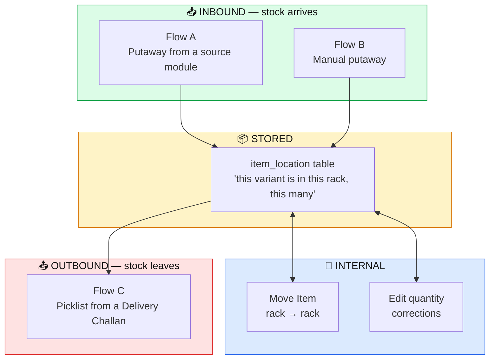
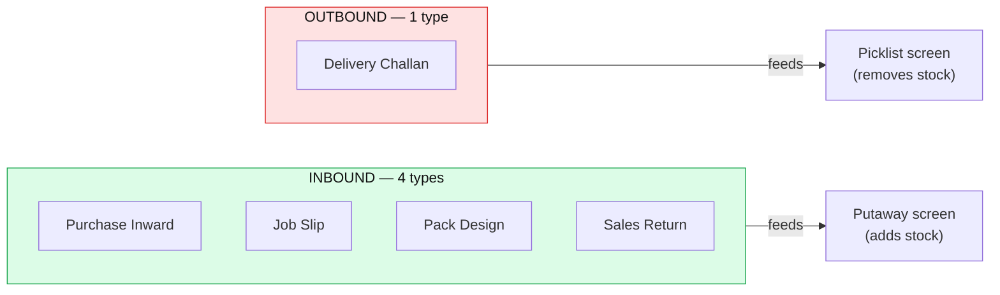
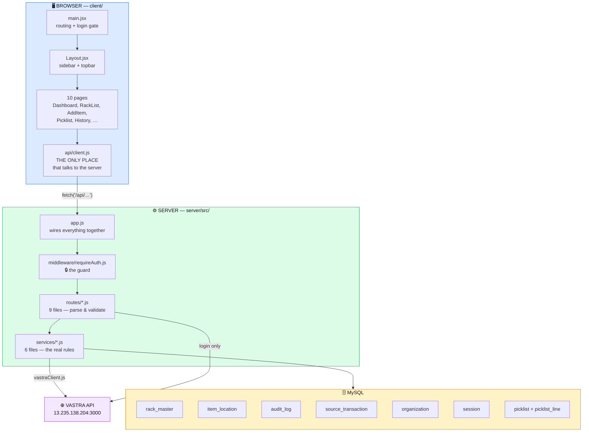
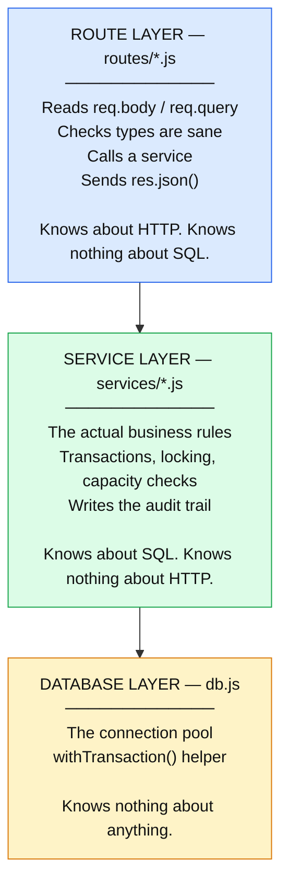
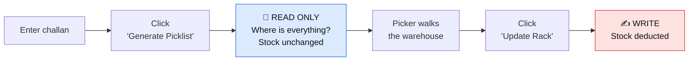
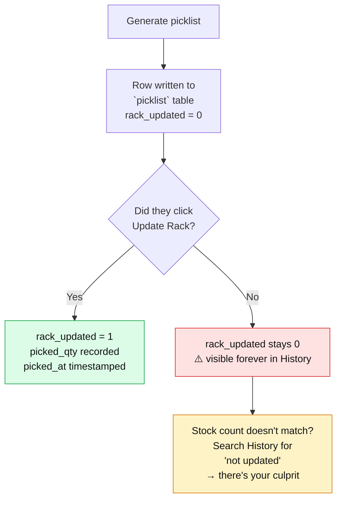
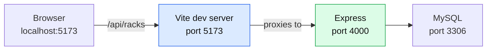
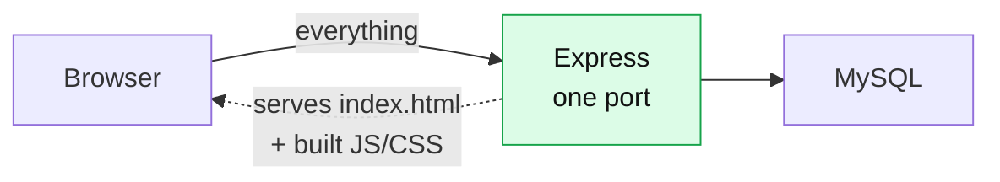

# 01 — The Big Picture

[← Back to Start](00-START-HERE.md) · [Next: The File Map →](02-the-file-map.md)

---

## What problem does RMS solve?

A warehouse holds thousands of garments. Two questions get asked all day:

1. **"This truck just arrived. Where do I put these 40 sarees?"** → *Putaway*
2. **"This challan says ship 9 kurtis. Which shelf are they on?"** → *Picking*

If nobody records the answer to #1, nobody can answer #2. RMS records #1 and answers #2.

---

## The three flows (memorise these names — the code uses them constantly)

The codebase literally uses the labels "Flow A", "Flow B", "Flow C" in its comments. Here's what they mean.



| Flow | Screen | What it does | Direction |
|------|--------|--------------|-----------|
| **A** | Putaway → "From Source Module" tab | Pick a document from Vastra, it auto-fills item/colour/size/qty, you choose a rack | Stock **in** |
| **B** | Putaway → "Manual Entry" tab | Type everything by hand, choose a rack | Stock **in** |
| **C** | Picklist | Enter a Delivery Challan, RMS says which racks to pick from, you confirm, stock is deducted | Stock **out** |

Plus two supporting operations that aren't "flows" but change stock:
- **Move Item** — take some units from one rack to another.
- **Edit quantity** — correct a number, or set it to 0 to remove the line entirely.

---

## The critical asymmetry: inbound vs outbound modules

This trips everyone up, so learn it now.

Vastra's other software produces **five** document types. RMS treats them in two groups:



**A Delivery Challan must never appear in the Putaway dropdown.** It would be nonsense — a challan describes goods *leaving*, so it can never be the reason goods are *stored*.

The code enforces this in several places at once:

| Where | How |
|-------|-----|
| [`server/src/vastraClient.js:86`](../server/src/vastraClient.js#L86) | `MODULE_TYPES` lists only the 4 inbound ones |
| [`server/src/vastraClient.js:89`](../server/src/vastraClient.js#L89) | `PICK_MODULE_TYPE` is a *separate* constant for the challan |
| [`server/migrations/schema.sql:32`](../server/migrations/schema.sql#L32) | `item_location.module_type` ENUM has only the 4 inbound values — the database itself will reject a challan |
| [`client/src/lib/rack.js:21`](../client/src/lib/rack.js#L21) | The browser's dropdown list also has only 4 |
| [`server/checkModules.js:140`](../server/checkModules.js#L140) | A test asserts the challan is *not* in `MODULE_TYPES` |

That's four layers of the same rule. When something matters, this codebase enforces it in the database *and* the server *and* the client.

---

## The full system, drawn properly



---

## The layered server — and why the layers exist

The server has **three** layers. Understanding why is the single most useful architectural insight in this project.



### Why bother? Here's the proof.

Look at [`server/src/routes/moves.js`](../server/src/routes/moves.js) — the **entire file** is 17 lines:

```js
router.post('/', async (req, res, next) => {
  try {
    const { itemId, toRackId, qty } = req.body;
    const result = await moveItem({
      itemId: Number(itemId), toRackId, qty, userId: req.org.vastra_org_id,
    });
    res.json(result);
  } catch (err) { next(err); }
});
```

That's it. Unpack the request, call the service, send the answer.

Meanwhile [`moveItem()` in rackService.js:232-280](../server/src/services/rackService.js#L232-L280) is 49 lines of genuinely hard logic: lock the source row, check you're not moving to the same rack, check there's enough stock, check the destination has capacity, deduct, merge-or-insert at the destination, recalculate *both* racks, write the audit entry — all inside one transaction.

**The payoff:** the picklist route ([`picklist.js:92`](../server/src/routes/picklist.js#L92)) also calls `findPlacements()` from the same service file. Two completely different features, one copy of the rule. Fix a bug in the service and both are fixed.

---

## The "two-step" principle in the picklist

Flow C is the most carefully designed part of the app, and it hinges on one rule spelled out at [`picklist.js:14-15`](../server/src/routes/picklist.js#L14-L15):

> *"Two deliberate steps: `GET /:dcNo` only reads (generating a picklist must never touch stock), `POST /:dcNo/pick` is the one that writes."*



**Why?** Because a warehouse worker generates the list, then physically walks around for twenty minutes. If generating the list had already deducted the stock, the system would be lying about reality for those twenty minutes. Worse — if the picker finds an empty shelf and abandons the job, the deduction would already have happened.

So: **generating a picklist changes nothing.** The only button that changes stock is "Update Rack".

But there's a catch, and the solution to it is clever. See the next section.

---

## The `rack_updated` flag — the smartest idea in the codebase

If generating a picklist writes nothing to stock, how would you ever discover that someone generated a list, took goods off the shelf, and never clicked "Update Rack"? The physical stock is gone but the database still thinks it's there.

The answer, from [`server/migrations/picklist.sql:8-11`](../server/migrations/picklist.sql#L8-L11):

> *"A row is written when a picklist is GENERATED, not when the racks are updated. That is the whole point of `rack_updated`: it shows a picklist was produced and then never acted on, which is how you find the picklist behind a stock discrepancy."*



The History screen surfaces this directly — [`History.jsx:89-95`](../client/src/pages/History.jsx#L89-L95) shows a banner: *"3 picklists were generated without the racks being updated. Search **not updated** to see just those."*

**This is what "good design" looks like in practice**: an audit feature that exists specifically to catch the failure mode the main design created.

---

## Where the data actually lives — the six-and-a-bit tables

| Table | Holds | Created by | Survives a reseed? |
|-------|-------|-----------|--------------------|
| `rack_master` | The 100 physical bins | `schema.sql` | ❌ dropped & rebuilt |
| `item_location` | What's in each bin | `schema.sql` | ❌ dropped & rebuilt |
| `audit_log` | Every change ever | `schema.sql` | ❌ dropped & rebuilt |
| `source_transaction` | Fake Vastra documents (demo only) | `schema.sql` | ❌ dropped & rebuilt |
| `organization` | Companies that have logged in | `auth.sql` | ✅ **survives** |
| `session` | Active login tokens | `auth.sql` | ✅ **survives** |
| `picklist` + `picklist_line` | Picklist history | `picklist.sql` | ✅ **survives** |

That split is deliberate and explained at [`db.js:63-67`](../server/src/db.js#L63-L67):

> *"Apply the migrations that live OUTSIDE schema.sql, which seed.js drops and recreates: auth (a demo reseed must never delete a login) and picklist history (operational record, not demo data)."*

Running `npm run seed` wipes the demo warehouse but **does not log everyone out** and **does not erase the picklist audit trail**. Details in [03 — The Database](03-the-database.md).

---

## Technology choices, and what each one is for

| Layer | Technology | What it is, in one line |
|-------|-----------|------------------------|
| Browser UI | **React 18** | A library for building screens out of reusable pieces |
| Browser build tool | **Vite 5** | Turns your source files into something a browser can run, instantly |
| Browser routing | **react-router-dom 6** | Makes `/racks` show the racks page without reloading |
| Browser charts | **Chart.js** + **react-chartjs-2** | Draws the dashboard graphs |
| Server | **Express 4** | The standard Node.js library for building an API |
| Database driver | **mysql2** | Lets Node.js talk to MySQL |
| PDF generation | **pdfkit** | Draws the printable picklist, no browser needed |
| Config | **dotenv** | Reads settings from a `.env` file |
| Cross-origin | **cors** | Lets the browser on port 5173 talk to the server on port 4000 during development |

**Notice what is absent**: no ORM (no Prisma, no Sequelize). Every database query is hand-written SQL. No Redux or Zustand — state is plain React `useState`. No test framework — the two check scripts are plain Node with `assert`. No TypeScript.

That's a deliberate "few dependencies" stance. It means more code to read, but nothing hidden behind a library's magic.

---

## Two ways the app runs

### Development (what you use while building)



Two programs running. Vite serves the React app and **forwards** anything starting with `/api` to Express. That forwarding is configured in [`client/vite.config.js:10`](../client/vite.config.js#L10):

```js
proxy: { '/api': 'http://localhost:4000' }
```

This is why every call in the browser can use a plain relative URL like `/api/racks` and never needs to know a hostname.

### Production (what a real deployment looks like)



**One** program. Express serves the compiled React files itself. That's [`app.js:54-61`](../server/src/app.js#L54-L61):

```js
const clientDist = path.resolve(fileURLToPath(import.meta.url), '../../../client/dist');
if (existsSync(clientDist)) {
  app.use(express.static(clientDist));
  app.get('*', (req, res, next) => {
    if (req.path.startsWith('/api')) return next(); // let unknown API routes 404 as JSON
    res.sendFile(path.join(clientDist, 'index.html'));
  });
}
```

Read the `if (existsSync(...))`: in development that folder doesn't exist, so this block is skipped entirely and Vite does the job instead. **One codebase, two modes, no configuration flag.**

The `req.path.startsWith('/api')` line matters too — without it, a typo'd API URL would return the HTML homepage instead of a proper 404, and you'd waste an hour debugging.

---

## Checkpoint — can you answer these?

Don't move on until you can:

1. Why can't the browser query MySQL directly?
2. What's the difference between Flow A and Flow B?
3. Why is Delivery Challan kept out of `MODULE_TYPES`?
4. What does "generating a picklist changes nothing" mean, and why is it designed that way?
5. What is `rack_updated` for?
6. In development, what listens on port 5173 and what listens on 4000?

*(Answers are in [14 — Quiz & Cheatsheet](14-quiz-and-cheatsheet.md).)*

---

Next: **[02 — The File Map](02-the-file-map.md)** — the file that answers "where is that code?"
