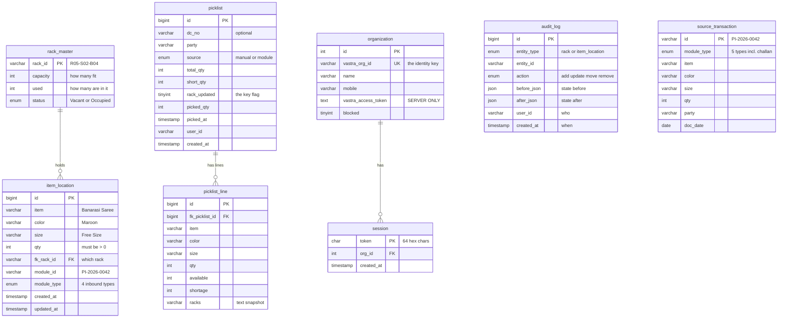
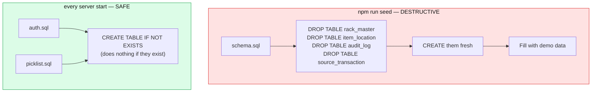
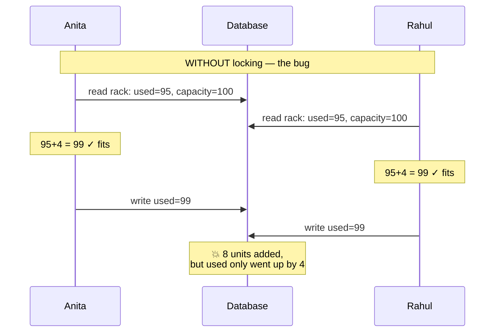
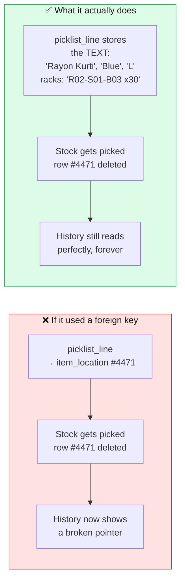
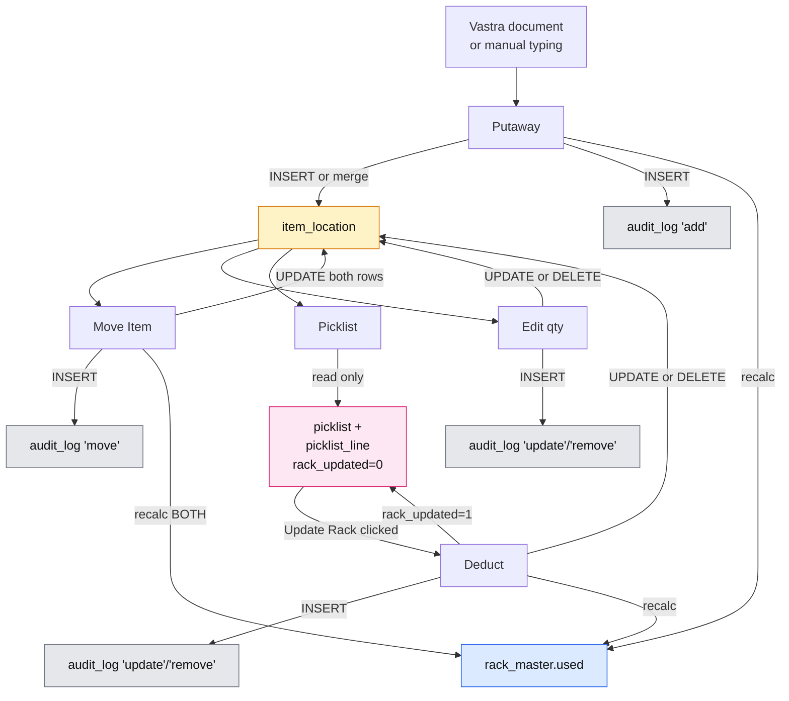

# 03 — The Database

[← File Map](02-the-file-map.md) · [Next: Login & Auth →](04-login-and-auth.md)

---

> **Why start here?** Because every screen in this app is just a nice way of looking at these tables, and every button is a nice way of changing them. Understand the tables and the rest is decoration.

---

## What a database is (skip if you know)

A database is a set of **tables**. A table is a grid, like a spreadsheet:

- **Columns** are the fields (`rack_id`, `capacity`, `used`)
- **Rows** are the records (one physical rack)

You talk to it in **SQL**:

```sql
SELECT rack_id, used FROM rack_master WHERE status = 'Occupied';
```
> "Give me the rack_id and used columns, from the rack_master table, for rows where status is Occupied."

Four SQL verbs cover 95% of this codebase:

| SQL | Means | HTTP equivalent |
|-----|-------|-----------------|
| `SELECT` | read | `GET` |
| `INSERT` | create | `POST` |
| `UPDATE` | modify | `PATCH` |
| `DELETE` | remove | `DELETE` |

---

## The eight tables



---

## The two-speed migration system

This is unusual and worth understanding properly.



### Why split them?

From [`auth.sql:3-6`](../server/migrations/auth.sql#L3-L6):

> *"Deliberately NOT in schema.sql: that file drops and recreates its four tables on every `npm run seed`, which would delete every login."*

Imagine the alternative. You're demoing the app, the fake data looks stale, you run `npm run seed` to refresh it — and every user is instantly logged out and every picklist audit record is gone. That's a bad afternoon.

So:
- **Demo data** (racks, stock, audit, fake documents) → `schema.sql`, wiped freely
- **Real operational data** (logins, picklist history) → `auth.sql` + `picklist.sql`, never wiped

The mechanism is at [`db.js:68-77`](../server/src/db.js#L68-L77):

```js
const STANDING_MIGRATIONS = ['auth.sql', 'picklist.sql'];

export async function applyAuthSchema() {
  for (const file of STANDING_MIGRATIONS) {
    const sql = await readFile(new URL(`../migrations/${file}`, import.meta.url), 'utf8');
    for (const stmt of sql.split(';')) {
      if (stmt.trim()) await pool.query(stmt);
    }
  }
}
```

> **Why `sql.split(';')`?** The connection pool isn't configured with `multipleStatements`, so it can only run one statement per call. Splitting on semicolons handles that. (Allowing multiple statements per query is a common SQL-injection amplifier, so leaving it off is the safer default.)

Because every statement in those files is `CREATE TABLE IF NOT EXISTS`, running this on every single boot is harmless — and it means an old database automatically gains any new table you add, with no manual migration step.

---

## Table 1: `rack_master` — the physical shelves

📄 [`server/migrations/schema.sql:14-21`](../server/migrations/schema.sql#L14-L21)

```sql
CREATE TABLE rack_master (
  rack_id   VARCHAR(20) NOT NULL PRIMARY KEY,          -- R{n}-S{n}-B{n}, e.g. R05-S02-B04
  capacity  INT NOT NULL,
  used      INT NOT NULL DEFAULT 0,
  status    ENUM('Vacant','Occupied') NOT NULL DEFAULT 'Vacant',
  CONSTRAINT chk_used_nonneg CHECK (used >= 0),
  CONSTRAINT chk_used_capacity CHECK (used <= capacity)
) ENGINE=InnoDB;
```

### Reading it line by line

| Piece | Meaning |
|-------|---------|
| `VARCHAR(20)` | Text, up to 20 characters |
| `NOT NULL` | This field can never be empty |
| `PRIMARY KEY` | The unique identifier. No two racks share a `rack_id`. |
| `ENUM('Vacant','Occupied')` | Only these two exact strings are allowed. Anything else is rejected by the database. |
| `CHECK (used <= capacity)` | The database itself refuses to store an overfull rack |
| `ENGINE=InnoDB` | The MySQL storage engine that supports transactions and foreign keys. Required for this app to work. |

### The important subtlety: `used` is a cache

`used` should always equal `SUM(qty)` of all `item_location` rows pointing at this rack. It's stored separately so the rack list doesn't have to run a `SUM` for all 100 racks on every page load.

Storing the same fact twice is normally a bug waiting to happen — so the codebase has **exactly one function** allowed to write it, [`recalcRack()` at rackService.js:29-38](../server/src/services/rackService.js#L29-L38):

```js
async function recalcRack(conn, rackId) {
  const [[row]] = await conn.query(
    'SELECT COALESCE(SUM(qty),0) AS total FROM item_location WHERE fk_rack_id = ?',
    [rackId]
  );
  const total = Number(row.total); // SUM() comes back as a string; coerce for the === 0 check
  const status = total === 0 ? 'Vacant' : 'Occupied';
  await conn.query('UPDATE rack_master SET used = ?, status = ? WHERE rack_id = ?', [total, status, rackId]);
  return { used: total, status };
}
```

It doesn't do `used = used + 5`. It **recounts from scratch** every time. That's slower and completely correct — it can't drift out of sync no matter what happened before.

Notice `status` is derived here too. There is no code anywhere that sets `status` independently; it is always a consequence of `used`.

> ⚠️ **Gotcha worth memorising:** `Number(row.total)`. MySQL returns `SUM()` as a *string* (because sums can exceed JavaScript's safe integer range). Without the coercion, `total === 0` would be `"0" === 0` → `false`, and an emptied rack would stay marked "Occupied" forever. This same trap is handled in `dashboardService.js` with its `num()` helper.

### Where rack IDs come from

[`seed.js:94-102`](../server/seed.js#L94-L102) generates 100 racks: 5 racks × 4 shelves × 5 bins.

```js
const CAPACITY_BY_SHELF = { 1: 150, 2: 120, 3: 100, 4: 60 };
```

Capacity varies by shelf height — bulk goods live on lower shelves. That's not decoration: it makes the utilisation report show a realistic spread instead of a flat line.

---

## Table 2: `item_location` — what's on the shelves ⭐

📄 [`server/migrations/schema.sql:24-39`](../server/migrations/schema.sql#L24-L39)

**This is the most important table in the app.**

```sql
CREATE TABLE item_location (
  id          BIGINT NOT NULL AUTO_INCREMENT PRIMARY KEY,
  item        VARCHAR(120) NOT NULL,
  color       VARCHAR(60)  NOT NULL DEFAULT '',
  size        VARCHAR(60)  NOT NULL DEFAULT '',
  qty         INT NOT NULL,
  fk_rack_id  VARCHAR(20) NOT NULL,
  module_id   VARCHAR(60)  NULL,
  module_type ENUM('Purchase Inward','Job Slip','Pack Design','Sales Return') NULL,
  created_at  TIMESTAMP NOT NULL DEFAULT CURRENT_TIMESTAMP,
  updated_at  TIMESTAMP NOT NULL DEFAULT CURRENT_TIMESTAMP ON UPDATE CURRENT_TIMESTAMP,
  CONSTRAINT chk_qty_pos CHECK (qty > 0),
  CONSTRAINT fk_item_rack FOREIGN KEY (fk_rack_id)
    REFERENCES rack_master(rack_id) ON UPDATE CASCADE,
  INDEX idx_item_rack (fk_rack_id)
) ENGINE=InnoDB;
```

### One row means one sentence

> *"There are **40** units of **Banarasi Saree / Maroon / Free Size** in rack **R05-S02-B04**, which arrived on document **PI-2026-0042** (a Purchase Inward)."*

### The five things to notice

**1. `CHECK (qty > 0)` — zero is not allowed**

A row with qty 0 doesn't mean "none here", it means the row shouldn't exist. So the code *deletes* rather than zeroing. See [`updateItemQty` at rackService.js:142-148`](../server/src/services/rackService.js#L142-L148):

```js
if (qty === 0) {
  await conn.query('DELETE FROM item_location WHERE id = ?', [id]);
  action = 'remove';
} else {
  await conn.query('UPDATE item_location SET qty = ? WHERE id = ?', [qty, id]);
  action = 'update';
}
```

This keeps the table meaning exactly one thing: *stock that exists*. No filtering `WHERE qty > 0` anywhere.

**2. `color` and `size` default to `''`, not `NULL`**

A Banarasi Saree has no size — it's stored as an empty string, never `NULL`. Why does that matter? Because in SQL, `NULL = NULL` is **not true**. If sizes were NULL, this lookup would silently fail to match:

```sql
WHERE il.item = ? AND il.color = ? AND il.size = ?
```

That query is [`findPlacements` at rackService.js:83`](../server/src/services/rackService.js#L83) and it's the backbone of both Putaway ("is this already stored somewhere?") and the entire Picklist. Empty strings compare correctly; NULLs would break both features in a way that's maddening to debug.

**3. The `module_type` ENUM has only 4 values**

No Delivery Challan. The schema comment at [line 56-58](../server/migrations/schema.sql#L56-L58) explains:

> *"Delivery Challan is outbound, so it is NOT in item_location.module_type above — a challan removes stock, it never becomes the provenance of stored stock."*

If a bug ever tried to store a challan as an item's origin, **MySQL itself would reject the insert.** That's a rule enforced at the deepest possible layer.

**4. `FOREIGN KEY (fk_rack_id) REFERENCES rack_master(rack_id)`**

You cannot store stock in a rack that doesn't exist. The database refuses.

**5. `INDEX idx_item_rack (fk_rack_id)`**

An index is a lookup shortcut, like the index at the back of a book. "Find everything in rack R05-S02-B04" is the app's most common query, so it gets an index. Without it, MySQL would scan every row every time.

### The merge rule

**Within one rack, `(item, color, size)` must be unique.** This isn't a database constraint — it's maintained by code. Every write path checks first:

```js
const [existing] = await conn.query(
  `SELECT id, qty FROM item_location
   WHERE fk_rack_id = ? AND item = ? AND color = ? AND size = ? LIMIT 1 FOR UPDATE`,
  [rackId, item, color, size]
);
```

Found → add to the existing row's qty. Not found → insert a new row.

That code appears twice: [`addItem` at rackService.js:102`](../server/src/services/rackService.js#L102) and [`moveItem` at rackService.js:252`](../server/src/services/rackService.js#L252). Even the seed script respects it — [`buildStock` at seed.js:126-136`](../server/seed.js#L126-L136) keeps a `seen` Set to avoid generating duplicates, with a comment saying exactly why:

> *"Within one rack (item, color, size) must be unique — the API merges duplicates on add, so the seed must not create any."*

### What `FOR UPDATE` means (important)

You'll see `FOR UPDATE` on almost every `SELECT` inside a transaction:

```sql
SELECT rack_id, capacity, used, status FROM rack_master WHERE rack_id = ? FOR UPDATE
```

It means: **lock this row until my transaction finishes.** Any other transaction wanting the same row waits.

Why it's essential — the classic race condition:



With `FOR UPDATE`, Rahul's read *blocks* until Anita commits, so he reads 99 and correctly finds his 4 units don't fit.

---

## Table 3: `audit_log` — the permanent record

📄 [`server/migrations/schema.sql:42-52`](../server/migrations/schema.sql#L42-L52)

```sql
CREATE TABLE audit_log (
  id          BIGINT NOT NULL AUTO_INCREMENT PRIMARY KEY,
  entity_type ENUM('rack','item_location') NOT NULL,
  entity_id   VARCHAR(60) NOT NULL,
  action      ENUM('add','update','move','remove') NOT NULL,
  before_json JSON NULL,
  after_json  JSON NULL,
  user_id     VARCHAR(60) NOT NULL DEFAULT 'system',
  created_at  TIMESTAMP NOT NULL DEFAULT CURRENT_TIMESTAMP,
  INDEX idx_audit_entity (entity_type, entity_id)
) ENGINE=InnoDB;
```

**Append-only.** Nothing in this codebase ever updates or deletes an audit row.

The `before_json` / `after_json` columns store snapshots as JSON, which is why the shape differs per action:

| Action | `before_json` | `after_json` |
|--------|--------------|--------------|
| `add` (new row) | `null` | the full new row |
| `add` (merged) | the row before | the row after — **qty is the running total** |
| `update` | the row before | the row after |
| `move` | source rack + qty | `{fromRack, toRack, movedQty}` |
| `remove` | the row before | `null` |
| picklist pick | the row before | `{source:'picklist', pickedQty, remainingQty, rack, picklist?}` |

### The merged-add trap, and how History fixes it

Look at that second row. When an add merges into an existing row, `after_json.qty` is the **new total**, not the amount added. Add 10 to a rack already holding 30 and `after_json.qty` is 40.

If the History screen showed that number, it would claim you put away 40 units when you actually put away 10.

The fix is at [`history.js:30-34`](../server/src/routes/history.js#L30-L34):

```js
// after_json holds the row AFTER the add, so when the add merged into an
// existing row its qty is the running total, not what was put away.
// The difference against before_json is the amount actually added.
const added = b ? Number(a.qty ?? 0) - Number(b.qty ?? 0) : Number(a.qty ?? 0);
```

`before_json` is `null` for a genuinely new row, so the ternary handles both cases. The UI then shows `+10` with a note `(rack held 40 after)`.

**This is the kind of detail that separates working software from software that quietly lies to you.**

### `writeAudit` takes a connection, not the pool

📄 [`server/src/services/audit.js`](../server/src/services/audit.js) — the entire file is 16 lines:

```js
export async function writeAudit(conn, { entityType, entityId, action, before, after, userId = 'system' }) {
  await conn.query(
    `INSERT INTO audit_log (entity_type, entity_id, action, before_json, after_json, user_id)
     VALUES (?, ?, ?, ?, ?, ?)`,
    [entityType, String(entityId), action,
     before ? JSON.stringify(before) : null,
     after ? JSON.stringify(after) : null,
     userId]
  );
}
```

That first parameter `conn` is the point. Because it uses the **caller's transaction connection**, the audit row is committed or rolled back *with* the change it describes. You can never end up with an audit entry for a change that didn't happen, or a change with no audit entry.

---

## Table 4: `source_transaction` — the fake Vastra feed

📄 [`server/migrations/schema.sql:61-74`](../server/migrations/schema.sql#L61-L74)

This table only exists because Vastra's live API isn't switched on yet. It's a **stand-in** so the app is fully usable and demo-able.

```sql
CREATE TABLE source_transaction (
  id          VARCHAR(60) NOT NULL PRIMARY KEY,
  module_type ENUM('Purchase Inward','Job Slip','Pack Design','Sales Return','Delivery Challan') NOT NULL,
  item        VARCHAR(120) NOT NULL,
  color       VARCHAR(60) NOT NULL DEFAULT '',
  size        VARCHAR(60) NOT NULL DEFAULT '',
  qty         INT NOT NULL,
  party       VARCHAR(120) NOT NULL DEFAULT '',
  doc_date    DATE NULL,
  INDEX idx_src_module (module_type)
) ENGINE=InnoDB;
```

Note this ENUM **does** include Delivery Challan (5 values) while `item_location`'s has only 4. That's the inbound/outbound distinction again, expressed in the schema.

### The `#` trick

`id` is the primary key, so it must be unique — but a real challan has several lines. The solution, explained at [schema.sql:59-60](../server/migrations/schema.sql#L59-L60):

```
DC-2026-0007#1   Rayon Kurti  Blue  L   x30
DC-2026-0007#2   Rayon Kurti  Pink  M   x12
DC-2026-0007#3   Silk Stole   Gold  FS  x5
```

Everything before the `#` is the document number. One tiny function reassembles it — [`picklist.js:20`](../server/src/routes/picklist.js#L20):

```js
const docNo = (id) => String(id).split('#')[0];
```

The comment notes this is a **no-op for real Vastra data**, because Vastra rows already share one `masterNo` per document. The workaround exists only for the fake table, and costs nothing when the real feed arrives.

---

## Tables 5 & 6: `organization` and `session`

📄 [`server/migrations/auth.sql`](../server/migrations/auth.sql)

Covered in depth in [04 — Login & Auth](04-login-and-auth.md). The headlines:

**`organization`** — one row per company that has successfully logged in. Created *only* as a side effect of a verified OTP; there is no signup form anywhere in this app.

```sql
vastra_org_id       VARCHAR(64)  NOT NULL UNIQUE,   -- Vastra's organization_Id
vastra_access_token TEXT         NULL,              -- SERVER-SIDE ONLY, never sent to the browser
blocked             TINYINT      NOT NULL DEFAULT 0,
```

**`session`** — opaque bearer tokens, one active row per org.

```sql
CREATE TABLE IF NOT EXISTS session (
  token      CHAR(64) NOT NULL PRIMARY KEY,           -- crypto.randomBytes(32).toString('hex')
  org_id     INT      NOT NULL,
  created_at TIMESTAMP NOT NULL DEFAULT CURRENT_TIMESTAMP,
  CONSTRAINT fk_session_org FOREIGN KEY (org_id)
    REFERENCES organization(id) ON DELETE CASCADE
) ENGINE=InnoDB;
```

The comment above it states the design rationale:

> *"One active row per org (login deletes the previous), which is what makes single-active-session and `blocked` actually revocable — a JWT could not be."*

`ON DELETE CASCADE` means deleting an organization automatically deletes its sessions. No orphan rows.

---

## Tables 7 & 8: `picklist` and `picklist_line`

📄 [`server/migrations/picklist.sql`](../server/migrations/picklist.sql)

### `picklist` — one row per generated picklist

| Column | Why it exists |
|--------|--------------|
| `dc_no` | **Nullable** — manual entry may have no challan number |
| `party` | The customer |
| `source` | `'manual'` or `'module'` |
| `total_qty` | Sum requested |
| `short_qty` | Sum that couldn't be found in racks |
| `rack_updated` | ⭐ 0 until "Update Rack" succeeds |
| `picked_qty` | What was actually deducted |
| `picked_at` | When |
| `user_id` | The org's `vastra_org_id` |

### `picklist_line` — the lines, stored as plain text

Here's the design decision worth understanding, from [picklist.sql:33-36](../server/migrations/picklist.sql#L33-L36):

> *"Line snapshot, kept as plain text rather than a foreign key into item_location: those rows get deducted, merged and deleted, and a history entry has to stay readable after they are gone."*



**The general principle: history tables should store facts, not pointers.** A pointer describes something that can change or vanish; a copied fact is true forever.

The `racks` column is a plain string like `"R02-S01-B03 x30, R04-S02-B01 x12"`, built by [`rackSummary()` at picklistStore.js:12`](../server/src/services/picklistStore.js#L12). It's a snapshot of what the printed sheet said — which is exactly what the "Update" feature later compares against to warn "stock has moved since this was printed".

### One reserved-word landmine

At [`picklistStore.js:73`](../server/src/services/picklistStore.js#L73):

```js
COUNT(l.id) AS line_count
...
// Aliased line_count, not `lines`: LINES is reserved in MySQL 8.
return rows.map(({ line_count, ...r }) => ({
  ...r, rack_updated: !!r.rack_updated, lines: Number(line_count),
}));
```

`LINES` is a reserved keyword in MySQL 8 — `AS lines` is a syntax error. So the query aliases it `line_count` and JavaScript renames it back to `lines` afterwards, keeping the API response clean. A small, real bug that was found and fixed.

---

## The complete data lifecycle



**Every single arrow that changes `item_location` also writes to `audit_log` and recalculates `rack_master`.** All three inside one transaction. That's the invariant of the whole system — if you're adding a new way to change stock, you must maintain it.

---

## Looking at the real data yourself

```bash
mysql -u root rms

SHOW TABLES;
DESCRIBE item_location;

SELECT * FROM rack_master LIMIT 5;
SELECT * FROM item_location WHERE fk_rack_id = 'R01-S01-B01';
SELECT * FROM audit_log ORDER BY id DESC LIMIT 10;

-- Does used actually match the stock? (should return nothing)
SELECT rm.rack_id, rm.used, COALESCE(SUM(il.qty),0) AS actual
FROM rack_master rm
LEFT JOIN item_location il ON il.fk_rack_id = rm.rack_id
GROUP BY rm.rack_id, rm.used
HAVING rm.used != actual;
```

That last query is a genuine health check. If it ever returns rows, something wrote `used` without going through `recalcRack()`.

---

## Checkpoint

1. Which tables survive `npm run seed`, and why those specific ones?
2. Why is `color` `''` instead of `NULL`?
3. Why does setting a quantity to 0 delete the row instead of storing 0?
4. What does `FOR UPDATE` do and what breaks without it?
5. Why does `picklist_line` store rack names as text instead of pointing at `item_location`?
6. Why does `history.js` subtract `before_json.qty` from `after_json.qty`?

---

Next: **[04 — Login & Auth](04-login-and-auth.md)**
