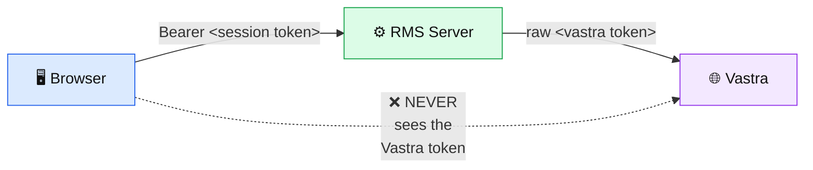
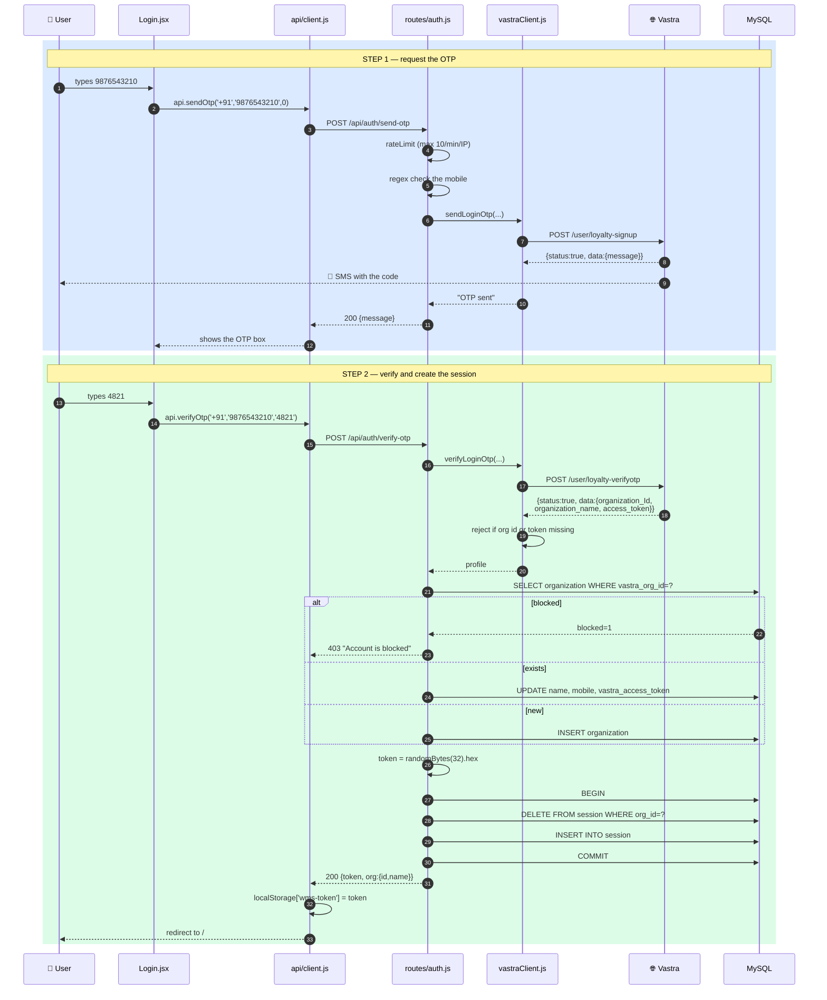
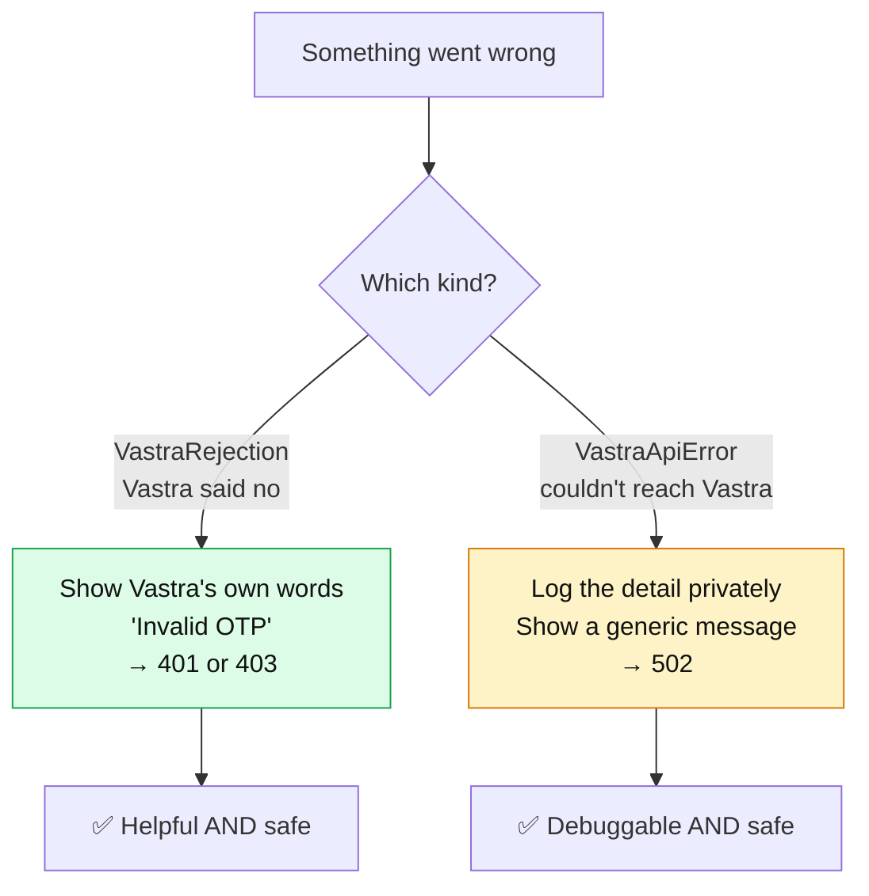
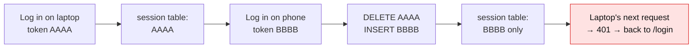
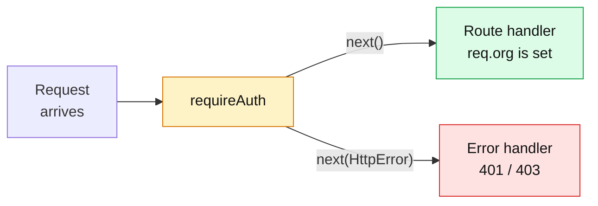
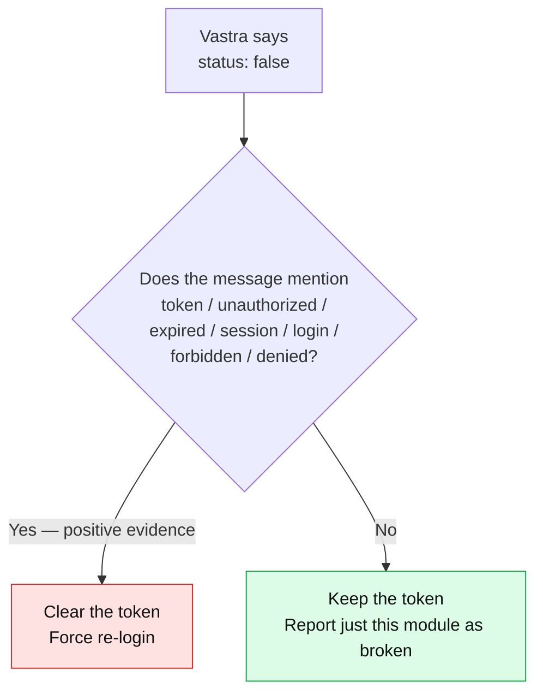

# 04 — Login & Authentication

[← The Database](03-the-database.md) · [Next: Server Anatomy →](05-server-anatomy.md)

---

## The one-sentence version

> **RMS has no passwords and no signup. Vastra vouches for you by texting an OTP; RMS then issues its own session token.**

---

## Two tokens — never confuse them

This is the single most important thing on this page.

| | Vastra access token | RMS session token |
|---|---|---|
| **Issued by** | Vastra | RMS |
| **Looks like** | whatever Vastra sends | 64 random hex characters |
| **Stored in** | `organization.vastra_access_token` | `session.token` |
| **Who holds it** | **the server only** | the browser (`localStorage`) |
| **Used for** | RMS calling Vastra's APIs on your behalf | you calling RMS |
| **Header format** | `authorization: <token>` (raw!) | `Authorization: Bearer <token>` |



The rule is enforced at [`auth.js:131-132`](../server/src/routes/auth.js#L131-L132):

```js
// Never the vastra_access_token — that stays server-side.
res.json({ token, org: { id: orgId, name } });
```

And there's a test asserting it, at [`checkAuth.js:80-81`](../server/checkAuth.js#L80-L81):

```js
// The Vastra access_token must never reach the client.
assert.equal(JSON.stringify(first).includes('token-one'), false);
```

> **Why does it matter?** Anything in the browser can be read by the user, by a browser extension, or by malicious JavaScript. The Vastra token can access Vastra's *entire* system for that organization. The RMS session token can only access RMS, and RMS can revoke it instantly. Give away the small key, keep the master key locked up.

---

## The whole flow, end to end



---

## Step 0 — the tables exist

At boot, [`index.js:30`](../server/src/index.js#L30) calls `applyAuthSchema()`, which runs `auth.sql`. Because everything in there is `CREATE TABLE IF NOT EXISTS`, this is harmless on every restart and automatically upgrades an old database.

If it fails, the error is explicit ([`index.js:32-35`](../server/src/index.js#L32-L35)):

```js
console.error(`  ✗ Could not apply auth schema (${e.code || 'ERROR'}): ${e.message}`);
console.error('    Login will fail until this is fixed.\n');
```

---

## Step 1 — `POST /api/auth/send-otp`

### The browser side

📄 [`client/src/pages/Login.jsx:17-29`](../client/src/pages/Login.jsx#L17-L29)

```js
const send = async (isResend = 0) => {
  if (!/^[0-9]{6,15}$/.test(mobile)) return toast('Enter a valid mobile number', 'warning');
  setBusy(true);
  try {
    const { message } = await api.sendOtp(countryCode, mobile, isResend);
    toast(message || 'OTP sent', 'success');
    setStep('otp');
  } catch (e) {
    toast(e.message, 'error');
  } finally {
    setBusy(false);
  }
};
```

The page is a two-state machine — `step` is `'mobile'` then `'otp'` ([line 11](../client/src/pages/Login.jsx#L11)). `busy` disables the button so double-clicks can't fire two SMS.

The input is sanitised as you type ([line 73](../client/src/pages/Login.jsx#L73)):

```js
onChange={(e) => setMobile(e.target.value.replace(/[^0-9]/g, ''))}
```

Non-digits are stripped on the spot. You literally cannot type a letter into the box.

### The server side

📄 [`server/src/routes/auth.js:57-75`](../server/src/routes/auth.js#L57-L75)

Three regexes guard the input ([lines 14-16](../server/src/routes/auth.js#L14-L16)):

```js
const COUNTRY_CODE = /^\+[0-9]+$/;
const MOBILE = /^[0-9]{6,15}$/;
const OTP = /^[0-9]{3,10}$/;
```

> The browser already checked the mobile format. **The server checks again anyway.** Never trust the client — a request can be sent by anything, not just your form.

### The rate limiter — worth reading closely

📄 [`server/src/routes/auth.js:18-41`](../server/src/routes/auth.js#L18-L41)

```js
// The two OTP endpoints are unauthenticated and each one costs Vastra a real
// SMS, so cap them per IP.
// ponytail: in-memory, per-process — move to a shared store if RMS ever runs multiple instances.
const WINDOW_MS = 60_000;
const MAX_HITS = 10;
const hits = new Map();

function rateLimit(req, res, next) {
  const ip = req.ip || 'unknown';
  const now = Date.now();
  const hit = hits.get(ip);
  if (!hit || now - hit.windowStart > WINDOW_MS) {
    hits.set(ip, { count: 1, windowStart: now });
    // Opportunistic sweep so the Map can't grow without bound.
    if (hits.size > 1000) {
      for (const [key, val] of hits) if (now - val.windowStart > WINDOW_MS) hits.delete(key);
    }
    return next();
  }
  if (++hit.count > MAX_HITS) {
    return next(new HttpError(429, 'Too many OTP requests — wait a minute and try again.'));
  }
  next();
}
```

Three things to notice:

1. **Why it exists** — every call costs a real SMS, and these two endpoints are the only unauthenticated ones in the app. Without a cap, anyone could run up Vastra's bill.
2. **The memory-leak guard** — a `Map` keyed by IP would grow forever. The `hits.size > 1000` check sweeps expired entries opportunistically, only when the map is already big. No timer, no background job.
3. **The `ponytail:` marker** — this is a deliberate, *documented* shortcut. It works perfectly for one server process; if RMS ever runs on two machines, each gets its own counter and the effective limit doubles. The note tells a future developer exactly what to fix and when.

> **Learn this habit.** A known limitation with a written note is engineering. The same limitation undocumented is a landmine.

### Talking to Vastra

📄 [`server/src/vastraClient.js:63-68`](../server/src/vastraClient.js#L63-L68)

```js
export async function sendLoginOtp(countryCode, mobile, isResend = 0) {
  const data = await call('POST', '/user/loyalty-signup', {
    json: { country_code: countryCode, mobile, is_resend: isResend },
  });
  return data?.message || 'OTP sent';
}
```

Note the endpoint is called `loyalty-signup` but it does **not** create anything in RMS — that's just Vastra's name for "send an OTP".

### The two error classes

📄 [`server/src/vastraClient.js:19-30`](../server/src/vastraClient.js#L19-L30)

```js
// Transport failure, timeout, missing config, unrecognized envelope → 502.
// The message can embed the internal Vastra host/IP, so it is for logs only.
export class VastraApiError extends Error {}

// Vastra answered and refused (bad OTP, unknown mobile, expired token).
// Carries Vastra's own code + message, which are safe to show the user → 401/403.
export class VastraRejection extends Error {
  constructor(code, message) {
    super(message);
    this.code = code;
  }
}
```

And the translator, [`auth.js:47-54`](../server/src/routes/auth.js#L47-L54):

```js
function toHttpError(err, rejectionStatus) {
  if (err instanceof VastraRejection) return new HttpError(rejectionStatus, err.message);
  if (err instanceof VastraApiError) {
    console.error('Vastra call failed:', err.message);
    return new HttpError(502, 'Vastra login service unavailable: please try again in a moment.');
  }
  return err;
}
```



**Why split them?** A transport error message might read `POST /user/loyalty-signup failed: connect ECONNREFUSED 13.235.138.204:3000`. That leaks Vastra's internal IP address to anyone who mistypes an OTP. So it goes to the server log and the browser gets a bland 502.

This exact discipline is applied to database errors too — see [`app.js:68-73`](../server/src/app.js#L68-L73).

---

## Step 2 — `POST /api/auth/verify-otp`

📄 [`server/src/routes/auth.js:78-136`](../server/src/routes/auth.js#L78-L136)

**This is the only route in the entire codebase that can create a session.**

### 2a — verify with Vastra

📄 [`vastraClient.js:72-80`](../server/src/vastraClient.js#L72-L80)

```js
export async function verifyLoginOtp(countryCode, mobile, otp) {
  const data = await call('POST', '/user/loyalty-verifyotp', {
    json: { country_code: countryCode, mobile, otp },
  });
  if (!data?.organization_Id || !data?.access_token) {
    throw new VastraApiError('loyalty-verifyotp returned no organization_Id/access_token');
  }
  return data;
}
```

> *"A half-empty profile must never create a session."*

Even when Vastra says `status: true`, the payload is checked. If Vastra ever has a bug that returns success with no organization, RMS refuses rather than creating a session for nobody.

### 2b — upsert the organization

📄 [`auth.js:94-122`](../server/src/routes/auth.js#L94-L122)

```js
const vastraOrgId = String(profile.organization_Id);
const name = profile.organization_name || `Org ${vastraOrgId}`;

const [[existing]] = await pool.query(
  'SELECT id, blocked FROM organization WHERE vastra_org_id = ?',
  [vastraOrgId]
);
if (existing?.blocked) throw new HttpError(403, 'Account is blocked');

let orgId;
if (existing) {
  orgId = existing.id;
  // Refresh all three every login: the token rotates and the org name can
  // change on Vastra's side.
  await pool.query(
    'UPDATE organization SET name = ?, mobile = ?, vastra_access_token = ? WHERE id = ?',
    [name, String(mobile), profile.access_token, orgId]
  );
} else {
  // The only INSERT into `organization` in the codebase. Not "creating an
  // account for a stranger": Vastra just vouched for this org via a
  // verified OTP, so we mirror their identity locally to have something for
  // our foreign keys and audit trail to point at.
  const [ins] = await pool.query(
    'INSERT INTO organization (vastra_org_id, name, mobile, vastra_access_token) VALUES (?, ?, ?, ?)',
    [vastraOrgId, name, String(mobile), profile.access_token]
  );
  orgId = ins.insertId;
}
```

**"Upsert" = update if it exists, insert if it doesn't.**

Three things worth noting:

1. **Lookup is by `vastra_org_id`, never by mobile or name.** Both of those change upstream. Identity must be the one thing that doesn't.
2. **`blocked` is checked before anything else.** A blocked org can't get a session even with a perfectly valid OTP.
3. **All three fields refresh on every login** — because the Vastra token rotates and the company might have renamed itself.

The `[[existing]]` double-bracket is mysql2 syntax: the driver returns `[rows, fields]`, and `[[first]]` destructures both at once — "give me the first row of the first element". You'll see this pattern everywhere in the codebase.

### 2c — mint the session

📄 [`auth.js:124-129`](../server/src/routes/auth.js#L124-L129)

```js
// One active session per org — logging in anywhere kills the old session.
const token = randomBytes(32).toString('hex');
await withTransaction(async (conn) => {
  await conn.query('DELETE FROM session WHERE org_id = ?', [orgId]);
  await conn.query('INSERT INTO session (token, org_id) VALUES (?, ?)', [token, orgId]);
});
```

**`randomBytes(32)`** comes from Node's `crypto` module. It's *cryptographically secure* randomness — unlike `Math.random()`, which is predictable and must never be used for tokens. 32 bytes → 64 hex characters → 2^256 possibilities. Unguessable.

**DELETE-then-INSERT** gives single-active-session:



**Why the transaction?** If the server crashed between DELETE and INSERT, the org would have zero sessions and nobody could log in until they tried again. `withTransaction` makes it all-or-nothing.

---

## Step 3 — the browser stores it

📄 [`client/src/api/client.js:1-6`](../client/src/api/client.js#L1-L6)

```js
// Session token from the Vastra OTP login. Opaque — the Vastra access_token
// itself never reaches the browser. Key follows the `wms-theme` convention.
const TOKEN_KEY = 'wms-token';
export const getToken = () => localStorage.getItem(TOKEN_KEY);
export const setToken = (t) => localStorage.setItem(TOKEN_KEY, t);
export const clearToken = () => localStorage.removeItem(TOKEN_KEY);
```

`localStorage` is browser storage that survives closing the tab and restarting the computer. It's per-domain and per-browser.

You can see it yourself: **F12 → Application tab → Local Storage**. You'll find `wms-token` and `wms-theme`.

---

## Step 4 — every request carries it

📄 [`client/src/api/client.js:9-27`](../client/src/api/client.js#L9-L27)

```js
async function request(path, options = {}) {
  const token = getToken();
  const res = await fetch(`/api${path}`, {
    headers: {
      'Content-Type': 'application/json',
      ...(token ? { Authorization: `Bearer ${token}` } : {}),
    },
    ...options,
    body: options.body ? JSON.stringify(options.body) : undefined,
  });
  const data = await res.json().catch(() => ({}));
  // 401 from anywhere means the session is gone — drop it and go to /login.
  if (res.status === 401) {
    clearToken();
    if (window.location.pathname !== '/login') window.location.replace('/login');
  }
  if (!res.ok) throw new Error(data.error || `Request failed (${res.status})`);
  return data;
}
```

**One function handles expiry for the entire application.** Every one of the ~20 API methods goes through here, so no page has to think about sessions at all.

The `window.location.pathname !== '/login'` check prevents an infinite redirect loop when you're already on the login page.

The `.catch(() => ({}))` on `res.json()` handles a response that isn't valid JSON — without it, a server crash producing an HTML error page would throw a confusing parse error instead of a clean message.

> **One exception:** `api.picklistPdf` at [client.js:79-89](../client/src/api/client.js#L79-L89) builds its header by hand, because it needs a binary PDF rather than JSON. It's the only method that skips `request()`.

---

## Step 5 — the server's guard

📄 [`server/src/app.js:36-49`](../server/src/app.js#L36-L49)

```js
// Vastra mobile+OTP login. Unauthenticated by definition — it is how you get
// a session. /api/health above stays public too.
app.use('/api/auth', auth);

// Everything else needs a session.
app.use('/api/dashboard', requireAuth, dashboard);
app.use('/api/racks', requireAuth, racks);
app.use('/api/item-locations', requireAuth, itemLocations);
app.use('/api/moves', requireAuth, moves);
app.use('/api/source-transactions', requireAuth, sourceTransactions);
app.use('/api/picklist', requireAuth, picklist);
app.use('/api/history', requireAuth, history);
app.use('/api/audit-log', requireAuth, auditLog);
```

**The whole security model is visible in fourteen lines.** Two public routes, eight guarded ones. You can audit it at a glance — which is exactly the point.

📄 [`server/src/middleware/requireAuth.js`](../server/src/middleware/requireAuth.js) — the entire file:

```js
export async function requireAuth(req, res, next) {
  try {
    const token = (req.get('authorization') || '').replace(/^Bearer\s+/i, '').trim();
    if (!token) throw new HttpError(401, 'Login required');

    const [rows] = await pool.query(
      `SELECT o.id, o.vastra_org_id, o.name, o.vastra_access_token, o.blocked
       FROM session s JOIN organization o ON o.id = s.org_id
       WHERE s.token = ?`,
      [token]
    );
    if (!rows.length) throw new HttpError(401, 'Session expired — please log in again');
    // Checked per request, so flipping `blocked` in the DB logs an org out on
    // its very next call.
    if (rows[0].blocked) throw new HttpError(403, 'Account is blocked');

    const { blocked, ...org } = rows[0];
    req.org = org;
    next();
  } catch (err) {
    next(err);
  }
}
```

### What a middleware is

A function that runs **before** the route handler and either passes the request along (`next()`) or stops it (`next(error)`).



### The four details that matter

**1. `.replace(/^Bearer\s+/i, '')`** — strips the `Bearer ` prefix. Case-insensitive (`/i`) and tolerant of extra spaces (`\s+`), because HTTP clients differ.

**2. One JOIN does both jobs** — validating the token and loading the organization in a single round trip.

**3. `if (rows[0].blocked)`** — checked *per request*. Set `blocked = 1` in the database and that org is out on their very next click. No waiting for a session to expire, no cache to bust. **This is precisely what a JWT could not do**, and it's the reason for the whole design.

**4. `const { blocked, ...org } = rows[0]`** — JavaScript destructuring with "rest". It pulls `blocked` out and puts everything else into `org`, so `req.org` carries only what routes actually need.

### What `req.org` is used for downstream

```bash
grep -rn "req\.org" server/src/
```

| Purpose | Where |
|---------|-------|
| Audit attribution — who did this | [`itemLocations.js:32`](../server/src/routes/itemLocations.js#L32), [`moves.js:11`](../server/src/routes/moves.js#L11), [`picklist.js:196`](../server/src/routes/picklist.js#L196) |
| Calling Vastra on your behalf | [`sourceModules.js:41`](../server/src/services/sourceModules.js#L41) |
| The org name on the PDF | [`picklist.js:165`](../server/src/routes/picklist.js#L165) |
| Restoring identity after refresh | [`auth.js:151`](../server/src/routes/auth.js#L151) |

The audit trail records `req.org.vastra_org_id` — Vastra's identifier, not RMS's internal one. That way the audit log stays meaningful even if the RMS database is rebuilt.

---

## Step 6 — the client-side gate

📄 [`client/src/main.jsx:21-49`](../client/src/main.jsx#L21-L49)

```js
// Must be a component, not `getToken() ? … : …` inlined into the `element`
// prop: that expression evaluates once when this file renders and freezes the
// result, so logging in would save the token but still bounce back to /login
// until a manual page reload. As a component it re-reads on every render.
function RequireAuth() {
  return getToken() ? <Layout /> : <Navigate to="/login" replace />;
}
```

That comment records a real bug. The broken version was:

```js
<Route element={getToken() ? <Layout /> : <Navigate to="/login" />}>  // ❌
```

`getToken()` ran **once**, when `main.jsx` first executed — before you'd logged in. React kept that frozen `false` forever. You'd log in successfully, the token would be saved, and you'd be bounced straight back to `/login`. Only a full page reload fixed it.

Wrapping it in a component means React re-runs `getToken()` on every render, so it picks up the new token immediately.

> ⚠️ **This gate is UX, not security.** It only checks that *some* string exists in localStorage — it never validates it. Type `localStorage.setItem('wms-token','garbage')` in the console and you'll get into the app's shell, but every single API call will return 401 and bounce you right back out. **The real gate is `requireAuth` on the server.**

---

## Step 7 — restoring identity on refresh

📄 [`client/src/components/Layout.jsx:31-33`](../client/src/components/Layout.jsx#L31-L33)

```js
// Restores the identity on a page refresh. A dead session 401s, and
// api/client.js redirects to /login for us.
useEffect(() => { api.me().then(setOrg).catch(() => {}); }, []);
```

The token is in localStorage but the org's *name* isn't, so `GET /api/auth/me` fetches it on mount.

The empty `.catch(() => {})` looks lazy but is correct: if the session is dead, `request()` has already redirected. There's genuinely nothing left to handle.

📄 [`auth.js:149-152`](../server/src/routes/auth.js#L149-L152) — three lines:

```js
router.get('/me', requireAuth, (req, res) => {
  res.json({ id: req.org.id, name: req.org.name });
});
```

`requireAuth` did all the work; the handler just reads `req.org`.

---

## Step 8 — logout

### Browser

📄 [`Layout.jsx:38-42`](../client/src/components/Layout.jsx#L38-L42)

```js
const logout = async () => {
  try { await api.logout(); } catch { /* leaving anyway */ }
  clearToken();
  window.location.replace('/login');
};
```

The `catch` with a comment instead of handling is deliberate — if the server call fails you *still* want to be logged out locally. Clearing the token locally is the part that must never be skipped.

`window.location.replace()` rather than react-router's `navigate()` forces a **full page reload**, wiping all React state. No stale data from the previous session can linger.

### Server

📄 [`auth.js:138-147`](../server/src/routes/auth.js#L138-L147)

```js
// POST /api/auth/logout — the Vastra session dies with ours.
router.post('/logout', requireAuth, async (req, res, next) => {
  try {
    await pool.query('DELETE FROM session WHERE org_id = ?', [req.org.id]);
    await pool.query('UPDATE organization SET vastra_access_token = NULL WHERE id = ?', [req.org.id]);
    res.json({ ok: true });
  } catch (err) { next(err); }
});
```

Two things die: the RMS session **and** the stored Vastra token. You don't leave a live upstream credential sitting in a database for an org that has logged out.

This is why [`sourceModules.js`](../server/src/services/sourceModules.js#L31-L38) has this specific error:

```js
if (!org.vastra_access_token) {
  throw new HttpError(401, 'Vastra session expired — please log in again.');
}
```

It happens when the row exists but the token was nulled — the fix really is to log in again.

**Why 401 and not 409.** This used to be a `409`, and that was a trap. The client only reacts to
`401` ([`client.js:21-24`](../client/src/api/client.js#L21-L24)): it clears the stored token and
redirects to `/login`. A `409` left the user apparently logged in, staring at an empty module
dropdown, with no prompt and no way to recover — every request failed the same way forever. The
status code has to match what the user must actually do.

---

## The token-clearing decision (subtle and important)

📄 [`server/src/services/sourceModules.js:44-62`](../server/src/services/sourceModules.js#L44-L62)

```js
if (err instanceof VastraRejection) {
  // Vastra answers `status:false` for everything it refuses, so an expired
  // token and a module it will not serve are indistinguishable at the
  // transport level. Clearing the session on the wrong one logs the org out
  // of EVERY module because one module misbehaved — so the destructive
  // branch needs positive evidence, not the benefit of the doubt.
  console.error(`Vastra rejected ${moduleType || 'all modules'}:`, err.code, err.message);
  if (AUTH_REJECTION.test(`${err.code} ${err.message}`)) {
    // Clearing the Vastra token alone used to leave the RMS session alive,
    // pointing at a NULL token — every later request 409'd with no way out
    // and no prompt to log in. Kill the session in the same breath.
    await pool.query('DELETE FROM session WHERE org_id = ?', [org.id]);
    await pool.query('UPDATE organization SET vastra_access_token = NULL WHERE id = ?', [org.id]);
    throw new HttpError(401, 'Vastra rejected the stored session — please log in again.');
  }
  // Not auth — surface Vastra's own words (safe to show) and keep the
  // session, so one bad module doesn't take the working ones down with it.
  throw new HttpError(502, `Vastra refused ${moduleType || 'the request'}: ${err.message}`);
}
```

With the pattern at [line 26](../server/src/services/sourceModules.js#L26):

```js
const AUTH_REJECTION = /token|unauthor|expire|session|login|forbidden|denied/i;
```



**The reasoning: the destructive action requires proof.** If RMS cleared the token on *any* rejection, then one temporarily-broken Vastra module would log the whole organization out of every feature. So the default is "keep the session"; clearing requires the message to actually look like an auth failure.

> **A principle to carry with you:** when one branch is destructive and the other is harmless, make the destructive one prove itself. Ambiguity should fall to the safe side.

---

## The self-test

📄 [`server/checkAuth.js`](../server/checkAuth.js) — run with `node checkAuth.js`

It intercepts `globalThis.fetch`, but only for Vastra traffic ([lines 25-34](../server/checkAuth.js#L25-L34)):

```js
const realFetch = globalThis.fetch;
globalThis.fetch = async (url, opts) => {
  if (String(url).startsWith(VASTRA_HOST)) {
    return new Response(JSON.stringify(reply()), { status: 200, ... });
  }
  return realFetch(url, opts);
};
```

Fake Vastra, real everything else — so it can start a genuine Express server on a random port and make genuine HTTP requests to it.

It asserts:

| # | Assertion | Line |
|---|-----------|------|
| a | `status:false` becomes a `VastraRejection` carrying Vastra's code and message | [40-45](../server/checkAuth.js#L40-L45) |
| b | First login creates the org, returns a token, and **leaks no Vastra token** | [74-82](../server/checkAuth.js#L74-L82) |
| c | Second login **updates** rather than inserting a duplicate, and rotates the token | [84-98](../server/checkAuth.js#L84-L98) |
| d | Second login deletes the first session; the old token now 401s | [100-108](../server/checkAuth.js#L100-L108) |

And it cleans up after itself in a `finally` block ([111-115](../server/checkAuth.js#L111-L115)).

**Run this before and after any auth change.** It's the fastest possible signal that you haven't broken login.

---

## Security scorecard

| Property | How it's achieved |
|----------|------------------|
| No password to steal | Identity is delegated to Vastra entirely |
| Tokens are unguessable | `crypto.randomBytes(32)` |
| Vastra token never exposed | Server-side column only, asserted by a test |
| Instant revocation | `blocked` checked per request |
| One session per org | DELETE-then-INSERT in a transaction |
| SMS abuse capped | Per-IP rate limiter on both OTP routes |
| No info leakage in errors | Rejection vs transport-error split |
| SQL injection prevented | Every query uses `?` placeholders |
| Session dies on logout | Both tokens cleared |

### Honest limitations (know these — someone will ask)

| Limitation | Consequence |
|-----------|-------------|
| Sessions never expire | A token is valid until the next login or logout. No TTL column. |
| Rate limiter is per-process | Two server instances → double the effective limit. Documented at [`auth.js:20`](../server/src/routes/auth.js#L20). |
| Token in `localStorage` | Readable by any JavaScript on the page. An `httpOnly` cookie would be safer against XSS, but can't be sent by `fetch` as easily. |
| Org-level, not user-level | Everyone at one company shares one identity and one session. The audit log says *which company*, not *which person*. |

That last one is the big one architecturally. If a future requirement is "show which employee moved this stock", it needs a new `user` table and a change to what `session` points at — not a small change.

---

## Checkpoint

1. What are the two tokens, and which one does the browser hold?
2. Why is `organization` looked up by `vastra_org_id` instead of mobile?
3. What makes single-active-session work, and why does it need a transaction?
4. Why is `blocked` checked in `requireAuth` rather than at login?
5. Why is `RequireAuth` a component instead of an inline ternary?
6. Why does a Vastra rejection *not* clear the token by default?

---

Next: **[05 — Server Anatomy](05-server-anatomy.md)**
