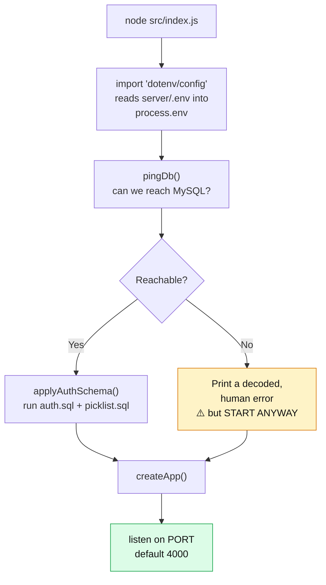
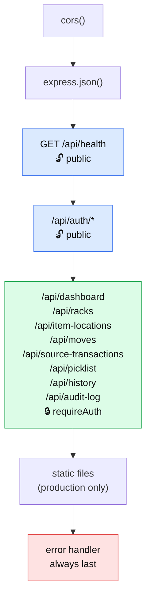
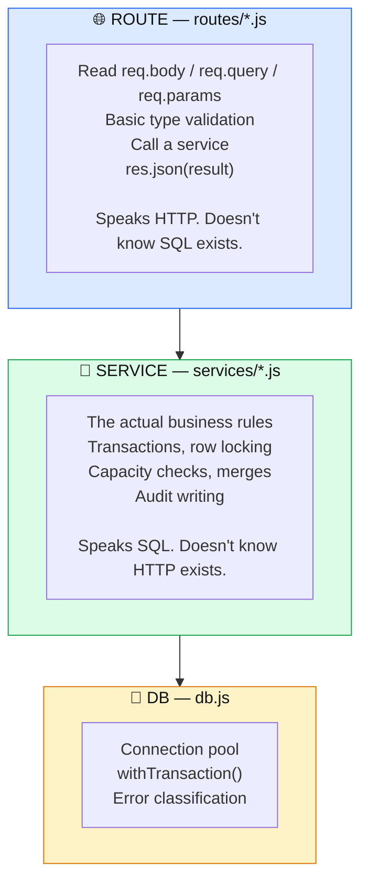
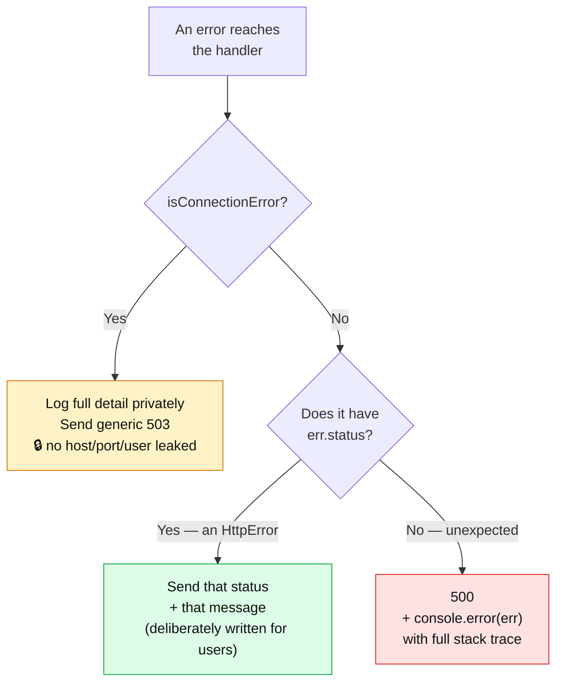
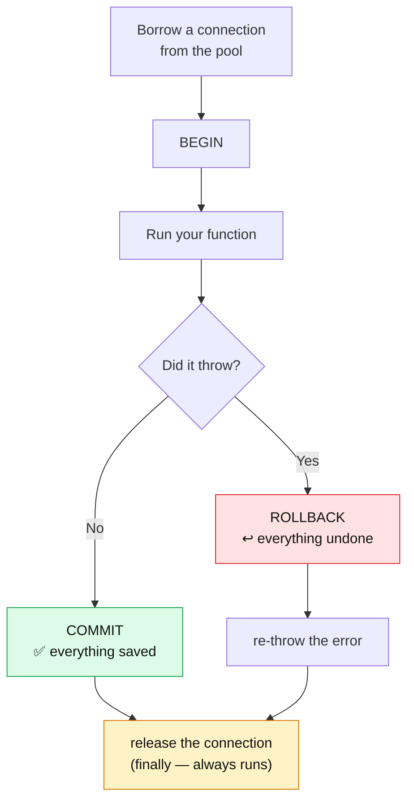
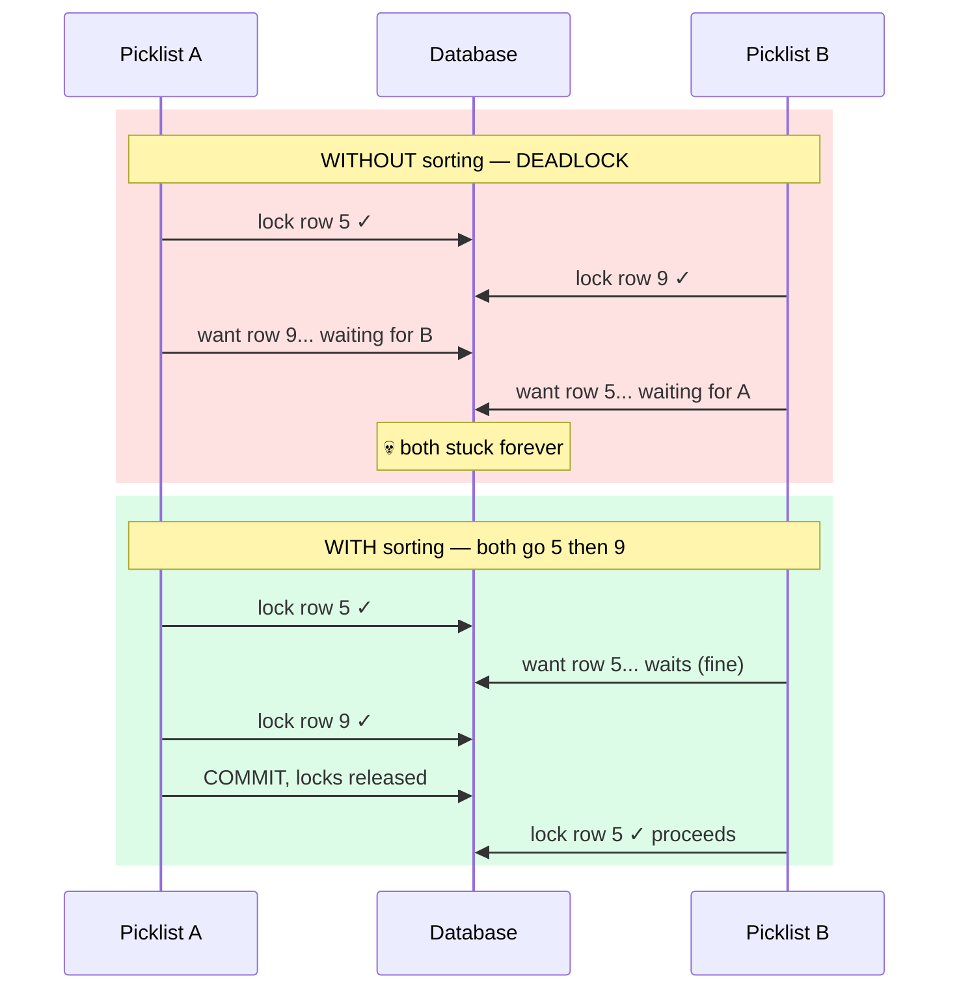
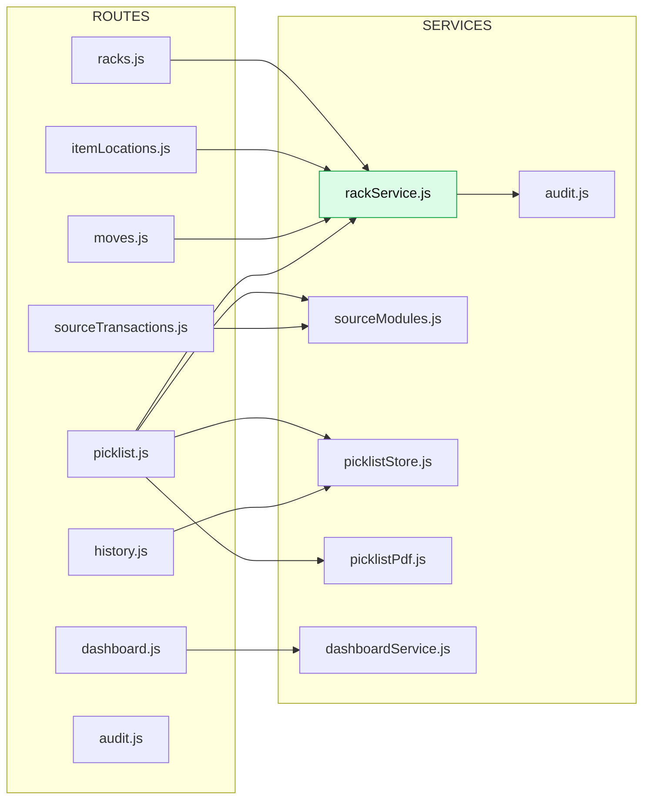
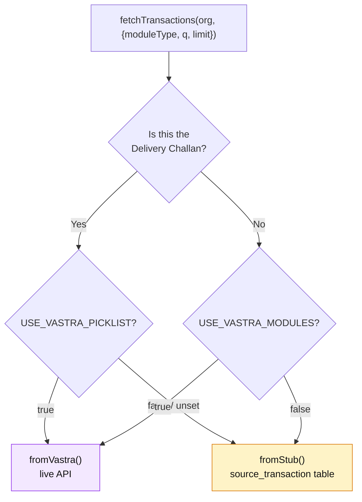
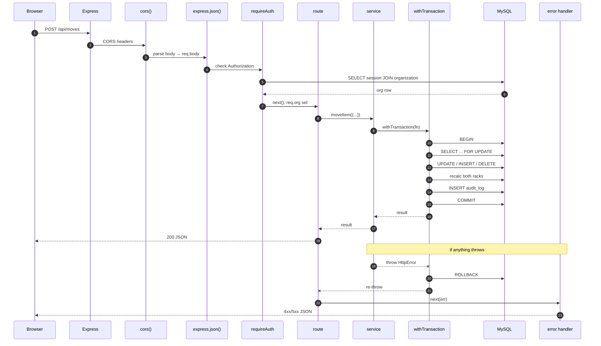

# 05 — Server Anatomy

[← Login & Auth](04-login-and-auth.md) · [Next: Client Anatomy →](06-client-anatomy.md)

---

> **Goal of this page:** you can trace any HTTP request from the moment it arrives to the moment a response leaves, and you know which file to open at each stage.

---

## The startup sequence

📄 [`server/src/index.js`](../server/src/index.js) — 38 lines, and it runs in this order:



### The best part: the error messages

📄 [`index.js:10-36`](../server/src/index.js#L10-L36)

```js
const err = await pingDb();
if (err) {
  console.error(`\n  ✗ Cannot reach the database at ${dbTarget()}`);
  console.error(`    ${err.code || 'ERROR'}: ${err.message}`);
  if (err.code === 'ENOTFOUND') {
    console.error('    That hostname does not resolve — the database server no longer');
    console.error('    exists, or DB_HOST is wrong. Managed free tiers (Aiven, Railway,');
    console.error('    PlanetScale) delete expired instances and remove their DNS record.');
  } else if (err.code === 'ECONNREFUSED') {
    console.error('    Host resolves but nothing is listening — is MySQL running?');
  } else if (err.code === 'ER_ACCESS_DENIED_ERROR') {
    console.error('    Wrong DB_USER / DB_PASSWORD.');
  } else if (err.code === 'ER_BAD_DB_ERROR') {
    console.error(`    Database "${process.env.DB_NAME || 'rms'}" missing — run: npm run seed`);
  }
  console.error('    The API will start, but every data route returns 503 until fixed.\n');
}
```

Each cryptic error code is translated into **what to actually do about it**. Compare `ECONNREFUSED 127.0.0.1:3306` (the raw driver message) with *"Host resolves but nothing is listening — is MySQL running?"*.

### Why start when the database is down?

From [`index.js:7-9`](../server/src/index.js#L7-L9):

> *"We still start listening on failure — the app should stay up to serve /api/health and the client shell — but the log says exactly what is wrong."*

If the server refused to start, you'd have nothing to inspect. Instead you get a live `/api/health` endpoint that tells you precisely what's broken:

```bash
curl localhost:4000/api/health
# {"ok":false,"db":"down","code":"ECONNREFUSED","host":"127.0.0.1"}
```

---

## `app.js` — the wiring diagram

📄 [`server/src/app.js`](../server/src/app.js) — 80 lines. **Read this file top to bottom and you know the entire URL surface of the server.**



### Order matters enormously in Express

Express tries each `app.use()` **in the order it was registered**. That's why:

- The error handler is **last** — it catches everything registered before it.
- The static-file block is **after** the API routes — otherwise a file named `racks` could shadow `/api/racks`.
- `express.json()` is **first** — it's what turns the raw request body into `req.body`. Without it, every POST handler would see `undefined`.

### The two global middlewares

```js
app.use(cors());
app.use(express.json());
```

**`cors()`** — browsers block a page on `localhost:5173` from calling `localhost:4000` unless the server explicitly permits it. This line grants that permission. In production it isn't needed (same origin), but it's harmless.

**`express.json()`** — parses a JSON request body into a JavaScript object on `req.body`.

### The health endpoint

📄 [`app.js:25-34`](../server/src/app.js#L25-L34)

```js
app.get('/api/health', async (req, res) => {
  const err = await pingDb();
  if (!err) return res.json({ ok: true, db: 'up' });
  res.status(503).json({
    ok: false,
    db: 'down',
    code: err.code || 'UNKNOWN',
    host: process.env.DB_HOST || '127.0.0.1',
  });
});
```

Note the comment at [line 23-24](../server/src/app.js#L23-L24): *"`host` is the configured hostname only — no user, port or credentials."* Even the diagnostic endpoint is careful about what it leaks.

### Serving the built client in production

📄 [`app.js:52-61`](../server/src/app.js#L52-L61)

```js
const clientDist = path.resolve(fileURLToPath(import.meta.url), '../../../client/dist');
if (existsSync(clientDist)) {
  app.use(express.static(clientDist));
  app.get('*', (req, res, next) => {
    if (req.path.startsWith('/api')) return next(); // let unknown API routes 404 as JSON
    res.sendFile(path.join(clientDist, 'index.html'));
  });
}
```

Three ideas packed into ten lines:

1. **`existsSync` check** — in development `client/dist` doesn't exist, so the block is skipped and Vite handles it. Same code, both modes, no flag.
2. **`app.get('*')`** — catch-all. React Router owns URLs like `/racks`, but the *server* has no such route. Without this, refreshing the page on `/racks` would 404. Instead the server sends `index.html` and React Router figures out which page to draw.
3. **The `/api` escape hatch** — without it, a typo'd API URL would return the HTML homepage. Your `fetch` would then fail with a bewildering "Unexpected token `<`" JSON parse error. This line makes it 404 properly.

---

## The three layers, properly explained



### The bridge between them: `HttpError`

There's an obvious tension. Services must be able to say "this rack doesn't exist" — but services aren't supposed to know about HTTP.

The solution is a 6-line class at [`rackService.js:5-10`](../server/src/services/rackService.js#L5-L10):

```js
// Simple typed error so routes can map to HTTP status codes.
export class HttpError extends Error {
  constructor(status, message) {
    super(message);
    this.status = status;
  }
}
```

A service throws `new HttpError(404, 'Rack X not found')`. It's still just an error — it doesn't touch `res`, doesn't know what a response is. The **error handler** at the very bottom of `app.js` reads `.status` and turns it into a real HTTP code.

**The service labels the problem; the route layer translates the label.** Clean separation, no ceremony.

---

## The universal route pattern

Every single route handler in this codebase looks like this:

```js
router.get('/', async (req, res, next) => {
  try {
    res.json(await someService(...));
  } catch (err) { next(err); }
});
```

### Why `try/catch` with `next(err)` and not just `throw`?

Express 4 (the version here) **cannot catch errors thrown from async functions**. If you throw and don't catch, the request hangs forever — no response, no error, just a spinning browser.

`next(err)` hands the error to Express's error-handling chain explicitly. Every handler in the codebase does this. **It is not optional.**

> When you write a new route, copy this shape exactly. Forgetting the `catch` produces the worst kind of bug: silence.

---

## The central error handler

📄 [`app.js:63-77`](../server/src/app.js#L63-L77)

```js
app.use((err, req, res, _next) => {
  // A dead/unreachable database is an infrastructure fault, not a bad request.
  // Report it as 503 with a generic message — the driver's own message embeds
  // the DB host, port and user, which must not reach the browser.
  if (isConnectionError(err)) {
    console.error(`DB unreachable (${err.code}) at ${dbTarget()}:`, err.message);
    return res.status(503).json({
      error: 'Database unavailable — the API cannot reach its database. Check the server logs.',
    });
  }
  const status = err.status || 500;
  if (status === 500) console.error(err);
  res.status(status).json({ error: err.message || 'Internal error' });
});
```

An Express error handler is recognised by having **four** parameters. That's the entire signal — three params means normal middleware, four means error handler.



### The `if (status === 500) console.error(err)` line

Only **unexpected** errors get logged with a stack trace. A 404 or a 409 is a normal outcome — logging every one would bury the real problems in noise.

### Why database errors are special-cased

📄 [`db.js:24-44`](../server/src/db.js#L24-L44)

```js
// Driver-level failures that mean "the database is unreachable/misconfigured"
// rather than "this query was bad". These must never be echoed to the browser:
// the message embeds the DB hostname, port and user.
const CONNECTION_ERRORS = new Set([
  'ENOTFOUND',            // hostname does not resolve — server deleted or DB_HOST typo
  'ECONNREFUSED',         // resolves, nothing listening on that port
  'ETIMEDOUT',
  'EHOSTUNREACH',
  'ENETUNREACH',
  'ECONNRESET',
  'EAI_AGAIN',            // transient DNS failure
  'PROTOCOL_CONNECTION_LOST',
  'ER_ACCESS_DENIED_ERROR',
  'ER_BAD_DB_ERROR',
  'ER_CON_COUNT_ERROR',
  'ER_NOT_SUPPORTED_AUTH_MODE',
  'HANDSHAKE_SSL_ERROR',
]);

export const isConnectionError = (err) =>
  CONNECTION_ERRORS.has(err?.code) || CONNECTION_ERRORS.has(err?.errno);
```

A raw mysql2 error message reads like:

```
Access denied for user 'rms_admin'@'10.0.0.5' (using password: YES)
```

That hands an attacker your database username and the app server's internal IP. So these codes get caught, logged privately, and replaced with a bland 503.

**Notice the same pattern as the Vastra error split in [04](04-login-and-auth.md).** Detail goes to the log; the browser gets safety. It's a consistent house rule, applied everywhere.

---

## `db.js` — the connection layer

📄 [`server/src/db.js`](../server/src/db.js)

### The pool

```js
export const pool = mysql.createPool({
  host: process.env.DB_HOST || '127.0.0.1',
  port: Number(process.env.DB_PORT) || 3306,
  user: process.env.DB_USER || 'root',
  password: process.env.DB_PASSWORD || '',
  database: process.env.DB_NAME || 'rms',
  waitForConnections: true,
  connectionLimit: 10,
  ssl: sslConfig(),
});
```

**What a pool is:** opening a database connection takes ~50ms. Doing that per request would be painfully slow. A pool opens 10 connections up front and hands them out, reclaiming each when a query finishes.

`waitForConnections: true` means an 11th simultaneous request *queues* rather than erroring.

Note every setting has a sensible localhost default via `||`. Clone the repo, have MySQL running locally, and it just works with no `.env` at all.

### `withTransaction()` — the most important helper on the server

📄 [`db.js:79-93`](../server/src/db.js#L79-L93)

```js
// Run a function inside a transaction; commit on success, rollback on throw.
export async function withTransaction(fn) {
  const conn = await pool.getConnection();
  try {
    await conn.beginTransaction();
    const result = await fn(conn);
    await conn.commit();
    return result;
  } catch (err) {
    await conn.rollback();
    throw err;
  } finally {
    conn.release();
  }
}
```

Fourteen lines that guarantee correctness across the whole application.



The `finally` is the piece people forget. Without it, a thrown error would leak the connection — do that ten times and the pool is exhausted and the entire server hangs.

### Why every write needs it

Look at what `addItem` does: lock the rack, insert or update stock, recalculate `rack_master.used`, write an audit row. **Four database operations.** If the process died after step 2:

- Stock exists but `rack_master.used` is wrong → the rack looks emptier than it is
- No audit entry → the change is invisible in history

With `withTransaction`, that's impossible. Either all four happen or none do.

### The SSL helper

📄 [`db.js:19-22`](../server/src/db.js#L19-L22)

```js
export function sslConfig() {
  if (process.env.DB_SSL !== 'true') return undefined;
  return process.env.DB_CA ? { ca: process.env.DB_CA } : { rejectUnauthorized: false };
}
```

Three modes: off (local), on-without-verification (quick cloud setup), on-with-CA-cert (proper cloud setup). It's exported so `seed.js` can reuse it — the seed script creates its own connection outside the pool.

---

## Reading the SQL in this codebase

### The `?` placeholder — always

```js
await pool.query('SELECT * FROM organization WHERE vastra_org_id = ?', [vastraOrgId]);
```

The `?` is a **parameter placeholder**. The driver sends the query and the values separately, so the value can never be interpreted as SQL.

Compare with the dangerous version:

```js
// ❌ NEVER DO THIS
await pool.query(`SELECT * FROM organization WHERE vastra_org_id = '${vastraOrgId}'`);
```

If someone's org id were `' OR '1'='1`, that query becomes `WHERE vastra_org_id = '' OR '1'='1'` — which matches every row. That's **SQL injection**, one of the most common serious vulnerabilities in web software.

**Every query in this codebase uses `?`.** You can verify it yourself:

```bash
grep -rn "query(\`" server/src/ | grep '\${'
```

The only hits are places where a value is a *number the code itself computed*, e.g. `LIMIT ${limit}` in [`sourceModules.js:75`](../server/src/services/sourceModules.js#L75) — and that `limit` is `Math.min(Number(...) || 10, 100)`, so it can only ever be a number.

### The `[rows]` destructuring

mysql2 always returns `[rows, fields]`:

```js
const [rows] = await pool.query('SELECT ...');       // I want all rows
const [[row]] = await pool.query('SELECT ... LIMIT 1'); // I want just the first row
const [res] = await pool.query('INSERT ...');        // res.insertId, res.affectedRows
```

You'll see all three constantly. `[[row]]` reads as "first element of the first element".

### `COALESCE(SUM(qty), 0)`

`SUM` of zero rows returns `NULL`, not `0`. `COALESCE(x, 0)` means "use x, or 0 if x is null". Used everywhere a sum might be empty.

---

## Walkthrough: the most complex service function

📄 [`rackService.js:161-228`](../server/src/services/rackService.js#L161-L228) — `pickItems()`

This deducts stock for a picklist. Read it in four phases.

### Phase 1 — validate before touching anything

```js
const normalized = picks.map((p) => {
  const id = Number(p.itemLocationId);
  const qty = Number(p.qty);
  if (!Number.isInteger(id) || id <= 0 || !Number.isInteger(qty) || qty <= 0) {
    throw new HttpError(400, 'each pick needs an itemLocationId and a positive integer qty');
  }
  return { id, qty };
});
```

> *"Normalize first so a bad row fails before anything is locked."*

Validating everything up front means a malformed request never opens a transaction or takes a lock. Fail fast, fail cheap.

### Phase 2 — collapse duplicates

```js
// The same item_location row can appear twice if the client sends a split;
// collapse so we lock and audit each row exactly once.
const byId = new Map();
for (const p of normalized) byId.set(p.id, (byId.get(p.id) || 0) + p.qty);
```

Without this you could lock the same row twice within one transaction and write two audit entries for what is really one deduction.

### Phase 3 — sort by id (the deadlock fix) ⭐

```js
// Ascending id order: two picklists touching the same rows lock them in the
// same sequence and queue instead of deadlocking.
const ordered = [...byId.entries()].sort((a, b) => a[0] - b[0]);
```

**This one line prevents a class of bug that is genuinely hard to debug.**



A deadlock needs two transactions to acquire the same locks in *different* orders. If everyone always locks in ascending id order, that's impossible.

> **This is the kind of thing that only shows up under real concurrent load, at 4pm on a busy shipping day, and is nearly impossible to reproduce.** One `sort()` eliminates it.

### Phase 4 — deduct, one row at a time

```js
for (const [id, qty] of ordered) {
  const before = await getItemForUpdate(conn, id);
  if (qty > before.qty) {
    throw new HttpError(400,
      `Cannot pick ${qty} of ${before.item} from ${before.fk_rack_id}; only ${before.qty} in stock`);
  }
  const remaining = before.qty - qty;
  if (remaining === 0) {
    await conn.query('DELETE FROM item_location WHERE id = ?', [id]);
    removed += 1;
  } else {
    await conn.query('UPDATE item_location SET qty = qty - ? WHERE id = ?', [qty, id]);
    updated += 1;
  }
  rackIds.add(before.fk_rack_id);
  totalQty += qty;
  const after = { source: 'picklist', pickedQty: qty, remainingQty: remaining, rack: before.fk_rack_id };
  if (dcNo) after.picklist = dcNo;
  await writeAudit(conn, { ..., action: remaining === 0 ? 'remove' : 'update', before, after, userId });
}
```

Note `SET qty = qty - ?` rather than `SET qty = ?` with a pre-computed value. Letting the *database* do the arithmetic is atomic and can't be affected by a stale read.

Note also `source: 'picklist'` in the audit — because a picklist deduction uses the same `remove`/`update` actions as a manual edit. That field is what distinguishes them later. The comment at [lines 205-210](../server/src/services/rackService.js#L205-L210) spells this out.

### Phase 5 — recalculate racks, once each, at the end

```js
// Once per distinct rack, after all deductions — a rack hit by two picks
// must not be recalculated against a half-applied state.
const racks = [];
for (const rackId of rackIds) {
  racks.push({ rack_id: rackId, ...(await recalcRack(conn, rackId)) });
}
```

`rackIds` is a `Set`, so each rack appears once. And recalculating *after* the loop means a rack touched by three picks is recalculated once, against the final state.

---

## Where each service is called from



`rackService.js` is used by **four** different routes. That's the reuse the layering buys you — `findPlacements()` is written once and powers both the Putaway hint and the entire picklist resolution.

`audit.js` is called only by `rackService.js`, never by a route. Audit writing is a consequence of a business operation, not an HTTP concern.

---

## The route files, ranked by what you'll read most

### `picklist.js` — 205 lines, the most interesting

Six endpoints. Covered fully in [09 — Flow C](09-flow-C-picklist.md). Note one Express subtlety at [line 131](../server/src/routes/picklist.js#L131) vs [line 172](../server/src/routes/picklist.js#L172):

```js
router.get('/:id/resolve', ...)   // registered FIRST
router.get('/:dcNo', ...)         // registered SECOND
```

Express matches in registration order. If `/:dcNo` came first it would swallow `/5/resolve` (treating `5` as a challan number) and the resolve endpoint would be unreachable. **More specific routes must be registered before more general ones.**

### `auth.js` — 154 lines

Covered in [04](04-login-and-auth.md).

### `history.js` — 61 lines

Two endpoints reading from two *different* sources, and the comment at [lines 7-12](../server/src/routes/history.js#L7-L12) explains why:

> *"putaway → audit_log (`add` rows), which is already written on every add; picklist → the picklist table, which also knows about picklists that were generated and then never acted on — audit_log cannot, because generating writes no audit row by design."*

Each flow is read from wherever that flow actually records itself.

### `sourceTransactions.js` — 19 lines

The thinnest route in the app. All the interesting logic lives in `sourceModules.js`.

### `racks.js` — 39 lines

Note the duplicate-key handling at [line 34](../server/src/routes/racks.js#L34):

```js
if (err.code === 'ER_DUP_ENTRY') return next(new HttpError(409, `Rack ${req.body.rackId} already exists`));
```

Rather than checking for existence first (which has a race condition), it lets the database's unique constraint do the work and translates the resulting error. **Let the database enforce uniqueness; translate its complaint.**

---

## The `sourceModules.js` switch

📄 [`server/src/services/sourceModules.js`](../server/src/services/sourceModules.js)



Two flags, because they can be split:

```js
export const USE_VASTRA = process.env.USE_VASTRA_MODULES === 'true';

const USE_VASTRA_PICK = process.env.USE_VASTRA_PICKLIST === undefined
  ? USE_VASTRA
  : process.env.USE_VASTRA_PICKLIST === 'true';
```

`USE_VASTRA_PICKLIST` defaults to whatever `USE_VASTRA_MODULES` is, but can be overridden. The reason, from [lines 16-19](../server/src/services/sourceModules.js#L16-L19): so you can read live Vastra data for Putaway while still testing picking against the local sample challans.

Both are read **at module load**, so changing them requires a server restart. The comment says so explicitly.

### The `limit` semantics — subtle but consistent

Both branches follow the same rule:

```js
// With a search term, return every match; otherwise cap at `limit` latest.
const cap = q ? '' : `LIMIT ${limit}`;
```

**If you typed a search, you get every match. If you didn't, you get the latest N.**

Why? Because a dropdown showing "latest 10" is a browse convenience, but if you searched for `PI-06` and it existed at position 15, capping would hide it and the search would look broken.

The Vastra branch applies the identical rule at [line 65](../server/src/services/sourceModules.js#L65) — Vastra already filtered server-side, so capping would be wrong there too.

### The timezone bug that was fixed

📄 [`sourceModules.js:77-83`](../server/src/services/sourceModules.js#L77-L83)

```js
// Formatted to a string rather than handed over as a DATE: mysql2 would
// return a Date at local midnight, which serializes back a day early in any
// timezone east of UTC.
const [rows] = await pool.query(
  `SELECT *, DATE_FORMAT(doc_date, '%Y-%m-%d') AS \`date\`
   FROM source_transaction ${clause} ORDER BY id DESC ${cap}`,
  params
);
```

A `DATE` column becomes a JavaScript `Date` at **local** midnight. In India (UTC+5:30), `2026-08-07 00:00 IST` is `2026-08-06 18:30 UTC` — and `JSON.stringify` uses UTC. Every date would display one day early.

Formatting to a string in SQL sidesteps the whole problem.

> **Dates and timezones cause more quiet bugs than almost anything else.** When a date only ever needs to be *displayed*, keeping it as a string is often the right answer.

---

## Complete request lifecycle



---

## Checkpoint

1. Why does the server start even when MySQL is unreachable?
2. Why must the error handler be registered last?
3. What does `HttpError` solve?
4. Why `next(err)` instead of `throw` in a route?
5. What does sorting picks by id prevent, and how?
6. Why must `/:id/resolve` be registered before `/:dcNo`?
7. Why is `doc_date` formatted to a string in SQL?

---

Next: **[06 — Client Anatomy](06-client-anatomy.md)**
