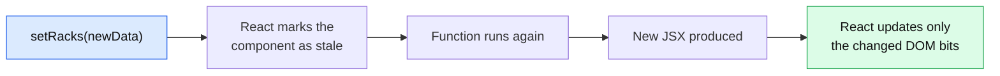
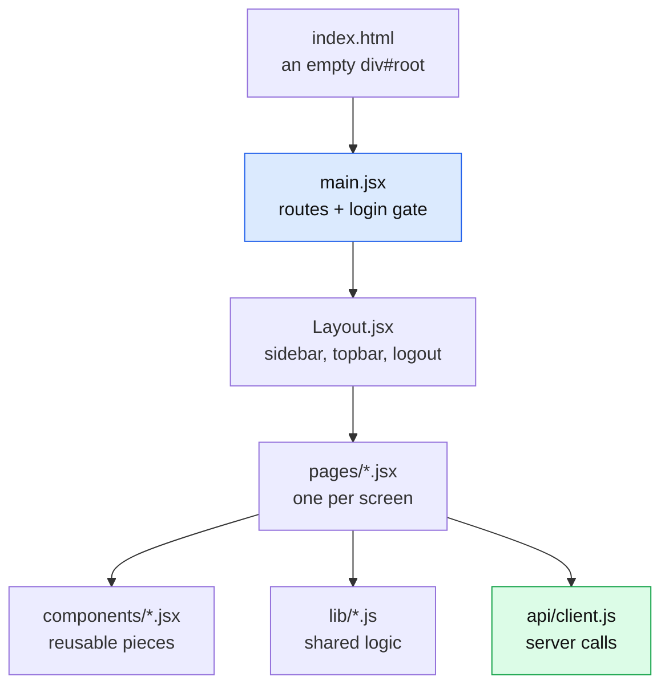
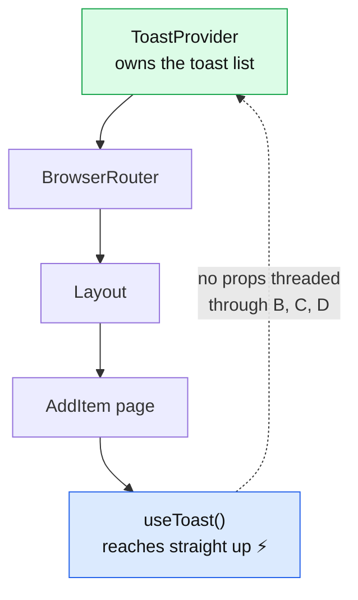
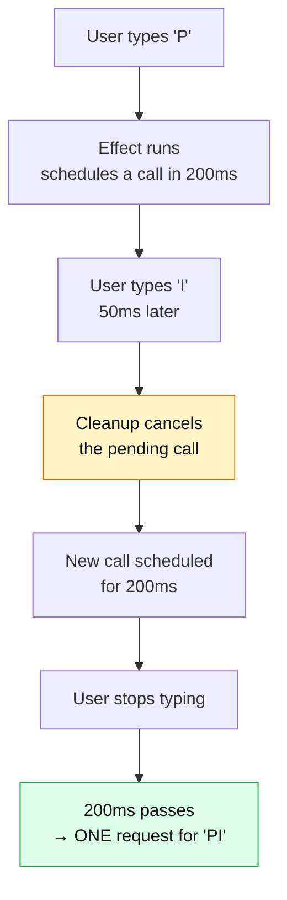
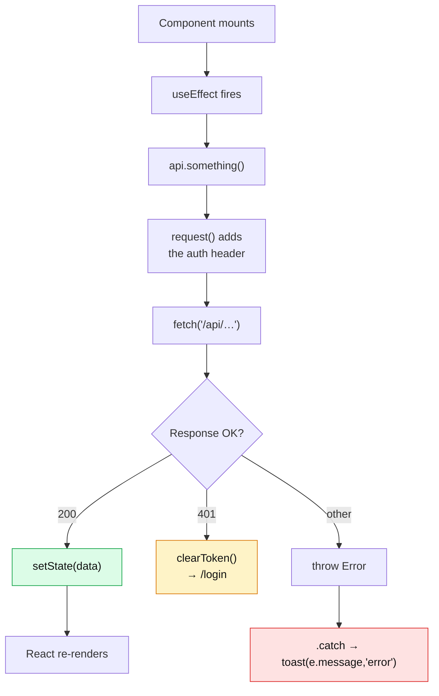

# 06 — Client Anatomy

[← Server Anatomy](05-server-anatomy.md) · [Next: Flow A — Putaway →](07-flow-A-putaway.md)

---

> **Goal:** understand React well enough to read any page in this app, and know exactly which file draws which part of the screen.

---

## React in five minutes (genuinely, from zero)

### 1. A component is a function that returns markup

```jsx
function RackCard({ rack }) {
  return <div className="rack-card">{rack.rack_id}</div>;
}
```

That `<div>` inside JavaScript is called **JSX**. It isn't HTML — it's JavaScript that *looks* like HTML. Vite converts it before the browser sees it.

Two differences from HTML you'll notice immediately:
- `className` instead of `class` (because `class` is a reserved word in JavaScript)
- `{ }` drops a JavaScript value into the markup

### 2. Props are the inputs

```jsx
<RackCard rack={someRack} onClick={handleClick} />
```

Props flow **downward only**, parent to child. A child can never modify its parent's data — it can only call a function the parent handed it.

### 3. State is memory that triggers redrawing

```jsx
const [racks, setRacks] = useState([]);
```

- `racks` — the current value
- `setRacks` — the only way to change it
- `useState([])` — the starting value

**The key idea:** calling `setRacks(...)` tells React "this changed, redraw anything that uses it". Assigning directly (`racks = [...]`) does nothing visible — React never finds out.



### 4. `useEffect` runs side effects

```jsx
useEffect(() => { api.listRacks().then(setRacks); }, []);
```

"After this component appears on screen, do this." The `[]` at the end is the **dependency array**:

| Dependency array | When it runs |
|-----------------|--------------|
| `[]` | once, when the component first appears |
| `[rackId]` | on first appearance, and whenever `rackId` changes |
| *(omitted)* | after every single render — usually a bug |

### 5. `useMemo` caches an expensive calculation

```jsx
const variants = useMemo(() => { /* heavy grouping */ }, [items]);
```

Only recompute when `items` changes. Without it, the calculation would run on every keystroke in an unrelated search box.

**That's genuinely all the React you need for this codebase.** No Redux, no context beyond toasts, no advanced patterns.

---

## The client's file structure and what each layer does



---

## `index.html` — the one and only page

📄 [`client/index.html`](../client/index.html)

```html
<body>
  <div id="root"></div>
  <script type="module" src="/src/main.jsx"></script>
</body>
```

**That's the entire HTML of the application.** One empty div. React builds everything inside it at runtime.

This is what "Single Page Application" means: the browser loads one HTML file ever, and JavaScript swaps the contents as you navigate. No page reloads, no flicker.

The `<head>` pulls in Font Awesome from a CDN — that's why icons are written as `<i className="fa-solid fa-warehouse" />`.

---

## `main.jsx` — the routing table

📄 [`client/src/main.jsx`](../client/src/main.jsx)

```jsx
ReactDOM.createRoot(document.getElementById('root')).render(
  <React.StrictMode>
    <ToastProvider>
      <BrowserRouter>
        <Routes>
          {/* Outside <Layout /> — the login screen has no sidebar. */}
          <Route path="/login" element={<Login />} />
          {/* No token → straight to /login. A 401 from any API call also lands
              here (see api/client.js), so an expired session self-corrects. */}
          <Route element={<RequireAuth />}>
            <Route index element={<Dashboard />} />
            <Route path="racks" element={<RackList />} />
            <Route path="items" element={<ItemManagement />} />
            <Route path="add" element={<AddItem />} />
            <Route path="move" element={<MoveItem />} />
            <Route path="picklist" element={<Picklist />} />
            <Route path="history" element={<History />} />
            <Route path="reports" element={<Reports />} />
            <Route path="report" element={<RackReport />} />
            <Route path="audit" element={<AuditLog />} />
          </Route>
        </Routes>
      </BrowserRouter>
    </ToastProvider>
  </React.StrictMode>
);
```

### The URL → page table

| URL | Page file | Inside Layout? |
|-----|-----------|---------------|
| `/login` | `Login.jsx` | ❌ no sidebar |
| `/` | `Dashboard.jsx` | ✅ |
| `/racks` | `RackList.jsx` | ✅ |
| `/items` | `ItemManagement.jsx` | ✅ |
| `/add` | `AddItem.jsx` | ✅ |
| `/move` | `MoveItem.jsx` | ✅ |
| `/picklist` | `Picklist.jsx` | ✅ |
| `/history` | `History.jsx` | ✅ |
| `/reports` | `Reports.jsx` | ✅ |
| `/report` | `RackReport.jsx` | ✅ |
| `/audit` | `AuditLog.jsx` | ✅ |

### The nesting trick

```jsx
<Route element={<RequireAuth />}>
  <Route index element={<Dashboard />} />
  ...
</Route>
```

A `<Route>` with an `element` but no `path` is a **layout route**. Everything nested inside it renders *through* `RequireAuth` → `Layout` → `<Outlet />`.

That's why `/login` sits outside: it must not have the sidebar.

`index` means "the parent's path exactly" — so `/` renders the Dashboard.

### The three wrappers

| Wrapper | Purpose |
|---------|---------|
| `React.StrictMode` | Development-only. Deliberately runs effects **twice** to expose bugs. If a `useEffect` misbehaves in dev but not production, this is why. |
| `ToastProvider` | Makes `toast()` available to every component below |
| `BrowserRouter` | Enables URL-based routing without page reloads |

---

## `api/client.js` — the one door to the server ⭐

📄 [`client/src/api/client.js`](../client/src/api/client.js)

**Every single server call in the browser goes through this file.** No page ever calls `fetch()` directly.

### Why that discipline pays off

Because auth, error handling and the 401 redirect are written **once**:

```js
async function request(path, options = {}) {
  const token = getToken();
  const res = await fetch(`/api${path}`, {
    headers: {
      'Content-Type': 'application/json',
      ...(token ? { Authorization: `Bearer ${token}` } : {}),
    },
    ...options,
    body: options.body ? JSON.stringify(options.body) : undefined,
  });
  const data = await res.json().catch(() => ({}));
  if (res.status === 401) {
    clearToken();
    if (window.location.pathname !== '/login') window.location.replace('/login');
  }
  if (!res.ok) throw new Error(data.error || `Request failed (${res.status})`);
  return data;
}
```

Add a header, change error handling, add a retry — one edit, whole app covered.

### The full API surface

```js
export const api = {
  sendOtp, verifyOtp, me, logout,           // auth
  listRacks, getRack, createRack,            // racks
  addItem, findPlacements, updateItemQty, move,  // stock
  sourceTransactions,                        // Flow A feed
  challans, resolvePicklist, picklist, pickItems, reresolvePicklist, picklistPdf,  // Flow C
  historyPutaway, historyPicklists,          // history
  auditLog, dashboard, listItems,            // reporting
};
```

Twenty methods. **Read this file and you know everything the browser can ask the server.**

### The one method that skips `request()`

📄 [`client.js:79-89`](../client/src/api/client.js#L79-L89)

```js
// The PDF endpoint needs the Authorization header, which a plain
// window.open() cannot send — so fetch it, then open the result as a blob.
// Wrapped in a File so the viewer's download button gets a real filename.
picklistPdf: async (id, name) => {
  const res = await fetch(`/api/picklist/${id}/pdf`, {
    headers: { Authorization: `Bearer ${getToken()}` },
  });
  if (!res.ok) {
    const data = await res.json().catch(() => ({}));
    throw new Error(data.error || `Could not build the PDF (${res.status})`);
  }
  const blob = await res.blob();
  return URL.createObjectURL(new File([blob], `${name}.pdf`, { type: 'application/pdf' }));
},
```

The problem: `window.open('/api/picklist/5/pdf')` cannot attach an `Authorization` header, so it'd get a 401.

The solution: fetch it properly (header attached), get the binary as a `Blob`, then `URL.createObjectURL` produces a temporary `blob:` URL that *can* be opened. Wrapping in a `File` gives the browser's PDF viewer a proper filename for its download button.

---

## `Layout.jsx` — the frame

📄 [`client/src/components/Layout.jsx`](../client/src/components/Layout.jsx)

### The navigation array — where you add a sidebar link

📄 [`Layout.jsx:6-19`](../client/src/components/Layout.jsx#L6-L19)

```js
const NAV = [
  { section: 'Main Menu' },
  { to: '/', icon: 'gauge-high', label: 'Dashboard', end: true },
  { to: '/racks', icon: 'layer-group', label: 'Rack Management' },
  { to: '/items', icon: 'box', label: 'Item Management' },
  { to: '/add', icon: 'truck-ramp-box', label: 'Putaway' },
  { to: '/picklist', icon: 'clipboard-list', label: 'Picklist' },
  { to: '/move', icon: 'arrows-up-down', label: 'Move Item' },
  { section: 'Operations' },
  { to: '/history', icon: 'timeline', label: 'History' },
  { to: '/reports', icon: 'chart-bar', label: 'Reports' },
  { to: '/report', icon: 'file-lines', label: 'Rack Report' },
  { to: '/audit', icon: 'clock-rotate-left', label: 'Audit Log' },
];
```

Entries with `section` render as headings; the rest render as links. Adding a nav item = adding one object here.

`end: true` on the Dashboard means "only highlight when the URL is *exactly* `/`". Without it, `/racks` would also match `/` and both links would look active.

### `<Outlet />` — where the page goes

📄 [`Layout.jsx:105-107`](../client/src/components/Layout.jsx#L105-L107)

```jsx
<main className="page-content">
  <Outlet />
</main>
```

React Router replaces `<Outlet />` with whichever nested route matches. Sidebar and topbar stay put; only this region changes. That's why navigating feels instant.

### The initials helper

📄 [`Layout.jsx:21-23`](../client/src/components/Layout.jsx#L21-L23)

```js
// "Vastra Textiles" → "VT". Two words max, so the avatar stays readable.
const initialsOf = (name = '') =>
  name.trim().split(/\s+/).slice(0, 2).map((w) => w[0] || '').join('').toUpperCase() || '—';
```

Read it right to left: split on whitespace, take at most 2 words, take each first letter, join, uppercase, fall back to `—` if empty. The `|| '—'` handles the moment before `api.me()` returns.

---

## `Toast.jsx` — notifications via Context

📄 [`client/src/components/Toast.jsx`](../client/src/components/Toast.jsx)

**Context** solves "how does a deeply nested component reach a function defined at the top?" without passing it through every intermediate component.



```js
const ToastCtx = createContext(() => {});
export const useToast = () => useContext(ToastCtx);

export function ToastProvider({ children }) {
  const [toasts, setToasts] = useState([]);

  const toast = useCallback((msg, type = 'success', title = '') => {
    const id = Date.now() + Math.random();
    setToasts((t) => [...t, { id, msg, type, title: title || TITLES[type] }]);
    setTimeout(() => setToasts((t) => t.filter((x) => x.id !== id)), 4000);
  }, []);
  ...
}
```

Usage in any page:

```jsx
const toast = useToast();
toast('Item added', 'success');
toast(e.message, 'error');
```

Two details:

- **`Date.now() + Math.random()`** for the id — `Date.now()` alone would collide if two toasts fired in the same millisecond, and React needs unique keys.
- **`setToasts((t) => ...)`** — the *function* form. Using `setToasts([...toasts, new])` would capture a stale `toasts` from when the callback was created, and rapid-fire toasts would overwrite each other.

---

## The `lib/` folder — shared rules

### `lib/rack.js` — occupancy colours and rack ordering

📄 [`client/src/lib/rack.js`](../client/src/lib/rack.js)

```js
export function occupancyBucket(used, capacity) {
  if (!capacity || used === 0) return 'vacant';
  const pct = (used / capacity) * 100;
  if (pct < 50) return 'low';
  if (pct < 85) return 'partial';
  return 'full';
}
```

Note the comment at [lines 1-2](../client/src/lib/rack.js#L1-L2): *"Display-only occupancy bucket. The stored status is only Vacant/Occupied; this 4-way coloring is derived."*

**The database stores 2 states; the UI shows 4 colours.** The extra granularity is purely visual and is computed on the fly — nothing is stored twice.

```js
export function sortByEmptiness(racks) {
  return racks
    .filter((r) => r.available > 0)
    .sort((a, b) => {
      const av = a.status === 'Vacant' ? 1 : 0;
      const bv = b.status === 'Vacant' ? 1 : 0;
      if (av !== bv) return bv - av;      // Vacant racks first
      return b.available - a.available;   // then most free space
    });
}
```

Used by both AddItem (Step 3) and MoveItem (destination picker) — so "which rack should I suggest first?" is answered identically on both screens.

### `lib/items.js` — one definition of "searchable"

📄 [`client/src/lib/items.js`](../client/src/lib/items.js)

```js
export const MANUAL = 'Manual';
export const moduleCode = (row) => row.module_id || MANUAL;

export const searchText = (row) =>
  `${row.item} ${row.module_id || ''} ${row.module_type || MANUAL} ${row.color || ''} ${row.size || ''}`
    .toLowerCase();

export const matches = (text, query) => {
  const q = (query || '').trim().toLowerCase();
  return !q || text.toLowerCase().includes(q);
};
```

Twenty-four lines used by **six** screens: RackList, ItemManagement, MoveItem, History, Reports, AuditLog.

The header comment explains why it's centralised:

> *"one helper used everywhere so the rules can't drift page to page."*

Without it, someone adds colour to the searchable fields on one page, forgets three others, and users learn that search "works differently depending on where you are". That's how software becomes untrustworthy.

`!q ||` means an empty query matches everything — no special-casing needed at the call sites.

### `lib/charts.js` — Chart.js setup + gap filling

📄 [`client/src/lib/charts.js`](../client/src/lib/charts.js)

```js
Chart.register(CategoryScale, LinearScale, PointElement, LineElement, BarElement, ArcElement, Tooltip, Legend, Filler);
Chart.defaults.color = '#94a3b8';
Chart.defaults.borderColor = 'rgba(148,163,184,.15)';
```

Chart.js 4 requires you to register only the pieces you use (so unused chart types aren't shipped to the browser). Doing it here means it happens exactly once.

The muted grey defaults are chosen to be readable on **both** light and dark backgrounds — one colour instead of theme-switching logic.

```js
// Build a continuous last-7-days axis from sparse {day, added, moved} rows.
export function sevenDayTrend(trend) {
  const key = (d) => d.toLocaleDateString('en-CA'); // YYYY-MM-DD, local tz
  const map = new Map(trend.map((r) => [key(new Date(r.day)), r]));
  const labels = [], added = [], moved = [];
  for (let i = 6; i >= 0; i--) {
    const d = new Date();
    d.setDate(d.getDate() - i);
    labels.push(d.toLocaleDateString('en-IN', { weekday: 'short' }));
    const row = map.get(key(d));
    added.push(row ? row.added : 0);
    moved.push(row ? row.moved : 0);
  }
  return { labels, added, moved };
}
```

The server only returns days that **had** activity. A quiet Sunday is simply missing. Plotting that directly would make the line skip a day and misrepresent the trend.

This walks all 7 days and fills gaps with 0.

> **The `'en-CA'` trick is worth stealing.** Canadian English formats dates as `YYYY-MM-DD` — exactly the ISO format — but via `toLocaleDateString` it uses the **local** timezone. `toISOString()` would use UTC and shift the day in India.

### `lib/useTheme.js` — a custom hook

📄 [`client/src/lib/useTheme.js`](../client/src/lib/useTheme.js)

```js
export function useTheme() {
  const [theme, setTheme] = useState(() => localStorage.getItem('wms-theme') || 'light');

  useEffect(() => {
    document.documentElement.setAttribute('data-theme', theme);
    localStorage.setItem('wms-theme', theme);
  }, [theme]);

  const toggle = () => setTheme((t) => (t === 'dark' ? 'light' : 'dark'));
  return { theme, toggle };
}
```

A **custom hook** is just a function starting with `use` that calls other hooks. That's the whole concept.

`useState(() => localStorage.getItem(...))` passes a *function* rather than a value — the "lazy initializer". It runs only on the first render instead of on every render.

The effect sets `data-theme="dark"` on `<html>`, and [`style.css:33`](../client/src/styles/style.css#L33) does the rest:

```css
[data-theme="dark"] { --bg: #0f172a; --text: #e2e8f0; ... }
```

**All theming is CSS variables.** No JavaScript recolours anything.

---

## Patterns you'll see on every page

### Pattern 1 — the load-on-mount shape

```jsx
const [data, setData] = useState(null);
const toast = useToast();

useEffect(() => {
  api.something().then(setData).catch((e) => toast(e.message, 'error'));
}, []);

if (!data) return <Skeleton />;
return <RealContent data={data} />;
```

Used by Dashboard, RackList, ItemManagement, AuditLog, History, Reports.

`.then(setData)` is shorthand for `.then(d => setData(d))`.

### Pattern 2 — the debounced search

📄 [`AddItem.jsx:209-217`](../client/src/pages/AddItem.jsx#L209-L217)

```jsx
useEffect(() => {
  if (picked) return;
  const t = setTimeout(() => {
    api.sourceTransactions(moduleType, query.trim(), 10)
      .then(setResults)
      .catch(() => setResults([]));
  }, query.trim() ? 200 : 0);
  return () => clearTimeout(t);
}, [query, moduleType, picked]);
```



The `return () => clearTimeout(t)` is React's **cleanup function** — it runs before the effect re-runs and when the component disappears. Here it cancels the pending request.

Typing "PI-2026" would fire 7 requests without debouncing. With it: one.

Note `query.trim() ? 200 : 0` — an empty box loads instantly (you're opening the dropdown), typing waits 200ms.

### Pattern 3 — the combobox

There are four near-identical ones: `TxnCombobox` ([AddItem.jsx:200](../client/src/pages/AddItem.jsx#L200)), `RackCombobox` ([MoveItem.jsx:201](../client/src/pages/MoveItem.jsx#L201)), `ItemCombobox` ([Picklist.jsx:537](../client/src/pages/Picklist.jsx#L537)), `DcCombobox` ([Picklist.jsx:571](../client/src/pages/Picklist.jsx#L571)).

All share this shape:

```jsx
const [query, setQuery] = useState('');
const [open, setOpen] = useState(false);
const [picked, setPicked] = useState(false);
const blurTimer = useRef(null);

<input
  onFocus={() => { clearTimeout(blurTimer.current); setOpen(true); }}
  onBlur={() => { blurTimer.current = setTimeout(() => setOpen(false), 150); }}
/>
{open && <div className="txn-dropdown">
  {results.map(r => <div onMouseDown={() => choose(r)}>...</div>)}
</div>}
```

**Two subtleties that took real debugging to get right:**

1. **`onMouseDown`, not `onClick`.** Clicking an option fires `blur` on the input *before* `click` fires on the option. The dropdown would close and the click would land on nothing. `mousedown` fires *before* blur, so it wins.

2. **The 150ms blur timer.** Even so, blur closes the dropdown. Delaying by 150ms leaves a window for the selection to register. And `onFocus` cancels a pending close, so clicking back into the input doesn't flicker.

`useRef` holds the timer id — a ref persists across renders but, unlike state, changing it doesn't cause a re-render. Exactly right for a timer handle.

> **Why four copies instead of one shared component?** They differ meaningfully — server-side vs client-side filtering, different result shapes, different clear behaviour. Extracting a component flexible enough for all four would need so many props it'd be harder to read than four honest copies. That's a judgement call, and a reasonable one.

### Pattern 4 — grouping with `useMemo`

📄 [`ItemManagement.jsx:22-44`](../client/src/pages/ItemManagement.jsx#L22-L44)

```jsx
const groups = useMemo(() => {
  const map = new Map();
  for (const r of items) {
    const key = `${moduleCode(r)}|${r.item}`;
    const g = map.get(key) || { key, code, moduleType, item, total: 0, racks: new Set(), rows: [] };
    g.total += r.qty;
    g.racks.add(r.rack_id);
    g.rows.push(r);
    map.set(key, g);
  }
  return [...map.values()].map(...).sort(...);
}, [items]);
```

The **Map-keyed-by-composite-string** pattern appears everywhere in this codebase — client and server. Build a `Map`, key on `` `${a}|${b}` ``, accumulate, then `[...map.values()]`.

The `|` separator is chosen because it never appears in item names or colours.

### Pattern 5 — the modal

```jsx
{selected && <SomeModal thing={selected} onClose={() => setSelected(null)} />}
```

`{condition && <Thing />}` renders `<Thing />` only when the condition is true. Setting the state back to `null` unmounts it.

Every modal has this backdrop click handler:

```jsx
<div className="modal-backdrop open" onClick={(e) => e.target === e.currentTarget && onClose()}>
```

`e.target` is what was actually clicked; `e.currentTarget` is the element with the handler. They're equal only when you clicked the backdrop itself, not the modal content. **That's how "click outside to close" works without closing when you click inside.**

---

## The pages, at a glance

| Page | Notable technique | Where |
|------|------------------|-------|
| `Login.jsx` | Two-step state machine | [line 11](../client/src/pages/Login.jsx#L11) |
| `Dashboard.jsx` | Skeleton loaders, 3 chart types | [line 28](../client/src/pages/Dashboard.jsx#L28) |
| `RackList.jsx` | Search racks *by their contents* | [line 48](../client/src/pages/RackList.jsx#L48) |
| `ItemManagement.jsx` | Grouping by document + item | [line 22](../client/src/pages/ItemManagement.jsx#L22) |
| `AddItem.jsx` | 3-step form, debounced combobox, live "already stored" hint | [line 25](../client/src/pages/AddItem.jsx#L25) |
| `MoveItem.jsx` | Progressive disclosure — Step 3 appears only after Step 2 | [line 150](../client/src/pages/MoveItem.jsx#L150) |
| `Picklist.jsx` | Size-run grid, catalogue built from live stock | [line 47](../client/src/pages/Picklist.jsx#L47) |
| `History.jsx` | Two tabs from two sources + re-pick modal | [line 28](../client/src/pages/History.jsx#L28) |
| `Reports.jsx` | Config-object-driven reports + CSV export | [line 7](../client/src/pages/Reports.jsx#L7) |
| `RackReport.jsx` | `window.print()` with print CSS | [line 29](../client/src/pages/RackReport.jsx#L29) |
| `AuditLog.jsx` | Raw JSON display | [line 18](../client/src/pages/AuditLog.jsx#L18) |

### Worth a closer look: `Reports.jsx`'s config object

📄 [`Reports.jsx:7-32`](../client/src/pages/Reports.jsx#L7-L32)

```js
const REPORTS = {
  inventory: {
    title: 'Inventory Report', icon: 'boxes-stacked', ...,
    headers: ['Module', 'Module Type', 'Item', 'Color', 'Size', 'Qty', 'Rack'],
    fetch: () => api.listItems(),
    row: (r) => [moduleCode(r), r.module_type || MANUAL, r.item, r.color || '—', r.size || '—', r.qty, r.rack_id],
  },
  rack: { ... },
  movement: { ... },
  audit: { ... },
};
```

Four completely different reports, **one** rendering path. Each entry supplies its own `fetch` and `row` function; the component just calls them.

Adding a fifth report = adding one object. No new JSX, no new component. And because every report reduces to an array of strings, both the search and the CSV export work on all of them for free:

```js
const visibleRows = rows.filter((r) => matches(r.join(' '), query));
```

> **This is what "data-driven UI" means, and it's the single most transferable pattern in this codebase.** When you notice you're about to copy a component and change three things, consider whether those three things could be data instead.

### Worth a closer look: `RackList.jsx`'s reverse search index

📄 [`RackList.jsx:45-60`](../client/src/pages/RackList.jsx#L45-L60)

```jsx
// Everything a rack can be found by: its own id, plus the item names and
// module codes of the stock sitting in it — so "SGR-1" shows the racks that
// document's goods went into.
const rackText = useMemo(() => {
  const map = new Map();
  for (const it of items) {
    map.set(it.rack_id, `${map.get(it.rack_id) || ''} ${searchText(it)}`);
  }
  return map;
}, [items]);

const filtered = racks.filter(
  (r) => matches(`${r.rack_id} ${rackText.get(r.rack_id) || ''}`, search) && ...
);
```

The page loads **both** racks and all stock, then builds a lookup of "everything stored in this rack" as one searchable string per rack.

The result: typing an item name into the rack search highlights the racks containing it. That's a genuinely useful warehouse feature built from two API calls and a `Map`.

---

## Styling

📄 [`client/src/styles/style.css`](../client/src/styles/style.css) — 798 lines, organised into labelled sections

```
CSS Variables → Dark Mode → Reset → Layout Shell → Sidebar → Topbar →
Cards → Stat Cards → Buttons → Badges → Tables → Forms → Progress →
Tabs → Modal → Toast → Rack Visual → Empty State → Skeleton → Utility
```

Everything is driven by CSS variables declared at [`:root`](../client/src/styles/style.css#L2):

```css
:root { --primary: #0191D0; --bg: ...; --text: ...; }
[data-theme="dark"] { --bg: ...; --text: ...; }
```

Dark mode swaps the variables; every rule using `var(--bg)` follows automatically.

📄 [`responsive.css`](../client/src/styles/responsive.css) — four breakpoints: ≤1024px (tablet), ≤768px (mobile — the sidebar becomes a slide-over), ≤480px (small phone), and `@media print` (hides the sidebar for the Rack Report).

There are no CSS modules, no Tailwind, no styled-components — just plain CSS with utility classes (`.flex`, `.gap-3`, `.text-muted`) plus component classes (`.card`, `.data-table`).

---

## Data flow through the client



---

## Checkpoint

1. What does `useState` give you, and why can't you assign directly?
2. What does `[]` mean as a `useEffect` dependency array?
3. Why is `onMouseDown` used in the comboboxes instead of `onClick`?
4. What does `<Outlet />` do?
5. Why does every server call go through `api/client.js`?
6. How does `sevenDayTrend` handle days with no activity?
7. What makes `Reports.jsx` able to render four different reports with one code path?

---

Next: **[07 — Flow A: Putaway](07-flow-A-putaway.md)** — your first full end-to-end trace.
