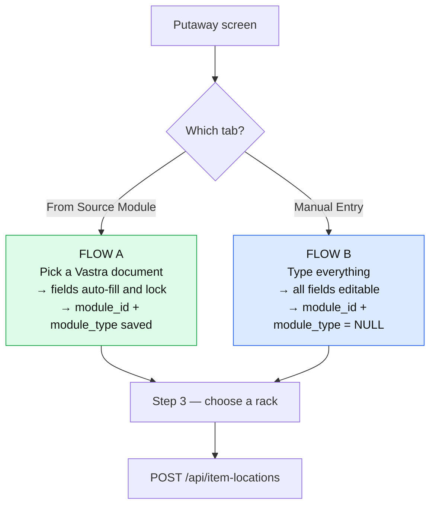
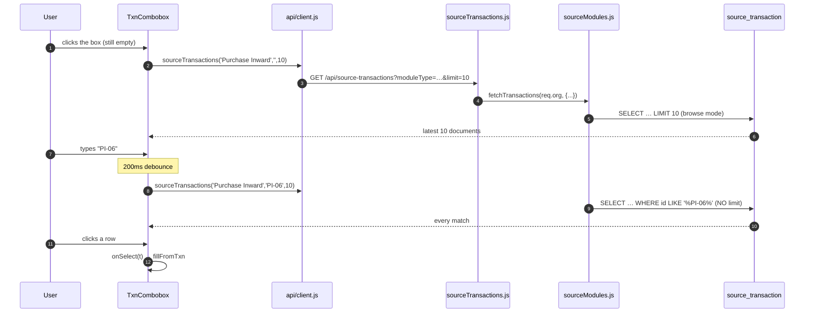
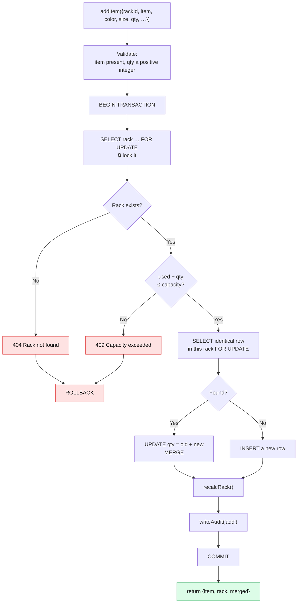
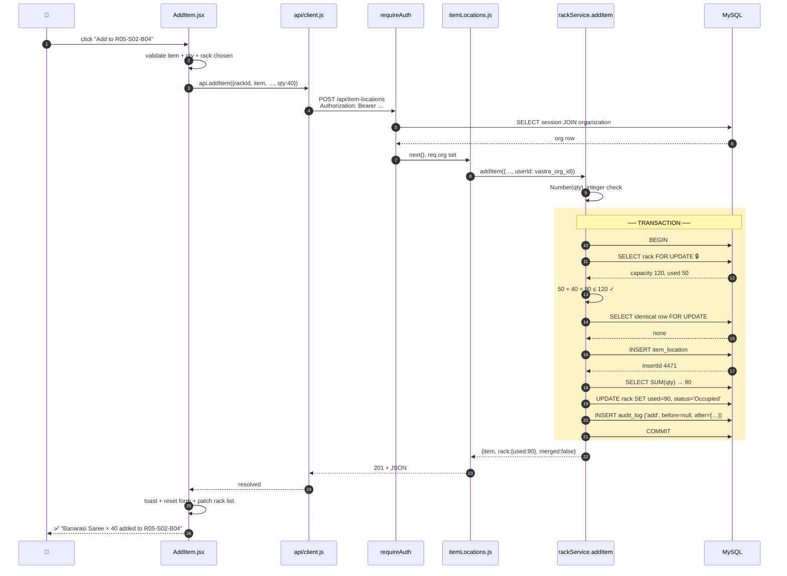
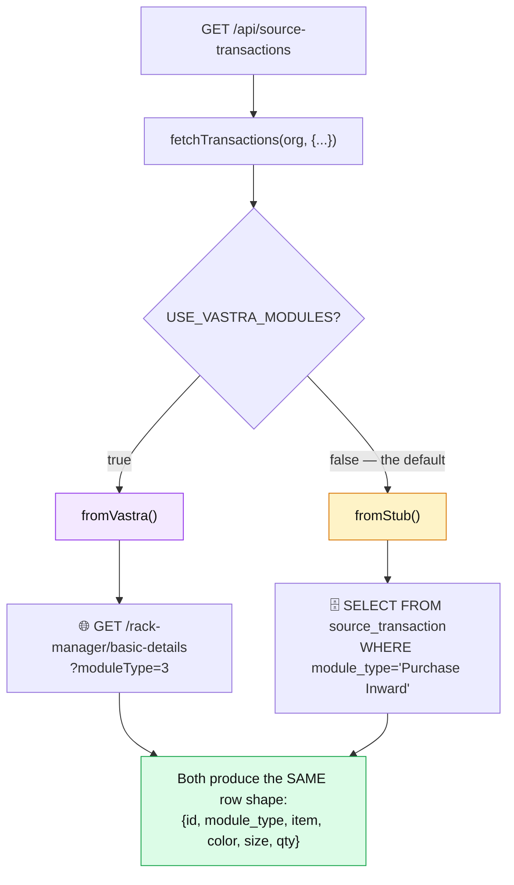

# 07 — Flow A & B: Putaway

[← Client Anatomy](06-client-anatomy.md) · [Next: Flow B — Move & Edit →](08-flow-B-move-and-edit.md)

---

> **Putaway = putting arriving goods into a rack, and recording where they went.**
>
> This is the first complete end-to-end trace in the guide. Follow it slowly — every other feature works the same way.

---

## The screen

📄 [`client/src/pages/AddItem.jsx`](../client/src/pages/AddItem.jsx) — sidebar label "Putaway", URL `/add`

Three steps down the left, a live summary on the right:

```
┌──────────────────────────────────────┬──────────────────┐
│ Step 1 — Item Source                 │ Summary          │
│  [From Source Module] [Manual Entry] │  Mode:  Source   │
│  Module: [Purchase Inward ▾]         │  Item:  Saree    │
│  Txn:    [search PI-06…      ]       │  Qty:   40       │
├──────────────────────────────────────┤  Module: PI      │
│ Step 2 — Item Details                │  ─────────────   │
│  Item [Banarasi Saree] Qty [40]      │  Rack: R05-S02   │
│  Color [Maroon]  Size [Free Size]    │  After: 90/120   │
├──────────────────────────────────────┤                  │
│ ⚠ Already stored in 2 racks          │                  │
├──────────────────────────────────────┤                  │
│ Step 3 — Select Rack                 │                  │
│  [grid of rack tiles]                │                  │
│  [ Add to R05-S02-B04 ]              │                  │
└──────────────────────────────────────┴──────────────────┘
```

---

## Flow A vs Flow B — one screen, two modes

📄 [`AddItem.jsx:10`](../client/src/pages/AddItem.jsx#L10)

```js
const [mode, setMode] = useState('source'); // 'source' (Flow A) | 'manual' (Flow B)
```



**The only difference in what gets saved** is whether `module_id` and `module_type` are filled in. Everything downstream — the merge, the capacity check, the audit entry — is identical.

That's why History and Item Management can display `Manual` as if it were a module: [`items.js:12`](../client/src/lib/items.js#L12)

```js
export const moduleCode = (row) => row.module_id || MANUAL;
```

A missing document *is* a kind of provenance, and treating it as one keeps every downstream screen simple.

---

## Step 1 — picking a source document (Flow A only)

### The module dropdown

📄 [`AddItem.jsx:91-93`](../client/src/pages/AddItem.jsx#L91-L93)

```jsx
<select className="form-control" value={moduleType} onChange={(e) => setModuleType(e.target.value)}>
  {MODULE_TYPES.map((m) => <option key={m}>{m}</option>)}
</select>
```

`MODULE_TYPES` comes from [`lib/rack.js:21`](../client/src/lib/rack.js#L21) — **four** entries, no Delivery Challan. The comment right above it:

> *"Delivery Challan is outbound and belongs to the Picklist tab alone, so it is deliberately not in here."*

### The transaction combobox

📄 [`AddItem.jsx:200-260`](../client/src/pages/AddItem.jsx#L200-L260)



The dropdown key is worth noticing — [`AddItem.jsx:248`](../client/src/pages/AddItem.jsx#L248):

```jsx
// One Vastra document yields a row per line item, so `id` (the
// document no) repeats — line_id is what's unique. Stub rows have
// no line_id and are already unique by id.
<div key={t.line_id ?? t.id} ...>
```

React requires unique keys among siblings. Live Vastra rows share a document number across lines, so `line_id` is used when present. `??` (nullish coalescing) falls back only for `null`/`undefined` — unlike `||`, which would also fall back on `0` or `''`.

### Auto-filling the form

📄 [`AddItem.jsx:34-35`](../client/src/pages/AddItem.jsx#L34-L35)

```js
const fillFromTxn = (t) =>
  setForm({ item: t.item, color: t.color, size: t.size, qty: t.qty, moduleType: t.module_type, moduleId: t.id });
```

Then the fields become read-only — [`AddItem.jsx:110`](../client/src/pages/AddItem.jsx#L110):

```jsx
<Field label="Item" required value={form.item}
  onChange={(v) => setForm({ ...form, item: v })}
  readOnly={mode === 'source' && !!form.moduleId} />
```

Item, colour and size lock; **quantity stays editable** ([line 111](../client/src/pages/AddItem.jsx#L111) has no `readOnly`).

> **Why?** The document says what the goods *are* — that must match exactly or the rack lookup will fail later. But it may say 100 units when only 60 physically arrived. The person at the loading dock is the authority on quantity, not the paperwork.

That's a business rule expressed as a UI decision, and it's the kind of detail worth being able to explain.

---

## Step 2 — the "already stored" hint

📄 [`AddItem.jsx:25-32`](../client/src/pages/AddItem.jsx#L25-L32)

```jsx
useEffect(() => {
  const it = (form.item || '').trim();
  if (!it) { setPlacements([]); return; }
  const t = setTimeout(() => {
    api.findPlacements(it, form.color || '', form.size || '').then(setPlacements).catch(() => setPlacements([]));
  }, 250);
  return () => clearTimeout(t);
}, [form.item, form.color, form.size]);
```

Whenever item/colour/size changes, ask the server: *is this exact variant already in a rack?*

The server side, [`rackService.js:76-88`](../server/src/services/rackService.js#L76-L88):

```js
export async function findPlacements(pool, { item, color = '', size = '' }) {
  if (!item) return [];
  const [rows] = await pool.query(
    `SELECT il.id, il.fk_rack_id AS rack_id, il.qty,
            rm.capacity, rm.used, (rm.capacity - rm.used) AS available
     FROM item_location il
     JOIN rack_master rm ON rm.rack_id = il.fk_rack_id
     WHERE il.item = ? AND il.color = ? AND il.size = ?
     ORDER BY il.qty DESC`,
    [item, color, size]
  );
  return rows;
}
```

> ⭐ **`findPlacements` is the single most reused query in the application.** It powers this hint *and* the entire picklist resolution ([`picklist.js:92`](../server/src/routes/picklist.js#L92)). One function, two major features.

Note `ORDER BY il.qty DESC` — biggest rack first. That ordering isn't cosmetic here; the picklist relies on it for its largest-rack-first allocation, with a comment saying so at [`picklist.js:90-91`](../server/src/routes/picklist.js#L90-L91).

### What the user sees

📄 [`AddItem.jsx:119-146`](../client/src/pages/AddItem.jsx#L119-L146)

```
⚠ Already stored in 2 racks
This exact item is already placed. Add to an existing rack to
consolidate, or pick a new rack below.

┌──────────────────────┬──────────────────────┐
│ R05-S02-B04          │ R02-S01-B03          │
│ has 40 here · 80 free│ has 15 here · 3 free │
│         [Add here]   │         [No room]    │
└──────────────────────┴──────────────────────┘
```

The button disables itself when there isn't room — [line 129](../client/src/pages/AddItem.jsx#L129):

```jsx
const noRoom = p.available < Number(form.qty || 0);
```

**Why this feature exists:** without it, the same variant scatters across a dozen racks over time and pickers waste minutes hunting. Nudging toward consolidation at the moment of decision is far cheaper than reorganising later.

---

## Step 3 — choosing a rack

📄 [`AddItem.jsx:62-64`](../client/src/pages/AddItem.jsx#L62-L64)

```js
const rackOptions = sortByEmptiness(
  racks.filter((r) => r.rack_id.toLowerCase().includes(rackSearch.toLowerCase()))
).slice(0, 8);
```

Filter by search → sort by emptiness → show 8.

`sortByEmptiness` ([`lib/rack.js:27`](../client/src/lib/rack.js#L27)) drops full racks entirely and puts completely-empty ones first, then the most spacious.

---

## The save — client side

📄 [`AddItem.jsx:46-60`](../client/src/pages/AddItem.jsx#L46-L60)

```js
const save = async () => {
  if (!form.item || !form.qty || form.qty <= 0) return toast('Item and a positive quantity are required', 'warning');
  if (!rackId) return toast('Select a rack', 'warning');
  try {
    const res = await api.addItem({ rackId, ...form, qty: Number(form.qty) });
    toast(`${form.item} × ${form.qty} added to ${rackId}`, 'success');
    setForm(mode === 'source' ? EMPTY : { ...EMPTY });
    setTxnResetKey((k) => k + 1);
    setRackId('');
    // refresh rack availability
    setRacks((rs) => rs.map((r) => (r.rack_id === res.rack.rack_id
      ? { ...r, used: res.rack.used, status: res.rack.status, available: r.capacity - res.rack.used }
      : r)));
  } catch (e) {
    toast(e.message, 'error');
  }
};
```

Three details:

**1. `qty: Number(form.qty)`** — HTML inputs always produce strings, even `type="number"`. Without the conversion the server would receive `"40"`, and `Number.isInteger("40")` is `false`, so it'd be rejected with a 400.

**2. `setTxnResetKey((k) => k + 1)`** — the combobox is rendered as `<TxnCombobox key={...-${txnResetKey}} />`. Changing a React `key` makes React **throw away and rebuild** the component, clearing all its internal state. It's the standard trick for "reset this child completely".

**3. The surgical state update** — rather than re-fetching all 100 racks, it patches the one rack that changed using values the server already returned. Instant UI, zero extra requests.

---

## The save — server side

### Route

📄 [`itemLocations.js:26-36`](../server/src/routes/itemLocations.js#L26-L36)

```js
router.post('/', async (req, res, next) => {
  try {
    const { rackId, item, color, size, qty, moduleType, moduleId } = req.body;
    const result = await addItem({
      rackId, item, color, size, qty, moduleType, moduleId,
      userId: req.org.vastra_org_id,
    });
    res.status(201).json(result);
  } catch (err) { next(err); }
});
```

Eleven lines. Unpack, call the service, respond `201 Created`.

Note `userId: req.org.vastra_org_id` — the logged-in organization becomes the audit author. The route never asks the client who they are; it uses what `requireAuth` established.

### Service — `addItem()`

📄 [`rackService.js:91-128`](../server/src/services/rackService.js#L91-L128)



Line by line:

```js
export async function addItem({ rackId, item, color = '', size = '', qty, moduleType = null, moduleId = null, userId = 'system' }) {
  qty = Number(qty);
  if (!item || !Number.isInteger(qty) || qty <= 0) {
    throw new HttpError(400, 'item and a positive integer qty are required');
  }
```

Validation **before** the transaction opens. No lock is taken for a request that was never going to succeed.

```js
  return withTransaction(async (conn) => {
    const rack = await getRackForUpdate(conn, rackId);
    assertCapacity(rack, rack.used + qty);
```

[`getRackForUpdate`](../server/src/services/rackService.js#L13) does `SELECT … FOR UPDATE` — the lock. [`assertCapacity`](../server/src/services/rackService.js#L41):

```js
function assertCapacity(rack, projectedUsed) {
  if (projectedUsed > rack.capacity) {
    throw new HttpError(409, `Capacity exceeded for ${rack.rack_id}: ${projectedUsed}/${rack.capacity}`);
  }
}
```

Note the message includes the actual numbers. `"Capacity exceeded for R05-S02-B04: 130/120"` tells you everything; `"Capacity exceeded"` tells you nothing.

**409 Conflict** is the right status here — the request was well-formed (not a 400), you're authenticated (not a 401), the rack exists (not a 404). It conflicts with the current state.

```js
    const [existing] = await conn.query(
      `SELECT id, qty FROM item_location
       WHERE fk_rack_id = ? AND item = ? AND color = ? AND size = ? LIMIT 1 FOR UPDATE`,
      [rackId, item, color, size]
    );
    let itemId, before, after;
    if (existing.length) {
      const newQty = existing[0].qty + qty;
      await conn.query('UPDATE item_location SET qty = ? WHERE id = ?', [newQty, existing[0].id]);
      itemId = existing[0].id;
      before = { id: itemId, item, color, size, qty: existing[0].qty, fk_rack_id: rackId };
      after = { id: itemId, item, color, size, qty: newQty, fk_rack_id: rackId, module_type: moduleType, module_id: moduleId };
    } else {
      const [res] = await conn.query(
        `INSERT INTO item_location (item, color, size, qty, fk_rack_id, module_id, module_type)
         VALUES (?, ?, ?, ?, ?, ?, ?)`,
        [item, color, size, qty, rackId, moduleId, moduleType]
      );
      itemId = res.insertId;
      before = null;
      after = { id: itemId, item, color, size, qty, fk_rack_id: rackId, module_type: moduleType, module_id: moduleId };
    }
```

**The merge.** From the comment at [lines 100-101](../server/src/services/rackService.js#L100-L101):

> *"Merge into an identical row already in this rack (same item/color/size), else insert a new row — so the same product never duplicates within a rack."*

Notice `before = null` for a fresh insert but a full object for a merge. **That distinction is exactly what the History screen uses** to work out how much was actually added — see [03 — The Database](03-the-database.md#the-merged-add-trap-and-how-history-fixes-it).

```js
    const rackState = await recalcRack(conn, rackId);
    await writeAudit(conn, { entityType: 'item_location', entityId: itemId, action: 'add', before, after, userId });
    return { item: after, rack: { rack_id: rackId, ...rackState }, merged: existing.length > 0 };
  });
}
```

Recalculate, audit, return. The response includes the fresh rack state, which is what lets the client patch its list without another request.

---

## The complete trace



---

## What the database looks like after

**`item_location`** — one new row:

| id | item | color | size | qty | fk_rack_id | module_id | module_type |
|----|------|-------|------|-----|-----------|-----------|-------------|
| 4471 | Banarasi Saree | Maroon | Free Size | 40 | R05-S02-B04 | PI-2026-0042 | Purchase Inward |

**`rack_master`** — one row updated:

| rack_id | capacity | used | status |
|---------|----------|------|--------|
| R05-S02-B04 | 120 | ~~50~~ **90** | Occupied |

**`audit_log`** — one new row:

| action | before_json | after_json | user_id |
|--------|-------------|------------|---------|
| add | `null` | `{"id":4471,"item":"Banarasi Saree",…,"qty":40,…}` | `12397` |

**All three, or none.** That's the transaction.

---

## Every way this can fail

| What went wrong | Where it's caught | Status | Message |
|-----------------|------------------|--------|---------|
| No item name | client + service | 400 | "item and a positive integer qty are required" |
| qty is 0 or negative | client + service | 400 | same |
| qty is `"abc"` | service | 400 | same |
| No rack selected | client only | — | toast "Select a rack" |
| Rack doesn't exist | service | 404 | "Rack XYZ not found" |
| Doesn't fit | service | 409 | "Capacity exceeded for R05-S02-B04: 130/120" |
| Not logged in | requireAuth | 401 | "Login required" |
| Org blocked | requireAuth | 403 | "Account is blocked" |
| Database down | error handler | 503 | "Database unavailable…" |

Notice how many appear **twice** — once in the client for a fast, friendly response, once in the service because that's the one that actually counts.

---

## Where the Vastra documents come from

The transaction dropdown reads through [`sourceModules.js`](../server/src/services/sourceModules.js), which switches between live Vastra and the local stub table.



> ⭐ **The key design idea:** both paths return the *identical shape*. The client cannot tell which one it got, so switching from fake to live data is a single environment variable — no code change anywhere.

The normalisation happens in [`vastraClient.js:117-142`](../server/src/vastraClient.js#L117-L142) (`flatten()`), covered in [10 — Vastra Integration](10-vastra-integration.md).

### The no-module fan-out

If you don't pass a `moduleType`, [`fetchTransactions`](../server/src/services/sourceModules.js#L91-L102) returns rows from **all four inbound modules**:

```js
if (!moduleType) {
  // The stub table holds outbound challans too, so an unfiltered read has to
  // exclude them by hand — Vastra's fan-out above is already inbound-only.
  const rows = await fromStub({ q, limit: limit * 4 });
  const inbound = rows.filter((r) => MODULE_TYPES.includes(r.module_type));
  return q ? inbound : inbound.slice(0, limit);
}
```

The stub table needs an explicit filter because it holds challans too. The Vastra path doesn't, because it iterates `MODULE_TYPES` which never contained the challan. **Same guarantee, two mechanisms, because the two data sources have different shapes.**

`limit * 4` over-fetches so that after filtering there are still roughly `limit` rows left.

---

## Try it yourself

```bash
# 1. Log in through the UI, then grab the token
#    F12 → Application → Local Storage → wms-token
TOKEN="paste-it-here"

# 2. See what documents are available
curl -s "localhost:4000/api/source-transactions?moduleType=Purchase%20Inward&limit=3" \
  -H "Authorization: Bearer $TOKEN" | jq

# 3. Find a rack with space
curl -s localhost:4000/api/racks -H "Authorization: Bearer $TOKEN" \
  | jq '[.[] | select(.available > 50)][0]'

# 4. Add stock
curl -s -X POST localhost:4000/api/item-locations \
  -H "Authorization: Bearer $TOKEN" -H 'Content-Type: application/json' \
  -d '{"rackId":"R01-S01-B01","item":"Test Item","color":"Red","size":"M","qty":5}' | jq

# 5. Try to overfill it — expect a 409
curl -s -X POST localhost:4000/api/item-locations \
  -H "Authorization: Bearer $TOKEN" -H 'Content-Type: application/json' \
  -d '{"rackId":"R01-S01-B01","item":"Test Item","color":"Red","size":"M","qty":99999}' | jq

# 6. Add the SAME variant again — watch it merge (merged: true)
curl -s -X POST localhost:4000/api/item-locations \
  -H "Authorization: Bearer $TOKEN" -H 'Content-Type: application/json' \
  -d '{"rackId":"R01-S01-B01","item":"Test Item","color":"Red","size":"M","qty":3}' | jq

# 7. Confirm in the audit trail
curl -s "localhost:4000/api/audit-log?action=add" -H "Authorization: Bearer $TOKEN" | jq '.[0]'
```

Step 6 is the one to actually run — seeing `"merged": true` and the qty jump from 5 to 8 makes the merge rule concrete.

---

## Checkpoint

1. What's the only difference between what Flow A and Flow B store?
2. Why is quantity editable when item/colour/size are locked?
3. What does `findPlacements` do, and which two features use it?
4. What happens when you add a variant that's already in that rack?
5. Why is `before_json` `null` for a new row but populated for a merge?
6. Why is `Number(form.qty)` necessary in the client?
7. Why does changing a React `key` reset the combobox?

---

Next: **[08 — Flow B: Move & Edit](08-flow-B-move-and-edit.md)**
