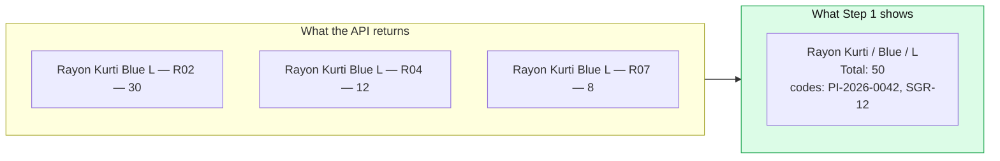
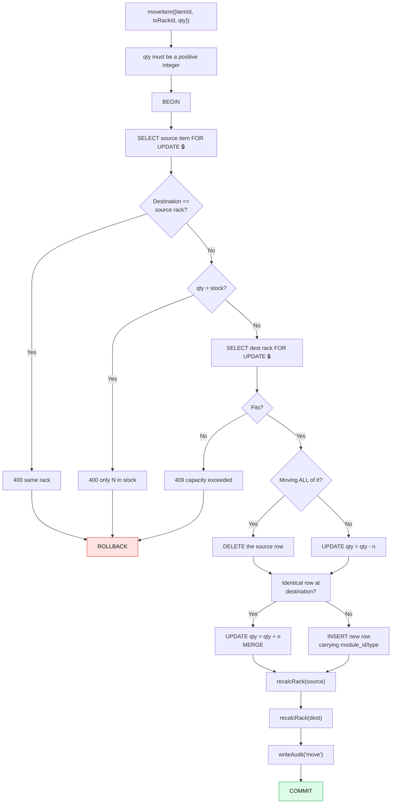
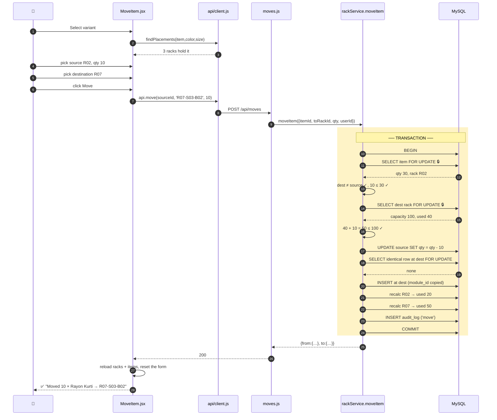
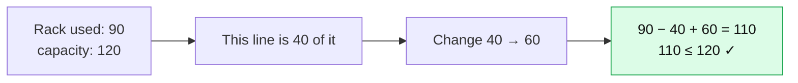

# 08 — Move & Edit

[← Flow A: Putaway](07-flow-A-putaway.md) · [Next: Flow C — Picklist →](09-flow-C-picklist.md)

---

> Two operations that change stock without anything entering or leaving the warehouse: **moving** between racks, and **correcting** a quantity.

---

# Part 1 — Move Item

## The screen

📄 [`client/src/pages/MoveItem.jsx`](../client/src/pages/MoveItem.jsx) — URL `/move`

Three steps, revealed progressively:

```
┌─────────────────────────┬──────────────────────────┐
│ Step 1 — Select Item    │ Step 2 — Source Rack     │
│ [search…            ]   │  (empty until step 1)    │
│ ┌─────────────────────┐ │  ┌────────┐ ┌────────┐   │
│ │Rayon Kurti  Blue  L │ │  │R02-S01 │ │R04-S02 │   │
│ │  PI-2026-0042       │ │  │30 here │ │12 here │   │
│ │           [Select]  │ │  └────────┘ └────────┘   │
│ └─────────────────────┘ │  Qty to move: [10  ]     │
└─────────────────────────┴──────────────────────────┘
┌────────────────────────────────────────────────────┐
│ Step 3 — Destination     (appears after step 2)    │
│  To Rack [search…]     From R02-S01 → To R07-S03   │
│  [ Move 10 × Rayon Kurti → R07-S03-B02 ]           │
└────────────────────────────────────────────────────┘
```

Step 3 only exists once a source is chosen — [`MoveItem.jsx:150`](../client/src/pages/MoveItem.jsx#L150):

```jsx
{source && (
  <div className="card mt-4" style={{ overflow: 'visible' }}>
```

**Progressive disclosure.** The screen never shows a control that can't yet be used meaningfully.

---

## Step 1 — variants, not rows

📄 [`MoveItem.jsx:27-37`](../client/src/pages/MoveItem.jsx#L27-L37)

```jsx
const variants = useMemo(() => {
  const map = new Map();
  for (const r of items) {
    const k = variantKey(r);
    const v = map.get(k) || { item: r.item, color: r.color, size: r.size, total: 0, codes: new Set() };
    v.total += r.qty;
    v.codes.add(moduleCode(r));
    map.set(k, v);
  }
  return [...map.values()].sort((a, b) => a.item.localeCompare(b.item));
}, [items]);
```

with [`line 7`](../client/src/pages/MoveItem.jsx#L7):

```js
const variantKey = (r) => `${r.item}|${r.color}|${r.size}`;
```

The API returns one row per *rack*. If "Rayon Kurti / Blue / L" sits in three racks, that's three rows. This groups them into **one** entry showing the total across all racks.



**Why?** You think "I want to move some Blue L kurtis", not "I want to move row #4471". Choosing the product first, then the rack, matches how people actually reason.

`codes` is a `Set` because the same variant can have arrived on several documents. The [`ModuleCodes`](../client/src/pages/MoveItem.jsx#L188) component shows two and collapses the rest into `+3`, so the cell stays one line.

---

## Step 2 — the same `findPlacements` again

📄 [`MoveItem.jsx:44-49`](../client/src/pages/MoveItem.jsx#L44-L49)

```jsx
const chooseVariant = async (v) => {
  setVariant(v); setSource(null); setToRackId(''); setQty(1); setPlacements([]);
  try {
    setPlacements(await api.findPlacements(v.item, v.color, v.size));
  } catch (e) { toast(e.message, 'error'); }
};
```

Selecting a variant resets **everything downstream** before fetching. If you'd already picked a source rack and a destination for a different item, leaving those set would be a bug waiting to happen.

> **A habit worth copying:** when a step changes, explicitly clear every step after it. Cheap to write, eliminates a whole category of stale-state bugs.

---

## Step 3 — destination

📄 [`MoveItem.jsx:53`](../client/src/pages/MoveItem.jsx#L53)

```jsx
const destCandidates = sortByEmptiness(racks.filter((r) => r.rack_id !== source?.rack_id));
```

Excludes the source rack (moving to yourself is meaningless — and the server rejects it too) and orders emptiest-first.

The live preview at [lines 160-173](../client/src/pages/MoveItem.jsx#L160-L173) shows a progress bar of what the destination will look like *after* the move:

```jsx
<div className="progress mt-1">
  <div className={`progress-bar ${pctColorClass(pct(destRack.used + Number(qty || 0), destRack.capacity))}`}
       style={{ width: `${pct(destRack.used + Number(qty || 0), destRack.capacity)}%` }} />
</div>
```

`destRack.used + qty` — the projected value, not the current one. You see the consequence before committing.

---

## The server — `moveItem()`

📄 [`rackService.js:232-280`](../server/src/services/rackService.js#L232-L280)

This is the most intricate function in `rackService.js` because it touches **two** racks atomically.



### The checks, in order

```js
const src = await getItemForUpdate(conn, itemId);
if (toRackId === src.fk_rack_id) throw new HttpError(400, 'Destination rack is the same as source');
if (qty > src.qty) throw new HttpError(400, `Cannot move ${qty}; only ${src.qty} in stock`);

const destRack = await getRackForUpdate(conn, toRackId);
assertCapacity(destRack, destRack.used + qty);
const srcRackId = src.fk_rack_id;
```

Note the order: **lock the source first, then the destination.** Both locks are held for the rest of the transaction.

> ⚠️ **This is a deadlock risk the codebase does not currently guard against.** Two simultaneous moves in opposite directions (A→B and B→A) could each hold one lock and wait for the other. `pickItems` explicitly sorts its locks to avoid exactly this ([`rackService.js:180-181`](../server/src/services/rackService.js#L180-L181)) but `moveItem` doesn't.
>
> In practice, two people moving stock between the same two racks within the same few milliseconds is vanishingly unlikely, and MySQL detects deadlocks and kills one transaction with an error rather than hanging. So it's a real but low-severity gap — worth *knowing* about, since being able to name a genuine weakness is more impressive than pretending there aren't any.

### The three-part write

```js
// Deduct from source (delete the row if it empties out).
if (qty === src.qty) {
  await conn.query('DELETE FROM item_location WHERE id = ?', [itemId]);
} else {
  await conn.query('UPDATE item_location SET qty = qty - ? WHERE id = ?', [qty, itemId]);
}

// Merge into an identical row in the destination, else insert a new one.
const [existing] = await conn.query(
  `SELECT id, qty FROM item_location
   WHERE fk_rack_id = ? AND item = ? AND color = ? AND size = ? LIMIT 1 FOR UPDATE`,
  [toRackId, src.item, src.color, src.size]
);
if (existing.length) {
  await conn.query('UPDATE item_location SET qty = qty + ? WHERE id = ?', [qty, existing[0].id]);
} else {
  await conn.query(
    `INSERT INTO item_location (item, color, size, qty, fk_rack_id, module_id, module_type)
     VALUES (?, ?, ?, ?, ?, ?, ?)`,
    [src.item, src.color, src.size, qty, toRackId, src.module_id, src.module_type]
  );
}
```

**The provenance carries over.** `src.module_id` and `src.module_type` are copied to the new row — moving goods doesn't change where they came from. Miss that and a move would silently turn documented stock into "Manual".

**The same merge rule as `addItem`.** Move into a rack that already holds this variant and the rows combine.

### Recalculating both racks

```js
const srcState = await recalcRack(conn, srcRackId);
const destState = await recalcRack(conn, toRackId);
```

Both, always. The source got emptier, the destination fuller. Recalculating only one would leave the other permanently wrong.

Note `srcRackId` is captured **before** the deletion ([line 242](../server/src/services/rackService.js#L242)) — after the row is deleted, `src.fk_rack_id` is still in memory but it's clearer to have saved it explicitly.

### The audit shape

```js
await writeAudit(conn, {
  entityType: 'item_location', entityId: itemId, action: 'move',
  before: { rack: srcRackId, item: src.item, color: src.color, size: src.size, qty: src.qty },
  after: { fromRack: srcRackId, toRack: toRackId, movedQty: qty },
  userId,
});
```

A move's `after_json` doesn't describe a row state — it describes *the movement*. That's why the Dashboard's activity feed has a special case, [`Dashboard.jsx:160`](../client/src/pages/Dashboard.jsx#L160):

```js
if (r.action === 'move') return `${a.fromRack} → ${a.toRack} · ${a.movedQty} units`;
```

And the Movement Report reads the same fields, [`Reports.jsx:24`](../client/src/pages/Reports.jsx#L24):

```js
row: (r) => [..., r.after_json?.fromRack || '—', r.after_json?.toRack || '—', r.after_json?.movedQty ?? '—', ...]
```

> Note `?? '—'` for `movedQty` but `|| '—'` for the rack names. `??` only falls back on `null`/`undefined`, so a legitimate `0` would still display as `0`. `||` would turn it into `—`. A small correctness detail worth noticing.

---

## Full move trace



After a successful move, [`MoveItem.jsx:64-65`](../client/src/pages/MoveItem.jsx#L64-L65) reloads **both** lists and resets the form:

```js
await Promise.all([loadRacks(), loadItems()]);
reset();
```

Unlike AddItem's surgical patch, a move changes two racks and possibly deletes a row — a full reload is simpler and correct. `Promise.all` runs both requests in parallel rather than one after the other.

---

# Part 2 — Editing a quantity

## Where it lives

Not its own page. It's inside the rack detail modal on the Rack Management screen.

📄 [`RackList.jsx:186-196`](../client/src/pages/RackList.jsx#L186-L196)

```jsx
<td>
  <input type="number" min="0" defaultValue={it.qty} style={{ width: 70 }} className="form-control"
    onKeyDown={(e) => { if (e.key === 'Enter') setQty(it.id, Number(e.target.value)); }} />
</td>
<td>
  <button className="btn btn-ghost btn-sm" onClick={() => setQty(it.id, 0)} title="Remove">
    <i className="fa-solid fa-trash" />
  </button>
</td>
```

With the hint below the table at [line 201](../client/src/pages/RackList.jsx#L201):

> *"Edit a quantity and press Enter to save. Set to 0 (or trash) to remove."*

### Two things to notice

**1. `defaultValue`, not `value`.** This is an **uncontrolled input** — React sets the starting value and then leaves it alone. A controlled input would need `onChange` state on every keystroke and a save on blur. For "type a number, press Enter", uncontrolled is simpler and there's nothing to keep in sync.

**2. The trash button is just `setQty(id, 0)`.** Deleting isn't a separate operation — it's the natural consequence of setting the quantity to zero. One server endpoint covers both.

```jsx
const setQty = async (id, qty) => {
  try {
    await api.updateItemQty(id, qty);
    toast(qty === 0 ? 'Item removed' : 'Quantity updated', 'success');
    onChanged();
  } catch (e) {
    toast(e.message, 'error');
  }
};
```

`onChanged()` is passed from the parent at [line 124](../client/src/pages/RackList.jsx#L124):

```jsx
onChanged={async () => { await load(); await openRack(selected.rack_id); }}
```

Reload the whole list **and** re-fetch the open rack, so both the grid behind and the modal in front are current.

---

## The server — `updateItemQty()`

📄 [`rackService.js:130-156`](../server/src/services/rackService.js#L130-L156)

```js
export async function updateItemQty({ id, qty, userId = 'system' }) {
  qty = Number(qty);
  if (!Number.isInteger(qty) || qty < 0) {
    throw new HttpError(400, 'qty must be an integer >= 0 (0 removes the item)');
  }
  return withTransaction(async (conn) => {
    const before = await getItemForUpdate(conn, id);
    const rack = await getRackForUpdate(conn, before.fk_rack_id);
    const projectedUsed = rack.used - before.qty + qty;
    assertCapacity(rack, projectedUsed);

    let action;
    if (qty === 0) {
      await conn.query('DELETE FROM item_location WHERE id = ?', [id]);
      action = 'remove';
    } else {
      await conn.query('UPDATE item_location SET qty = ? WHERE id = ?', [qty, id]);
      action = 'update';
    }
    const rackState = await recalcRack(conn, before.fk_rack_id);
    await writeAudit(conn, {
      entityType: 'item_location', entityId: id, action,
      before, after: qty === 0 ? null : { ...before, qty }, userId,
    });
    return { removed: qty === 0, rack: { rack_id: before.fk_rack_id, ...rackState } };
  });
}
```

### The capacity arithmetic

```js
const projectedUsed = rack.used - before.qty + qty;
```

**Subtract the old, add the new.** If the rack holds 90 total and this line is 40 of it, changing to 60 gives `90 - 40 + 60 = 110`. Just checking `rack.used + qty` would compute 150 and wrongly reject it.



### `qty >= 0`, unlike everywhere else

Every other function requires `qty > 0`. This one allows `0` because zero is the delete signal — and the error message says so explicitly: *"qty must be an integer >= 0 (0 removes the item)"*.

### The audit distinction

```js
before, after: qty === 0 ? null : { ...before, qty },
```

`after_json` is `null` for a removal. That's the mirror image of `before_json` being `null` for a fresh add. The pattern across the whole audit table:

| | before | after |
|---|---|---|
| Created | `null` | the row |
| Changed | the row | the row |
| Deleted | the row | `null` |

`{ ...before, qty }` spreads the old row and overrides just `qty` — the shortest correct way to say "same row, new quantity".

---

## Where else quantities get edited

Two other paths, and it's worth knowing they're distinct:

| Path | Endpoint | Service | Purpose |
|------|----------|---------|---------|
| Rack modal | `PATCH /api/item-locations/:id` | `updateItemQty` | Manual correction |
| Picklist | `POST /api/picklist/pick` | `pickItems` | Fulfilling a challan |

Both can produce `update` or `remove` audit rows. What distinguishes them is `after_json.source` — see the comment at [`rackService.js:205-210`](../server/src/services/rackService.js#L205-L210):

> *"`remove` when the row empties, `update` when it survives — both already in the audit_log.action ENUM, and both also mean 'someone edited a quantity by hand'. `source: 'picklist'` is what separates the two, so the Audit Log still shows WHY the stock left even when there is no challan number."*

So in the Audit Log:

```json
{ "id": 4471, "item": "Rayon Kurti", "qty": 20, "fk_rack_id": "R02-S01-B03" }
```
→ a manual correction

```json
{ "source": "picklist", "pickedQty": 10, "remainingQty": 20, "rack": "R02-S01-B03", "picklist": "DC-2026-0007" }
```
→ a picklist fulfilment

**The `picklist` field appears only when a challan number is known**, because manual picklist entry may not have one. The presence of `source: 'picklist'` is the reliable signal; the challan number is a bonus.

---

## Comparing all four stock operations

| | `addItem` | `moveItem` | `updateItemQty` | `pickItems` |
|---|---|---|---|---|
| Racks touched | 1 | 2 | 1 | many |
| Capacity check | ✅ | ✅ (dest) | ✅ (projected) | ❌ not needed |
| Can delete a row | ❌ | ✅ (if all moved) | ✅ (qty 0) | ✅ (if emptied) |
| Can create a row | ✅ | ✅ (at dest) | ❌ | ❌ |
| Merges | ✅ | ✅ | ❌ | ❌ |
| Audit action | `add` | `move` | `update`/`remove` | `update`/`remove` |
| Multiple rows at once | ❌ | ❌ | ❌ | ✅ |
| Lock ordering guard | n/a | ❌ | n/a | ✅ sorted by id |

### Why `pickItems` needs no capacity check

From [`rackService.js:159-160`](../server/src/services/rackService.js#L159-L160):

> *"Deduction only — a rack's `used` can only fall here, so there is no capacity check."*

If `used` can only decrease, it can never exceed `capacity`. Skipping the check isn't laziness — it's recognising that the constraint is unreachable.

---

## Try it yourself

```bash
TOKEN="your-token"

# Find something to move
curl -s localhost:4000/api/item-locations -H "Authorization: Bearer $TOKEN" | jq '.[0]'

# Move 5 units (use the id and a different rack)
curl -s -X POST localhost:4000/api/moves \
  -H "Authorization: Bearer $TOKEN" -H 'Content-Type: application/json' \
  -d '{"itemId":4471,"toRackId":"R09-S01-B01","qty":5}' | jq

# Try moving to the same rack — expect 400
curl -s -X POST localhost:4000/api/moves \
  -H "Authorization: Bearer $TOKEN" -H 'Content-Type: application/json' \
  -d '{"itemId":4471,"toRackId":"R05-S02-B04","qty":5}' | jq

# Try moving more than exists — expect 400 naming the real amount
curl -s -X POST localhost:4000/api/moves \
  -H "Authorization: Bearer $TOKEN" -H 'Content-Type: application/json' \
  -d '{"itemId":4471,"toRackId":"R09-S01-B01","qty":99999}' | jq

# Correct a quantity
curl -s -X PATCH localhost:4000/api/item-locations/4471 \
  -H "Authorization: Bearer $TOKEN" -H 'Content-Type: application/json' \
  -d '{"qty":25}' | jq

# Remove it entirely
curl -s -X PATCH localhost:4000/api/item-locations/4471 \
  -H "Authorization: Bearer $TOKEN" -H 'Content-Type: application/json' \
  -d '{"qty":0}' | jq
# → {"removed": true, "rack": {...}}

# See it all in the audit trail
curl -s "localhost:4000/api/audit-log?action=move" -H "Authorization: Bearer $TOKEN" | jq '.[0]'
```

---

## Checkpoint

1. Why does Step 1 group by variant instead of listing raw rows?
2. Why does `moveItem` copy `module_id` and `module_type` to the destination row?
3. Why must both racks be recalculated?
4. Why is `projectedUsed = used - before.qty + qty` rather than `used + qty`?
5. Why does `updateItemQty` allow 0 when other functions don't?
6. What tells a picklist deduction apart from a manual edit in the audit log?
7. Why does `pickItems` skip the capacity check?

---

Next: **[09 — Flow C: Picklist](09-flow-C-picklist.md)** — the biggest feature in the app.
