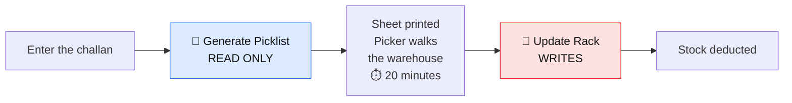
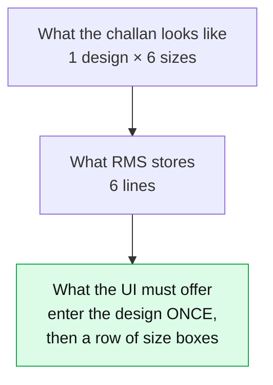
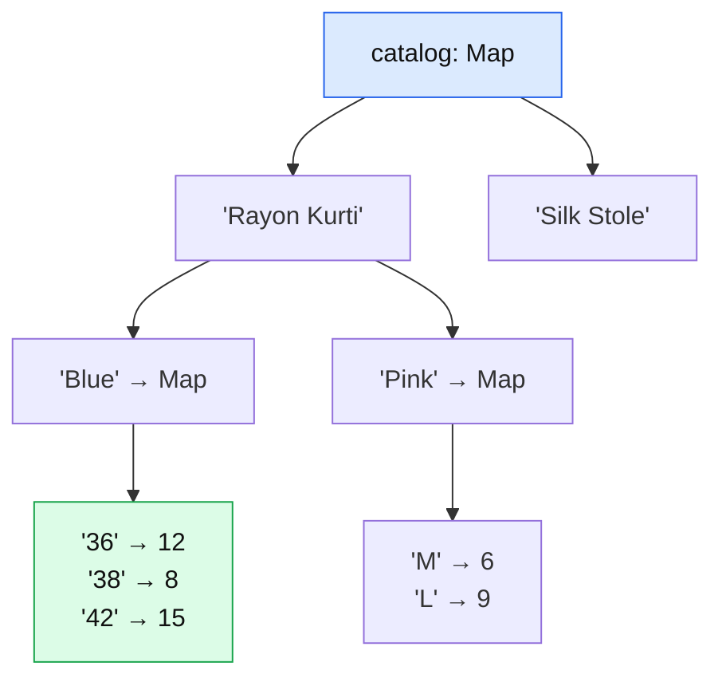
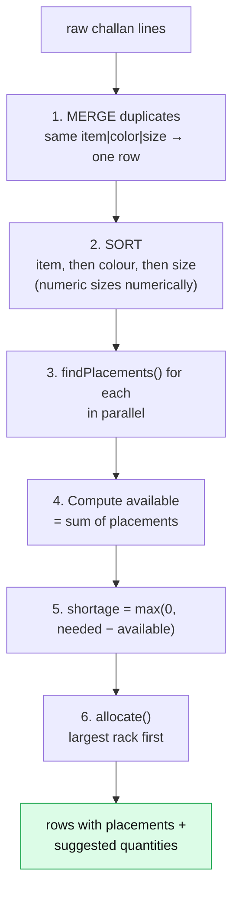
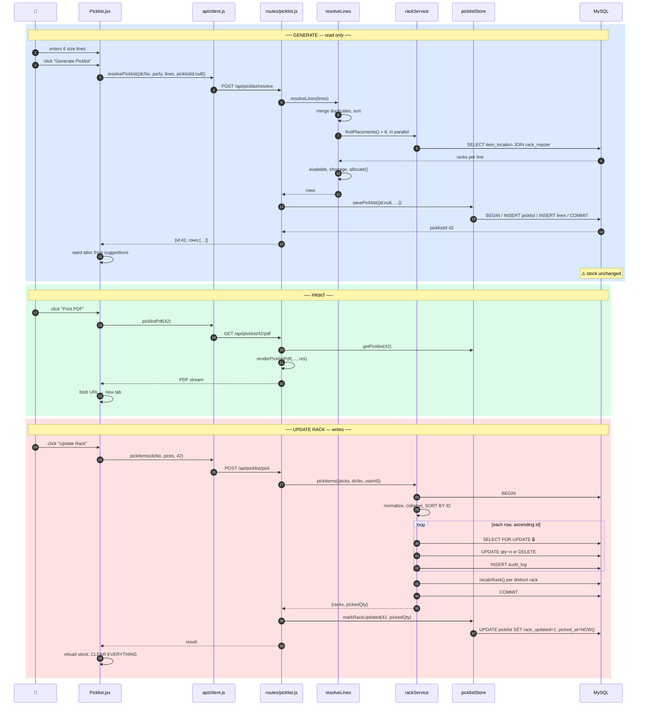
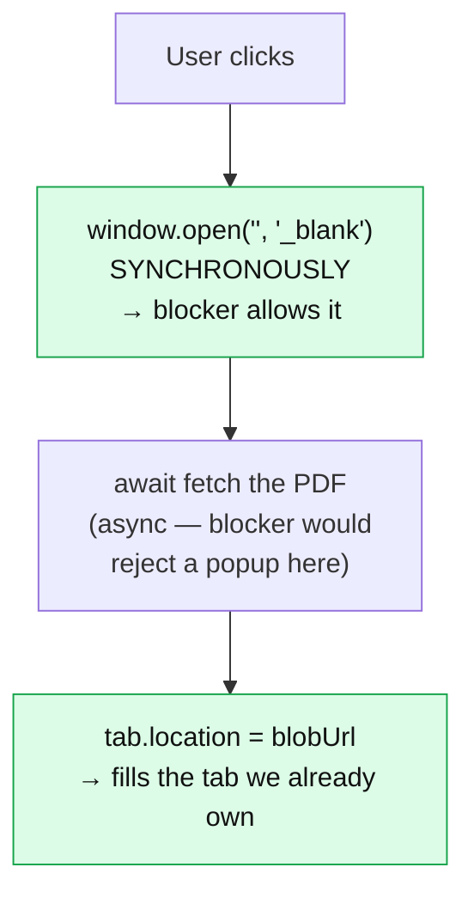
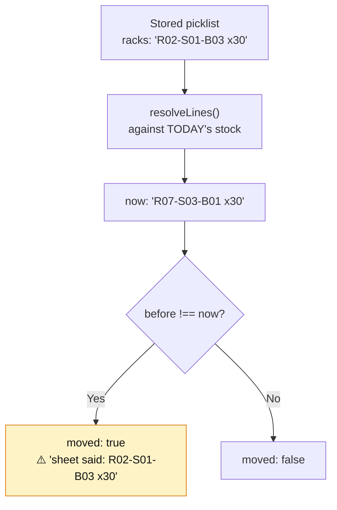

# 09 — Flow C: The Picklist

[← Move & Edit](08-flow-B-move-and-edit.md) · [Next: Vastra Integration →](10-vastra-integration.md)

---

> **The biggest and most carefully designed feature in the application.** 655 lines of client, 205 of route, plus three dedicated services and two database tables.
>
> Take this one slowly. If you understand the picklist, you understand this codebase.

---

## The problem it solves

A Delivery Challan arrives: *"Ship 9 Rayon Kurtis to Keshav Textiles — 1×36, 2×38, 3×42, 1×44, 1×46, 1×L."*

The picker needs to know **which shelf each of those sizes is on**. Without RMS they'd wander. With RMS they get a sheet listing the rack for every line.

---

## The two-step rule (the design's foundation)

From [`picklist.js:14-15`](../server/src/routes/picklist.js#L14-L15):

> *"Two deliberate steps: `GET /:dcNo` only reads (generating a picklist must never touch stock), `POST /:dcNo/pick` is the one that writes."*



**Why it must be two steps:** during those 20 minutes the system must still tell the truth about what's on the shelves. If generating had deducted, every other user would see phantom shortages. And if the picker found an empty shelf and abandoned the job, the deduction would already be permanent.

---

## The size run — the thing that shapes the whole UI

📄 [`challanFixtures.js:3-12`](../server/challanFixtures.js#L3-L12)

```
Sr  Item          Color      36  38  42  44  46  L   Total
1   DES-5044 …    No Color   1   2   3   1   1   1   9
```

**One design, one colour, spread across a row of sizes with a quantity each.** That's how garment challans are actually printed.

It reaches RMS as **six separate lines**, differing only in size. So the entry form must let you type a design *once* and fill in a row of quantities — not force you through six identical forms.



This single fact drives the entire Step 2 design.

---

## The screen

📄 [`client/src/pages/Picklist.jsx`](../client/src/pages/Picklist.jsx) — URL `/picklist`

```
┌───────────────────────────────────────────┬──────────────┐
│ Step 1 — Delivery Challan                 │ Summary      │
│  [Manual Entry] [From Vastra Module]      │  Items: 2    │
│  Challan No [DC-2026-0007] Party [Keshav] │  Lines: 6    │
├───────────────────────────────────────────┤  Total: 9    │
│ Step 2 — Items on the Challan             │  In racks: 7 │
│  Sr  Item        Color  Sizes       Qty   │  Short: 2    │
│  1   Rayon Kurti Blue   36×1 38×2   9     │  ───────     │
│                                            │  Alloc: 7    │
│  ┌── Item 2 ──────────────────────────┐   │              │
│  │ Item/Design [Rayon Kurti  ]        │   │              │
│  │ Color       [Blue ▾]               │   │              │
│  │ Quantity per size                  │   │              │
│  │  ┌──┐┌──┐┌──┐┌──┐                  │   │              │
│  │  │36││38││42││44│                  │   │              │
│  │  │1 ││2 ││3 ││1 │                  │   │              │
│  │  │12││ 8││15││ 4│ in stock         │   │              │
│  │  └──┘└──┘└──┘└──┘                  │   │              │
│  │  [+ Add item]                      │   │              │
│  └────────────────────────────────────┘   │              │
├───────────────────────────────────────────┴──────────────┤
│ Picklist — DC-2026-0007        [7 of 9] [Print PDF]      │
│  Item        Color Size Qty        Rack                  │
│  Rayon Kurti Blue  36   1          R02-S01-B03 [1] of 12 │
│  Rayon Kurti Blue  38   2          R04-S02-B01 [2] of 8  │
│  Rayon Kurti Blue  46   1 short 1  Not in any rack       │
│  [ Update Rack ]  Generating changed nothing…            │
└──────────────────────────────────────────────────────────┘
```

---

## Step 1 — the challan header

📄 [`Picklist.jsx:229-253`](../client/src/pages/Picklist.jsx#L229-L253)

Two tabs. **Manual Entry** is the one that works today; **From Vastra Module** is built and tested but waiting on Vastra to serve the module.

The critical insight is in the comment at [lines 26-29](../client/src/pages/Picklist.jsx#L26-L29):

> *"The challan is not recreated here — it already exists in the Vastra app. Manual entry is only its item details, transcribed to find the racks."*

So Challan No and Party are **optional** in manual mode:

```jsx
<Field label="Challan No" value={dcNo} placeholder="optional — for the history record" ... />
<Field label="Party" value={party} placeholder="optional" onChange={setParty} />
<p className="text-xs text-muted">
  Both optional. Filling in the challan no. is what lets you find this picklist again in
  History if the stock ever looks wrong.
</p>
```

> **Why optional?** RMS is not the system of record for challans — Vastra is. Forcing a challan number would make people invent one. Instead the help text explains the *benefit* of filling it in and leaves the choice to them.
>
> That's a genuinely mature product decision: don't make a field mandatory unless *you* need it; explain why it helps and let the user decide.

---

## Step 2 — entering the lines

### The catalogue is built from actual stock

📄 [`Picklist.jsx:42-57`](../client/src/pages/Picklist.jsx#L42-L57)

```jsx
// Typed item/colour/size text has to match the stored stock exactly for a
// rack lookup to hit, so every field is backed by what is actually in the
// racks rather than left as free text with no safety net.
useEffect(() => { api.listItems().then(setStock).catch((e) => toast(e.message, 'error')); }, []);

const catalog = useMemo(() => {
  const byItem = new Map();
  for (const r of stock) {
    const colors = byItem.get(r.item) || new Map();
    const sizes = colors.get(r.color || '') || new Map();
    sizes.set(r.size || '', (sizes.get(r.size || '') || 0) + Number(r.qty || 0));
    colors.set(r.color || '', sizes);
    byItem.set(r.item, colors);
  }
  return byItem;
}, [stock]);
```

A **three-level nested Map**: `item → color → size → total quantity`.



Why this shape? Because the form asks three questions in sequence, and each answer narrows the next:

```jsx
const draftColors = useMemo(() => [...(catalog.get(draft.item)?.keys() ?? [])].sort(), [catalog, draft.item]);
const draftSizes = useMemo(() => {
  const sizes = catalog.get(draft.item)?.get(draft.color);
  return sizes ? [...sizes.entries()].sort((a, b) => sizeKey(a[0]) - sizeKey(b[0]) || a[0].localeCompare(b[0])) : [];
}, [catalog, draft.item, draft.color]);
```

Pick an item → its colours appear. Pick a colour → its size run appears, with current stock under each box.

**The reason this matters:** rack lookup is an exact string match. Type "rayon kurti" instead of "Rayon Kurti" and the picklist reports everything as short with no explanation. Backing the fields with real stock makes that near-impossible.

### The `ItemCombobox` and the `<datalist>` bug it replaced

📄 [`Picklist.jsx:532-536`](../client/src/pages/Picklist.jsx#L532-L536)

```js
// Item picker over what is actually in the racks. A plain <datalist> wasn't
// enough: it only resolves on an exact full-string match, so typing "Dupatta"
// left "Chiffon Dupatta" unreachable and the size run never appeared. This
// matches on any substring and fills in the stored name when you pick one.
// Free text is still allowed — the caller warns and lets it through.
```

A real bug, diagnosed and fixed, with the reasoning preserved. HTML's `<datalist>` only matches from the start of the string — searching by the *distinctive* part of a name simply didn't work.

```js
const matches = items.filter((n) => n.toLowerCase().includes(q)).slice(0, 8);
const exact = items.some((n) => n === value);
...
{open && matches.length > 0 && !exact && (
```

`!exact` hides the dropdown once you've typed a complete name — no point suggesting what you've already got.

### The size-run grid

📄 [`Picklist.jsx:336-366`](../client/src/pages/Picklist.jsx#L336-L366)

```jsx
{draftSizes.map(([size, have]) => {
  // A challan can legitimately ask for more than we hold — that is what the
  // shortage badge is for — so this warns rather than clamping. Clamping
  // would quietly rewrite the customer's order.
  const over = (Number(draft.sizeQty[size]) || 0) > have;
  return (
    <div key={size} className={`size-cell ${over ? 'over' : ''}`}>
      <div className="size-cell-label">{size || 'no size'}</div>
      <input className="form-control" type="number" min="0" placeholder="0"
        value={draft.sizeQty[size] ?? ''}
        onChange={(e) => setDraft({ ...draft, sizeQty: { ...draft.sizeQty, [size]: e.target.value } })} />
      <div className="size-cell-stock">{have} in stock</div>
      {over && <div className="size-cell-over">only {have}</div>}
    </div>
  );
})}
```

> ⭐ **"Clamping would quietly rewrite the customer's order."**
>
> This is the most important line of reasoning in the whole feature. It would be easy — and it would *feel* helpful — to cap the input at available stock. But the challan is a customer's order. If they ordered 10 and you only have 6, the correct behaviour is to **record the request of 10 and flag a shortage of 4**, not to silently pretend they asked for 6.
>
> Software that silently changes what you typed is software you can't trust. Warn, don't correct.

The warning is reinforced below the grid ([lines 358-364](../client/src/pages/Picklist.jsx#L358-L364)):

```jsx
{draftOver > 0 && (
  <p className="text-xs text-danger mt-1">
    {draftOver} unit{draftOver > 1 ? 's' : ''} more than stock. You can still add it —
    it will show as short on the picklist.
  </p>
)}
```

*"You can still add it"* — explicit permission. The user is told the consequence and trusted with the decision.

### Sizes not in stock

📄 [`Picklist.jsx:402-405`](../client/src/pages/Picklist.jsx#L402-L405)

```jsx
<button className="btn btn-ghost btn-sm"
  onClick={() => setDraft({ ...draft, extra: [...draft.extra, { size: '', qty: '' }] })}>
  <i className="fa-solid fa-plus" /> Add a size not in stock
</button>
```

The catalogue only knows sizes you currently hold. If a challan asks for a size you've completely run out of, it must still be recordable — it just reports as short. The `extra` array handles it.

### Grouping for display

📄 [`Picklist.jsx:177-190`](../client/src/pages/Picklist.jsx#L177-L190)

```jsx
// The flat `lines` are what the API takes, but a challan reads as one entry
// per design+colour with its sizes beside it — so group for display.
const blocks = useMemo(() => {
  const m = new Map();
  for (const l of lines) {
    const key = `${l.item}|${l.color}`;
    const b = m.get(key) || { key, item: l.item, color: l.color, sizes: [], total: 0 };
    b.sizes.push({ size: l.size, qty: l.qty });
    b.total += l.qty;
    m.set(key, b);
  }
  ...
}, [lines]);
```

**Two representations of the same data:** `lines` is flat (what the API needs), `blocks` is grouped (what a human reads). Neither is stored twice — `blocks` is derived on the fly from `lines`.

---

## Generate — the read-only step

### Client

📄 [`Picklist.jsx:103-122`](../client/src/pages/Picklist.jsx#L103-L122)

```jsx
const generate = async (dc = dcNo) => {
  setLoading(true);
  try {
    const res = mode === 'manual'
      // Pass the current id back so iterating on the same challan updates one
      // history entry rather than leaving a trail of abandoned ones.
      ? await api.resolvePicklist({ dcNo: dcNo.trim() || null, party, lines, picklistId: detail?.id ?? null })
      : await api.picklist(dc);
    setDetail(res);
    // Seed the boxes from the server's largest-rack-first suggestion.
    const next = {};
    for (const r of res.rows) for (const p of r.placements) next[p.id] = p.suggested;
    setAlloc(next);
  } catch (e) {
    toast(e.message, 'error');
    clearPicklist();
  } finally {
    setLoading(false);
  }
};
```

`picklistId: detail?.id ?? null` — the upsert key. Fix a typo, regenerate, and the *same* history row updates instead of creating a second one.

### Server — `resolveLines()`

📄 [`picklist.js:62-105`](../server/src/routes/picklist.js#L62-L105)

**This function is the core of the entire feature**, and it's shared by all three entry paths (manual, module, and re-resolve) so they can never drift apart.



**Phase 1 — merge**

```js
const merged = new Map();
for (const r of rawLines) {
  const item = String(r.item || '').trim();
  if (!item) continue;
  const color = String(r.color || '').trim();
  const size = String(r.size || '').trim();
  const qty = Number(r.qty) || 0;
  if (qty <= 0) continue;
  const key = `${item}|${color}|${size}`;
  const line = merged.get(key) || { item, color, size, qty: 0 };
  line.qty += qty;
  merged.set(key, line);
}
```

A challan may genuinely list the same variant twice. Merging means one picklist row instead of two confusing ones.

Note the defensive `String(...).trim()` and the skips for empty items and non-positive quantities. This runs on data typed by a human.

**Phase 2 — sort**

```js
// A challan lists one design across a run of sizes, so keep those lines
// adjacent — the picklist should read the way the challan does. Numeric
// sizes (36, 38, 42) sort numerically, lettered ones alphabetically.
const sizeKey = (s) => (/^\d+$/.test(s) ? Number(s) : Infinity);
const lines = [...merged.values()].sort((a, b) =>
  a.item.localeCompare(b.item) ||
  a.color.localeCompare(b.color) ||
  sizeKey(a.size) - sizeKey(b.size) ||
  a.size.localeCompare(b.size)
);
```

The `||` chain is a **tie-breaker cascade**: compare by item; if equal (returns 0, which is falsy) compare by colour; and so on.

`sizeKey` returns `Infinity` for non-numeric sizes, so numbers sort before letters. Without it, string sorting gives `36, 38, 4, 42` — because `"4" > "3"` character by character.

**Phase 3 — resolve, in parallel**

```js
const placed = await Promise.all(
  // findPlacements already orders qty DESC — exactly the largest-first
  // order the allocation wants, so no re-sort here.
  lines.map((l) => findPlacements(pool, { item: l.item, color: l.color, size: l.size }))
);
```

`Promise.all` fires all lookups **simultaneously**. A 20-line challan takes as long as one query, not twenty.

**Phase 4 — allocate**

```js
// Largest-rack-first: fill from the rack holding the most until the line is
// covered. Mutates nothing — returns a `suggested` per placement.
function allocate(placements, needed) {
  let left = needed;
  return placements.map((p) => {
    const take = Math.min(left, p.qty);
    left -= take;
    return { ...p, suggested: take };
  });
}
```

Need 10, racks hold `[R02: 12, R04: 8, R07: 3]`:

| Rack | Has | Take | Left after |
|------|-----|------|-----------|
| R02 | 12 | `min(10,12)` = **10** | 0 |
| R04 | 8 | `min(0,8)` = **0** | 0 |
| R07 | 3 | `min(0,3)` = **0** | 0 |

One rack, one trip. If R02 only had 6: take 6, then 4 from R04 — two racks, still the minimum possible.

> **Why largest-first?** It minimises the number of shelves a picker must visit. That's the actual optimisation goal in a warehouse — walking is the expensive part.

**Phase 5 — assemble**

```js
return lines.map((l, i) => {
  const placements = placed[i].map((p) => ({ id: p.id, rack_id: p.rack_id, qty: Number(p.qty) }));
  const available = placements.reduce((s, p) => s + p.qty, 0);
  return {
    ...l,
    available,
    shortage: Math.max(0, l.qty - available),
    placements: allocate(placements, l.qty),
  };
});
```

`Math.max(0, ...)` — shortage is never negative. Having more than needed isn't a surplus worth reporting here.

### Saving the history entry

📄 [`picklist.js:112-125`](../server/src/routes/picklist.js#L112-L125)

```js
router.post('/resolve', async (req, res, next) => {
  try {
    const { dcNo = null, party = '', date = null, lines = [], picklistId = null } = req.body;
    const rows = await resolveLines(lines);
    if (!rows.length) throw new HttpError(400, 'Add at least one item with a positive quantity');
    // Generating still changes no stock, but it does leave a history entry —
    // that trace is what makes "generated and never acted on" visible later.
    // `picklistId` lets a regenerate update the same entry instead of piling up.
    const id = await savePicklist({
      id: picklistId, dcNo, party, source: 'manual', rows, userId: req.org.vastra_org_id,
    });
    res.json({ id, dcNo: dcNo ? String(dcNo).trim() : null, party, date, rows, source: 'manual' });
  } catch (err) { next(err); }
});
```

**No stock changed. A history row was written.** That's the whole trick.

### The upsert

📄 [`picklistStore.js:15-57`](../server/src/services/picklistStore.js#L15-L57)

```js
return withTransaction(async (conn) => {
  let picklistId = id;

  // Only reuse a row that is still open and belongs to this user.
  if (picklistId) {
    const [[existing]] = await conn.query(
      'SELECT id FROM picklist WHERE id = ? AND rack_updated = 0 AND user_id = ?',
      [picklistId, userId]
    );
    if (!existing) picklistId = null;
  }

  if (picklistId) {
    await conn.query(`UPDATE picklist SET dc_no=?, party=?, source=?, total_qty=?, short_qty=? WHERE id=?`, [...]);
    await conn.query('DELETE FROM picklist_line WHERE fk_picklist_id = ?', [picklistId]);
  } else {
    const [res] = await conn.query(`INSERT INTO picklist (...) VALUES (...)`, [...]);
    picklistId = res.insertId;
  }

  if (rows.length) {
    await conn.query(
      `INSERT INTO picklist_line (fk_picklist_id, item, color, size, qty, available, shortage, racks) VALUES ?`,
      [rows.map((r) => [picklistId, r.item, r.color, r.size, r.qty, r.available, r.shortage, rackSummary(r.placements)])]
    );
  }
  return picklistId;
});
```

**Three guards on the reuse:**

| Condition | Why |
|-----------|-----|
| `id = ?` | It's the one the client claims |
| `rack_updated = 0` | Still open. A completed picklist is history — a new generate is a genuinely new pick. |
| `user_id = ?` | You can't overwrite another org's picklist by guessing an id |

That third one is a **security check disguised as a data check.** Without it, sending someone else's picklist id would overwrite their record.

The `DELETE` then bulk-`INSERT` of lines is simpler and safer than diffing — and since it's all in one transaction, there's never a moment where a picklist has no lines.

The `VALUES ?` bulk-insert syntax is a mysql2 feature: pass an array of arrays and it expands into one multi-row INSERT.

---

## The picklist table on screen

📄 [`Picklist.jsx:465-498`](../client/src/pages/Picklist.jsx#L465-L498)

Each row shows the racks with an editable quantity box per rack:

```jsx
{r.placements.map((p) => (
  <div key={p.id} className="pick-rack">
    <span className="font-600 text-primary-color">{p.rack_id}</span>
    <input className="form-control pick-qty" type="number" min="0" max={p.qty}
      value={alloc[p.id] ?? 0}
      onChange={(e) => setAlloc({ ...alloc, [p.id]: clamp(e.target.value, p.qty) })} />
    <span className="text-xs text-muted">of {p.qty} in stock</span>
  </div>
))}
```

**Here** clamping *is* correct — [`Picklist.jsx:525-530`](../client/src/pages/Picklist.jsx#L525-L530):

```js
// Keep a box within [0, that rack's stock]; a cleared box reads as 0, not NaN.
function clamp(v, max) {
  const n = Math.floor(Number(v));
  if (!Number.isFinite(n) || n < 0) return 0;
  return Math.min(n, max);
}
```

> **Why clamp here but not in Step 2?** Different meanings. Step 2 records **what the customer asked for** — sacred, never alter it. This box records **what you're physically taking off a shelf** — you cannot take 15 units from a shelf holding 12. Clamping enforces physical reality; clamping the order would falsify a document.

The safety check before enabling the button, [`Picklist.jsx:144-146`](../client/src/pages/Picklist.jsx#L144-L146):

```jsx
const overAllocated = detail
  ? detail.rows.some((r) => r.placements.some((p) => (Number(alloc[p.id]) || 0) > p.qty) || pickedFor(r) > r.qty)
  : false;
```

Two conditions: no single box exceeds its rack's stock, and no line's total exceeds what was requested.

---

## Update Rack — the write

### Client

📄 [`Picklist.jsx:148-173`](../client/src/pages/Picklist.jsx#L148-L173)

```jsx
const updateRack = async () => {
  const picks = Object.entries(alloc)
    .map(([id, qty]) => ({ itemLocationId: Number(id), qty: Number(qty) || 0 }))
    .filter((p) => p.qty > 0);
  if (!picks.length) return toast('Nothing allocated to pick', 'warning');

  const short = detail.rows.filter((r) => r.shortage > 0);
  setSaving(true);
  try {
    const res = await api.pickItems(detail.dcNo, picks, detail.id);
    toast(`${res.pickedQty} units picked${detail.dcNo ? ` for ${detail.dcNo}` : ''} across ${res.racks.length} rack(s)`, 'success');
    if (short.length) {
      toast(`${short.length} line(s) still short: ${short.map((r) => r.item).join(', ')}`, 'warning');
    }
    // The pick is done — clear the whole challan so the next one starts from
    // a blank slate. Leaving the list up invites picking it a second time.
    setStock(await api.listItems());   // the catalogue's availability just changed
    setLines([]); setDraft(EMPTY_DRAFT);
    setDcNo(''); setParty('');
    clearPicklist();
  } catch (e) {
    toast(e.message, 'error');
  } finally {
    setSaving(false);
  }
};
```

> ⭐ **"Leaving the list up invites picking it a second time."**
>
> Everything is wiped after a successful pick. That's not tidiness — it's a **double-deduction guard built out of UI design**. If the picklist stayed on screen, someone could click "Update Rack" again and deduct the same stock twice. The server wouldn't stop them; the quantities are valid.
>
> Clearing the screen makes the mistake impossible without deliberately re-entering everything.

Also note the shortage toast fires **after** success, listing which lines couldn't be fully filled — so the operator knows to follow up.

### Server — the route

📄 [`picklist.js:191-203`](../server/src/routes/picklist.js#L191-L203)

```js
router.post('/pick', async (req, res, next) => {
  try {
    const picks = (req.body.picks || []).filter((p) => Number(p.qty) > 0);
    if (!picks.length) throw new HttpError(400, 'Nothing to pick');
    const result = await pickItems({
      picks, dcNo: req.body.dcNo || null, userId: req.org.vastra_org_id,
    });
    // Close the history entry. After the stock has moved, so a failed pick
    // never leaves a picklist marked as acted on.
    await markRackUpdated(req.body.picklistId, result.pickedQty);
    res.json(result);
  } catch (err) { next(err); }
});
```

**Order matters.** `markRackUpdated` runs *after* `pickItems`. If the deduction throws, execution never reaches it and `rack_updated` stays 0 — correctly reporting "this picklist was generated but not acted on".

Doing it the other way round would mark picklists as complete that had actually failed. That's exactly the discrepancy the flag exists to catch.

### Service — `pickItems()`

Covered in detail in [05 — Server Anatomy](05-server-anatomy.md#walkthrough-the-most-complex-service-function). The five phases: validate → collapse duplicates → **sort by id (deadlock prevention)** → deduct each row → recalculate each rack once.

---

## The complete Flow C trace



---

## The PDF

📄 [`server/src/services/picklistPdf.js`](../server/src/services/picklistPdf.js)

Generated with **pdfkit** — pure JavaScript drawing commands, no headless browser required.

```js
const COLS = [
  { key: 'item', label: 'Item / Design', width: 150 },
  { key: 'color', label: 'Color', width: 75 },
  { key: 'size', label: 'Size', width: 55 },
  { key: 'qty', label: 'Qty', width: 40, align: 'right' },
  { key: 'racks', label: 'Rack', width: 175 },
];
```

Same columns, same order as the screen — from the header comment:

> *"Deliberately laid out to match the on-screen table — same columns, same order — so a picker holding the sheet and someone at the portal are reading the same thing."*

### Four details worth knowing

**1. The em-dash trap** — [`picklistPdf.js:38-40`](../server/src/services/picklistPdf.js#L38-L40)

```js
// pdfkit's standard-font encoding silently DROPS characters it can't map, so
// em dashes vanish mid-sentence. Plain ASCII punctuation throughout.
```

Not an error, not a warning — the character just **disappears**. `"Racks updated — Yes"` prints as `"Racks updated  Yes"`. Every dash in this file is a plain hyphen for that reason.

**2. Row height follows the tallest cell** — [`lines 96-100`](../server/src/services/picklistPdf.js#L96-L100)

```js
const rackHeight = doc.heightOfString(racks, { width: COLS[4].width - ROW_PAD * 2 });
const itemHeight = doc.heightOfString(line.item, { width: COLS[0].width - ROW_PAD * 2 });
const rowHeight = Math.max(rackHeight, itemHeight, 12) + ROW_PAD * 2;
```

A line sitting in four racks wraps to several lines. Measuring *before* drawing prevents overprinting the next row.

**3. Page breaks close the grid** — [`lines 102-109`](../server/src/services/picklistPdf.js#L102-L109)

```js
if (y + rowHeight > doc.page.height - MARGIN - 20) {
  grid(doc, pageTop, y);          // close the grid before leaving the page
  doc.addPage();
  head = tableHead(doc, MARGIN);
  ...
}
```

The vertical lines are drawn *after* the text (so they sit on top), which means each page's grid must be closed off before moving on.

**4. Shortages are unmissable** — [`lines 129-134`](../server/src/services/picklistPdf.js#L129-L134)

```js
// Shortage is the one thing a picker must not miss on paper.
if (line.shortage > 0) {
  doc.font('Helvetica-Bold').fontSize(8).fillColor('#b42318')
    .text(`short by ${line.shortage}`, ...);
}
```

Bold, red, right next to the quantity.

### Streaming into the response

📄 [`picklist.js:157-167`](../server/src/routes/picklist.js#L157-L167)

```js
res.setHeader('Content-Type', 'application/pdf');
// `inline` so it opens in the tab rather than downloading straight away.
res.setHeader('Content-Disposition', `inline; filename="${name.replace(/[^\w.-]/g, '_')}.pdf"`);
renderPicklistPdf(picklist, req.org.name, res);
```

`doc.pipe(stream)` writes the PDF **directly into the HTTP response** as it's generated — never held whole in memory.

The `replace(/[^\w.-]/g, '_')` sanitises the filename. A challan number containing a quote could otherwise break the header, or worse — this is called **header injection**.

### The popup-blocker workaround

📄 [`Picklist.jsx:124-140`](../client/src/pages/Picklist.jsx#L124-L140)

```jsx
// Opens the printable sheet in a new tab. Popup blockers only trust a window
// opened synchronously from the click, so the tab is claimed first and its
// location set once the PDF has been fetched.
const openPdf = async () => {
  const tab = window.open('', '_blank');
  setPrinting(true);
  try {
    const url = await api.picklistPdf(detail.id, ...);
    if (tab) tab.location = url;
    else window.open(url, '_blank');   // blocked anyway — try once more
  } catch (e) {
    tab?.close();
    toast(e.message, 'error');
  } finally {
    setPrinting(false);
  }
};
```



Browsers only allow `window.open` during direct user interaction. By the time an `await` resolves, that permission is gone. So: claim the blank tab immediately, fill it later.

`tab?.close()` on error avoids leaving an empty tab behind.

---

## The "Update" feature in History

📄 [`History.jsx:200-322`](../client/src/pages/History.jsx#L200-L322) → [`picklist.js:131-153`](../server/src/routes/picklist.js#L131-L153)

Scenario: a picklist was generated three days ago and never actioned. Stock has moved since. The printed sheet is now wrong.

```js
router.get('/:id/resolve', async (req, res, next) => {
  try {
    const stored = await getPicklist(Number(req.params.id));
    if (!stored) throw new HttpError(404, 'Picklist not found');
    if (stored.rack_updated) throw new HttpError(409, 'This picklist has already updated the racks');

    const rows = await resolveLines(stored.lines);
    // Flag lines whose racks no longer match what the printed sheet said, so
    // whoever is picking knows the paper is out of date.
    const wasRacks = new Map(stored.lines.map((l) => [`${l.item}|${l.color}|${l.size}`, l.racks]));
    const withDrift = rows.map((r) => {
      const now = r.placements.filter((p) => p.suggested > 0)
        .map((p) => `${p.rack_id} x${p.suggested}`).join(', ');
      const before = wasRacks.get(`${r.item}|${r.color}|${r.size}`) ?? '';
      return { ...r, printedRacks: before, moved: before !== now };
    });
    ...
```



**It re-resolves rather than replaying.** The stored `racks` text is a snapshot; stock may have moved. Recomputing gives the truth, and comparing gives the warning.

The `409` guard prevents double-picking an already-completed picklist — the server-side counterpart to the UI clearing itself.

The modal surfaces the drift, [`History.jsx:261-267`](../client/src/pages/History.jsx#L261-L267):

```jsx
{moved > 0 && (
  <p className="text-xs mb-3" style={{ color: 'var(--warning)' }}>
    Stock has moved since this was printed — {moved} line{moved > 1 ? 's' : ''} now
    {moved > 1 ? ' resolve' : ' resolves'} to different racks. Check against the sheet before picking.
  </p>
)}
```

And per line, [`lines 294-298`](../client/src/pages/History.jsx#L294-L298):

```jsx
{r.moved && r.printedRacks && (
  <div className="text-xs mt-1" style={{ color: 'var(--warning)' }}>
    sheet said: {r.printedRacks || 'nothing'}
  </div>
)}
```

The picker is holding paper. The screen tells them precisely where the paper is now wrong.

---

## Route ordering — a real Express gotcha

📄 [`picklist.js`](../server/src/routes/picklist.js)

```js
router.get('/challans', ...)      // line 36
router.post('/resolve', ...)      // line 112
router.get('/:id/resolve', ...)   // line 131
router.get('/:id/pdf', ...)       // line 157
router.get('/:dcNo', ...)         // line 172  ← LAST
router.post('/pick', ...)         // line 191
```

`/:dcNo` matches **any** single path segment — including `challans`. It's registered last on purpose. Move it up and:

- `/api/picklist/challans` would be read as "find challan number 'challans'"
- `/api/picklist/42/resolve` — actually safe, since `/:dcNo` is only one segment

**Rule: register specific paths before parameterised ones.** Express matches in registration order and stops at the first hit.

---

## Try it yourself

```bash
TOKEN="your-token"

# What's in stock?
curl -s localhost:4000/api/item-locations -H "Authorization: Bearer $TOKEN" | jq '.[0:3]'

# Generate a picklist (use real item/colour/size from above)
curl -s -X POST localhost:4000/api/picklist/resolve \
  -H "Authorization: Bearer $TOKEN" -H 'Content-Type: application/json' \
  -d '{"dcNo":"TEST-001","party":"Test Party","lines":[
        {"item":"Rayon Kurti","color":"Blue","size":"L","qty":5}
      ]}' | jq

# → note the id and the placements[].id + suggested

# Confirm stock is UNCHANGED
curl -s localhost:4000/api/item-locations -H "Authorization: Bearer $TOKEN" | jq '.[0]'

# See it in history with rack_updated: false
curl -s localhost:4000/api/history/picklists -H "Authorization: Bearer $TOKEN" | jq '.[0]'

# Download the PDF
curl -s localhost:4000/api/picklist/1/pdf -H "Authorization: Bearer $TOKEN" -o /tmp/picklist.pdf
open /tmp/picklist.pdf

# NOW deduct (use the real placement id)
curl -s -X POST localhost:4000/api/picklist/pick \
  -H "Authorization: Bearer $TOKEN" -H 'Content-Type: application/json' \
  -d '{"dcNo":"TEST-001","picklistId":1,"picks":[{"itemLocationId":4471,"qty":5}]}' | jq

# rack_updated is now true
curl -s localhost:4000/api/history/picklists -H "Authorization: Bearer $TOKEN" | jq '.[0]'

# Re-resolving a completed picklist → 409
curl -s localhost:4000/api/picklist/1/resolve -H "Authorization: Bearer $TOKEN" | jq
```

Running steps 2–4 in order is the clearest possible demonstration of "generate changes nothing".

---

## Checkpoint

1. Why must generating and picking be two separate steps?
2. What is a size run and how does it shape the UI?
3. Why does the size-run grid *warn* on over-request instead of clamping — but the picklist allocation boxes *do* clamp?
4. What does `allocate()` optimise for?
5. Why does `savePicklist` check `rack_updated = 0 AND user_id = ?` before reusing a row?
6. Why is `markRackUpdated` called after `pickItems` rather than before?
7. Why does the screen clear itself completely after a successful pick?
8. Why must `/:dcNo` be the last route registered?
9. Why does the History "Update" re-resolve instead of replaying the stored racks?

---

Next: **[10 — Vastra Integration](10-vastra-integration.md)**
