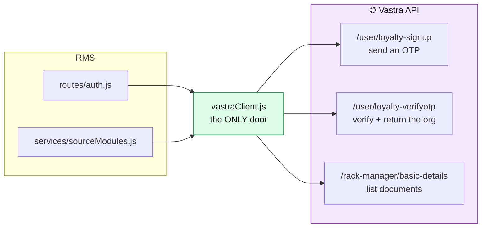
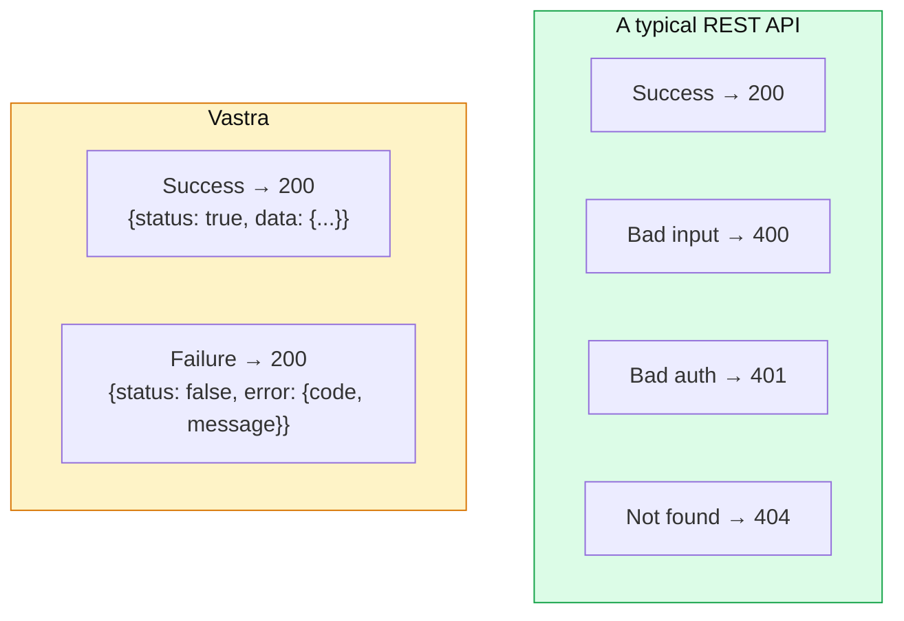
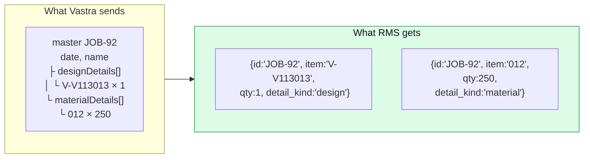
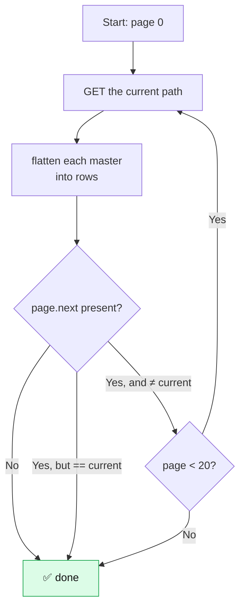
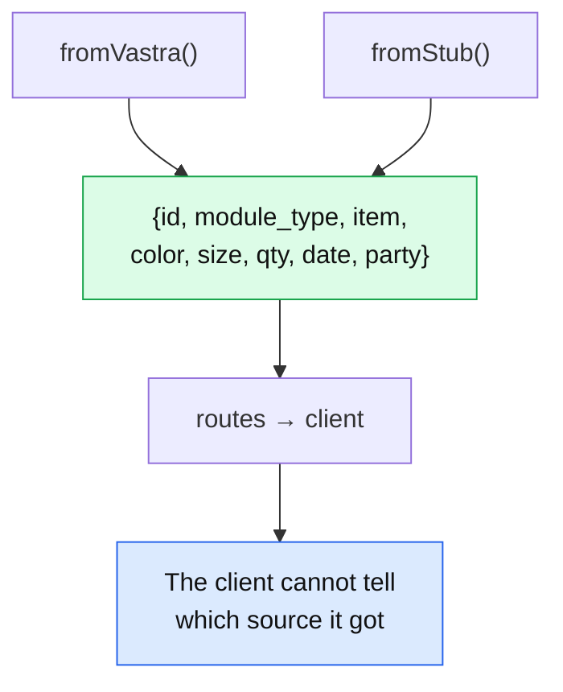

# 10 — Vastra Integration

[← Flow C: Picklist](09-flow-C-picklist.md) · [Next: API Reference →](11-api-reference.md)

---

> **Vastra is a separate company's software.** RMS depends on it for two things: proving who you are, and telling you what documents exist.
>
> One file talks to it: [`server/src/vastraClient.js`](../server/src/vastraClient.js). That containment is deliberate.

---

## What RMS uses Vastra for



| Purpose | Endpoint | Used by |
|---------|----------|---------|
| Send an OTP | `POST /user/loyalty-signup` | Login step 1 |
| Verify the OTP, get the org | `POST /user/loyalty-verifyotp` | Login step 2 |
| List documents for a module | `GET /rack-manager/basic-details?moduleType=N` | Putaway feed & Picklist challans |

**Three endpoints. That's the entire integration surface.**

---

## Why isolating it in one file matters

Every external dependency is a risk: it changes without warning, it goes down, it behaves oddly. Containing it in one file means:

| Benefit | Concretely |
|---------|-----------|
| One place to change | Vastra renames a field → one file to edit |
| One place to fake | `checkModules.js` stubs `fetch` and tests the whole path with no network |
| One place to reason about | "What do we send Vastra?" has exactly one answer |
| Failures translate once | Every Vastra error becomes an `HttpError` at the boundary |

> **This is the Adapter pattern**, and it's one of the highest-value habits in software. Whenever you depend on something you don't control, put a thin layer of your own code between it and everything else.

---

## The two quirks that will bite you

📄 [`vastraClient.js:3-8`](../server/src/vastraClient.js#L3-L8)

```js
// The only module in RMS that talks to Vastra. Node 18+ global fetch, no axios.
//
// Two things the Vastra API does differently from most REST APIs:
//   1. Every endpoint answers HTTP 200 and puts success/failure in the body.
//      Read `status`, never the HTTP status code.
//   2. The `authorization` header takes the RAW access_token — no "Bearer " prefix.
```

### Quirk 1 — everything is HTTP 200



`if (!res.ok) throw ...` — the reflex every developer has — would treat every Vastra error as a success.

### Quirk 2 — raw token, no "Bearer"

```js
if (accessToken) headers.authorization = accessToken; // RAW — no "Bearer "
```

RMS's own API *does* use `Bearer`. Vastra's doesn't. Getting this backwards produces a mystifying auth failure, so there's a test asserting it — [`checkModules.js:72-73`](../server/checkModules.js#L72-L73):

```js
// Vastra takes the RAW token — a "Bearer " prefix here is rejected upstream.
assert.equal(sent[0].headers.authorization, 'tok-abc');
```

---

## The generic `call()` function

📄 [`vastraClient.js:32-59`](../server/src/vastraClient.js#L32-L59)

```js
async function call(method, path, { json, accessToken, raw = false } = {}) {
  if (!BASE_URL) throw new VastraApiError('VASTRA_API_BASE_URL is not configured');

  const headers = { 'api-key': API_KEY, udid: UDID, 'device-type': DEVICE_TYPE };
  if (json) headers['content-type'] = 'application/json';
  if (accessToken) headers.authorization = accessToken; // RAW — no "Bearer "

  let body;
  try {
    const res = await fetch(`${BASE_URL}${path}`, {
      method,
      headers,
      body: json ? JSON.stringify(json) : undefined,
      signal: AbortSignal.timeout(TIMEOUT),
    });
    body = await res.json();
  } catch (err) {
    throw new VastraApiError(`${method} ${path} failed: ${err.message}`);
  }

  // `raw` keeps the whole envelope — basic-details needs the sibling `page`
  // block for pagination, which sits next to `data`, not inside it.
  if (body?.status === true) return raw ? body : body.data;
  if (body?.status === false) {
    throw new VastraRejection(body.error?.code, body.error?.message || 'Vastra rejected the request');
  }
  throw new VastraApiError(`${method} ${path}: unrecognized response shape`);
}
```

### The five things worth noticing

**1. Fail closed on missing config**

```js
const BASE_URL = process.env.VASTRA_API_BASE_URL || '';
...
if (!BASE_URL) throw new VastraApiError('VASTRA_API_BASE_URL is not configured');
```

From [lines 11-13](../server/src/vastraClient.js#L11-L13):

> *"No fallback URL: with VASTRA_API_BASE_URL unset, every call fails closed instead of hitting a hardcoded host that may belong to someone else."*

A hardcoded default is worse than no default. If Vastra ever changed IP, a stale hardcoded address could send your organization's credentials to whoever owns it now.

**2. The timeout**

```js
signal: AbortSignal.timeout(TIMEOUT)   // default 10 seconds
```

`AbortSignal.timeout()` is a modern browser/Node built-in — no library needed. Without it, a hung Vastra server would hold an RMS request open indefinitely, and enough of those exhaust the connection pool. **Every external call needs a timeout.**

**3. The three-way response check**

```js
if (body?.status === true)  → success
if (body?.status === false) → rejection
otherwise                   → unrecognised shape → VastraApiError
```

`=== true`, not truthy. A response with `status: "true"` (a string) or `status: 1` would be a genuine change in Vastra's behaviour and is caught by the third branch rather than silently accepted.

**4. The `raw` flag**

Most calls only want `body.data`. But pagination info lives *beside* `data`:

```json
{ "status": true, "data": [ ... ], "page": { "next": "/rack-manager/basic-details?…" } }
```

so `basic-details` passes `raw: true` to keep the whole envelope.

**5. Every failure becomes one of two classes**

Network error, timeout, invalid JSON, missing config, unknown shape → `VastraApiError`.
Vastra explicitly refusing → `VastraRejection`.

Callers only ever have two cases to handle.

---

## The module system

📄 [`vastraClient.js:86-108`](../server/src/vastraClient.js#L86-L108)

```js
// ── source modules (Flow A) ───────────────────────────────────────────────
// Inbound only — these four feed putaway (Add Item) and the no-moduleType
// fan-out in /api/source-transactions. Delivery Challan is deliberately NOT
// here: it is outbound, and putaway must never offer it.
export const MODULE_TYPES = ['Purchase Inward', 'Job Slip', 'Pack Design', 'Sales Return'];

// Outbound (Flow C) — the picklist reads this one module and nothing else.
export const PICK_MODULE_TYPE = 'Delivery Challan';

// All four modules are ONE endpoint discriminated by a numeric moduleType —
// same handler, same response envelope, so one normalizer covers everything.
//   GET /rack-manager/basic-details?moduleType=1&search_string=Job19
// The doc writes the separator as `&?search_string=`; that is a typo in the doc
// (a literal `?` mid-query), not something to reproduce.
// NOTE: the dev-supplied path `/rekManager/basic-details` 404s — `rack-manager`
// is the one that resolves.
const BASIC_DETAILS = '/rack-manager/basic-details';

// Vastra calls #2 "Order Return"; RMS has always called it "Sales Return".
// Treated as the same module (its example row is SGR-12 with a customerOrgID).
const MODULE_IDS = {
  'Job Slip': 1,
  'Sales Return': 2,
  'Purchase Inward': 3,
  'Pack Design': 4,
  [PICK_MODULE_TYPE]: 5, // Delivery Challan — outbound, picklist only
};
```

### Three pieces of hard-won knowledge preserved as comments

| Comment | What it saves you |
|---------|------------------|
| *"the dev-supplied path `/rekManager/basic-details` 404s — `rack-manager` is the one that resolves"* | Someone burned time on a wrong path from the integration docs |
| *"The doc writes the separator as `&?search_string=`; that is a typo in the doc"* | Prevents someone "fixing" the code to match a broken document |
| *"Vastra calls #2 'Order Return'; RMS has always called it 'Sales Return'"* | Explains a naming mismatch that would otherwise look like a bug |

> **These are the most valuable comments in a codebase.** They record things you can only learn by trying, failing, and investigating. Without them the next person repeats the whole exercise.

And there's a test locking in the doc-typo fix — [`checkModules.js:70-71`](../server/checkModules.js#L70-L71):

```js
// The doc's `&?search_string=` typo must not survive into a real query string.
assert.equal(sent[0].url.search.includes('&?'), false, 'doc typo leaked into the URL');
```

---

## `flatten()` — the shape converter ⭐

📄 [`vastraClient.js:117-142`](../server/src/vastraClient.js#L117-L142)

Vastra returns **nested** documents. RMS wants **flat** rows. This function is the bridge.



```js
function flatten(master, moduleType) {
  const base = {
    module_type: moduleType,
    master_id: String(master.masterID ?? ''),
    date: master.date ?? null,
    party: master.name ?? '',
  };
  const lines = [
    ...(master.designDetails || []).map((d) => ({ d, kind: 'design' })),
    ...(master.materialDetails || []).map((d) => ({ d, kind: 'material' })),
  ];
  return lines.map(({ d, kind }, i) => ({
    ...base,
    // What the user searches and sees, e.g. "JOB-92" — masterNo, not masterID.
    id: String(master.masterNo ?? master.masterID ?? ''),
    // Unique per line; `id` alone repeats across a multi-line document.
    line_id: `${master.masterID ?? master.masterNo}:${kind}:${i}`,
    detail_kind: kind,
    item: d.itemName ?? '',
    color: d.color_name ?? '',
    size: d.size_name ?? '',
    qty: Number(d.quantity ?? 0),
    rate: d.rate === '' || d.rate == null ? null : Number(d.rate),
    item_type_id: d.itemTypeID ?? '',
  }));
}
```

### The five decisions inside

**1. Two detail arrays, both flattened** — [lines 113-116](../server/src/vastraClient.js#L113-L116)

> *"A master document carries two detail arrays: designDetails (the goods) and materialDetails (raw material consumed). Both describe physically rackable stock, so both are flattened into rows and tagged with `detail_kind` — the caller can drop one kind without another round trip."*

Both are physical things that occupy shelf space, so both become rows. `detail_kind` lets a caller filter later without re-fetching.

**2. `masterNo` for display, not `masterID`**

`masterID` is `"1783935130250_83b60d51"`. `masterNo` is `"JOB-92"`. Users search for JOB-92.

**3. `line_id` for React keys**

`id` repeats across a document's lines. `line_id` combines the master id, the kind, and the index — guaranteed unique. That's what [`AddItem.jsx:248`](../client/src/pages/AddItem.jsx#L248) uses as its React key.

**4. `rate: '' → null`, not `NaN`**

```js
rate: d.rate === '' || d.rate == null ? null : Number(d.rate),
```

`Number('')` is `0`, and `Number(undefined)` is `NaN` — which `JSON.stringify` turns into `null` anyway but breaks any arithmetic first. Explicit is better. There's a test for it at [`checkModules.js:85`](../server/checkModules.js#L85).

**5. `??` everywhere**

`??` (nullish coalescing) falls back only for `null`/`undefined`. `||` would also fall back for `0` and `''` — so a genuine quantity of 0 or an intentionally empty colour would be replaced. Subtle, and correct.

---

## Pagination

📄 [`vastraClient.js:147-166`](../server/src/vastraClient.js#L147-L166)

```js
export async function fetchModuleTransactions(accessToken, moduleType, search = '') {
  const moduleId = MODULE_IDS[moduleType];
  if (!moduleId) {
    throw new VastraApiError(`Unknown module "${moduleType}"`);
  }

  const params = new URLSearchParams({ moduleType: String(moduleId) });
  if (search) params.set('search_string', search);

  const rows = [];
  let path = `${BASIC_DETAILS}?${params}`;
  for (let page = 0; page < MAX_PAGES && path; page++) {
    const body = await call('GET', path, { accessToken, raw: true });
    for (const master of body.data || []) rows.push(...flatten(master, moduleType));
    // `page.next` comes back as a ready-made path; absent on the last page.
    const next = body.page?.next;
    path = next && next !== path ? next : null;
  }
  return rows;
}
```



### Two independent stop conditions

```js
const MAX_PAGES = 20;   // "Stop runaway paging if Vastra ever returns a self-referential `next`."
```

**Guard 1 — `next !== path`.** If Vastra returned a `next` pointing at the current page, the loop would run forever. This catches it immediately.

**Guard 2 — `MAX_PAGES`.** A backstop for any looping pattern the first guard misses (say, a 3-page cycle).

Both are tested — [`checkModules.js:112-121`](../server/checkModules.js#L112-L121):

```js
// ── (d) a self-referential next must not loop forever ─────────────────────
reply = (u) => ({
  status: true,
  page: { next: `${u.pathname.replace('/api/v2', '')}${u.search}` }, // points at itself
  data: [JOBSLIP_MASTER],
});
rows = await fetchModuleTransactions('tok-abc', 'Job Slip');
assert.equal(sent.length, 1, 'self-referential next must stop after one page');
```

> **When you loop based on data from an external system, you need a stop condition that doesn't depend on that system behaving well.** An infinite loop against a remote API doesn't just hang — it hammers them until someone notices.

### Rejecting unknown modules

```js
if (!moduleId) throw new VastraApiError(`Unknown module "${moduleType}"`);
```

Without it, `MODULE_IDS['typo']` is `undefined` and the request becomes `?moduleType=undefined` — a confusing failure far from its cause. Tested at [`checkModules.js:133`](../server/checkModules.js#L133).

---

## The live-vs-stub switch

📄 [`server/src/services/sourceModules.js`](../server/src/services/sourceModules.js)

```js
export const USE_VASTRA = process.env.USE_VASTRA_MODULES === 'true';

const USE_VASTRA_PICK = process.env.USE_VASTRA_PICKLIST === undefined
  ? USE_VASTRA
  : process.env.USE_VASTRA_PICKLIST === 'true';
```

| `USE_VASTRA_MODULES` | `USE_VASTRA_PICKLIST` | Putaway reads | Picklist reads |
|---|---|---|---|
| `false` | unset | stub | stub |
| `true` | unset | **Vastra** | **Vastra** |
| `true` | `false` | **Vastra** | stub |
| `false` | `true` | stub | **Vastra** |

The third row is the useful one — test picking against local sample challans while Putaway reads live Vastra. Explained at [lines 16-19](../server/src/services/sourceModules.js#L16-L19).

**Both are read at module load**, so changes require a restart. The comment says so explicitly, which saves someone ten minutes of "why isn't my env change taking effect".

### Why the default is off

📄 [`sourceModules.js:10-13`](../server/src/services/sourceModules.js#L10-L13)

> *"Left off by default because the whole demo dataset depends on the stub — the live read itself is done (see vastraClient.js) and needs only a real api-key to switch on."*

The integration is **finished**, not unfinished. It's off because the demo data is more useful for development.

---

## The shape contract



From [`sourceModules.js:28-30`](../server/src/services/sourceModules.js#L28-L30):

> *"Live Vastra read, normalized in vastraClient to the same `{ id, module_type, item, color, size, qty }` shape the stub returns — so the client needs no changes either way."*

The stub table's SQL even aliases its date column to match — [`sourceModules.js:76-84`](../server/src/services/sourceModules.js#L76-L84):

```js
// Aliased to `date` to match the live Vastra row shape, where the document
// date arrives as `date` off the master.
`SELECT *, DATE_FORMAT(doc_date, '%Y-%m-%d') AS \`date\` FROM source_transaction …`
```

The stub bends to match the real API, not the other way round. When the switch flips, nothing downstream notices.

---

## Configuration

📄 [`server/.env.example`](../server/.env.example)

```bash
# ── Vastra login (mobile + OTP) ────────────────────────────────────────────
# Vastra is the identity provider — without these, /api/auth returns 502 and
# nobody can log in. No fallback URL is baked in on purpose.
# Use the base URL you were given; the friendly webstaging.vastraapp.com host
# 301s POSTs away and drops the path, so don't "correct" it to that domain.
VASTRA_API_BASE_URL=http://13.235.138.204:3000/api/v2
# Staging's api-key really is the literal "1" (verified: any other value gets
# "Invalid api-key"). Expect a different value for production.
VASTRA_API_KEY=1
VASTRA_API_TIMEOUT=10000
VASTRA_UDID=rms-backend
VASTRA_DEVICE_TYPE=android
```

Two more preserved discoveries:

- **Don't "fix" the IP to the friendly domain** — it 301-redirects POSTs and drops the path. Somebody tried; it broke; the note stops the next person.
- **The api-key really is `1`** — it looks like a placeholder someone forgot to fill in. It isn't. Without this comment, someone would "fix" it and break login.

`VASTRA_UDID` and `VASTRA_DEVICE_TYPE` are device-identification headers Vastra expects, presumably because the API was designed for a mobile app. RMS sends fixed values.

---

## The self-test

📄 [`server/checkModules.js`](../server/checkModules.js) — run with `node checkModules.js`

**No database, no api-key, no network.** It replaces `globalThis.fetch` entirely:

```js
const sent = [];
let reply = () => { throw new Error('no Vastra stub installed'); };

globalThis.fetch = async (url, opts) => {
  const u = new URL(String(url));
  sent.push({ url: u, headers: opts?.headers || {}, method: opts?.method });
  return new Response(JSON.stringify(reply(u)), {
    status: 200, // Vastra always answers 200 and puts success/failure in the body.
    headers: { 'content-type': 'application/json' },
  });
};
```

`sent` captures every outgoing request so assertions can inspect exactly what was sent. `reply` is swapped per test.

The fixture is **verbatim from Vastra's own documentation** ([lines 38-59](../server/checkModules.js#L38-L59)) — a real Jobslip master with `designDetails` and `materialDetails`.

| Test | Asserts | Line |
|------|---------|------|
| a | Correct path, numeric moduleType, `search_string` only when searching, raw token, no `&?` typo | [66-74](../server/checkModules.js#L66-L74) |
| b | JOB-92 flattens to 2 rows in the client shape; `rate: '' → null`; unique `line_id` | [76-88](../server/checkModules.js#L76-L88) |
| — | Browse mode omits `search_string` entirely | [91-94](../server/checkModules.js#L91-L94) |
| c | `page.next` followed across 3 pages, rows accumulated | [97-110](../server/checkModules.js#L97-L110) |
| d | Self-referential `next` stops after one page | [113-121](../server/checkModules.js#L113-L121) |
| e | All four modules map to their documented numbers; unknown module rejected | [124-134](../server/checkModules.js#L124-L134) |
| f | Delivery Challan is moduleType 5, **excluded** from `MODULE_TYPES`, flattens correctly | [139-170](../server/checkModules.js#L139-L170) |

Test (f) is the guard on the inbound/outbound rule:

```js
// Putaway (Add Item) and the no-moduleType fan-out both iterate MODULE_TYPES,
// so a challan appearing there would offer outbound documents for inbound work.
assert.equal(PICK_MODULE_TYPE, 'Delivery Challan');
assert.equal(MODULE_TYPES.includes(PICK_MODULE_TYPE), false, 'DC must stay out of the inbound list');
```

**Run this after any change to `vastraClient.js`.** It takes under a second and covers the whole read path.

---

## Failure modes

| What happens | Class | Result |
|--------------|-------|--------|
| Vastra unreachable | `VastraApiError` | 502, logged privately |
| Timeout (>10s) | `VastraApiError` | 502 |
| `VASTRA_API_BASE_URL` unset | `VastraApiError` | 502, fails closed |
| Bad OTP | `VastraRejection` | 401, Vastra's own message shown |
| Unknown mobile | `VastraRejection` | 403 |
| Token expired *(matches the auth regex)* | `VastraRejection` | Token cleared, 502 "log out and back in" |
| Module refused *(doesn't match)* | `VastraRejection` | 502 for that module, **session kept** |
| Response shape unrecognised | `VastraApiError` | 502 |
| Unknown module name | `VastraApiError` | 502 |

The token-clearing decision is analysed in [04 — Login & Auth](04-login-and-auth.md#the-token-clearing-decision-subtle-and-important). Short version: **the destructive branch requires positive evidence.**

---

## Switching the live integration on

1. Get a production `VASTRA_API_KEY`
2. In `server/.env`:
   ```bash
   VASTRA_API_KEY=<the real key>
   USE_VASTRA_MODULES=true
   ```
3. Restart the server (flags are read at load)
4. Log out and log back in — you need a fresh `vastra_access_token`
5. Open Putaway → "From Source Module" and confirm real documents appear

If the Picklist module still isn't served, add:
```bash
USE_VASTRA_PICKLIST=false
```
so Putaway reads live while picking still works against the sample challans.

**No code changes.** That's the payoff of the shape contract.

---

## Checkpoint

1. Why is `vastraClient.js` the only file allowed to call Vastra?
2. What are Vastra's two quirks, and what breaks if you forget each?
3. Why is there no fallback URL?
4. What does `flatten()` do and why is `line_id` needed?
5. What are the two independent guards against infinite pagination?
6. Why does the stub table alias `doc_date` to `date`?
7. What would happen if Delivery Challan were added to `MODULE_TYPES`?

---

Next: **[11 — API Reference](11-api-reference.md)**
