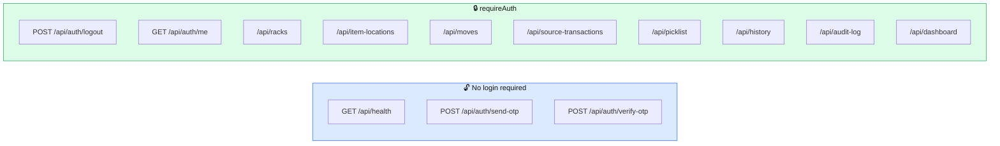

# 11 — API Reference

[← Vastra Integration](10-vastra-integration.md) · [Next: Running & Testing →](12-running-and-testing.md)

---

> Every endpoint the server exposes, where it's defined, and what calls it. Use this as a lookup table.

---

## The complete endpoint map



---

## Full table — 24 endpoints

*(23 defined in `routes/*.js`, plus `/api/health` declared directly in `app.js`.)*

| # | Method | Path | Auth | Defined in | Client method |
|---|--------|------|:----:|-----------|---------------|
| 1 | `GET` | `/api/health` | 🔓 | [`app.js:25`](../server/src/app.js#L25) | — |
| 2 | `POST` | `/api/auth/send-otp` | 🔓 | [`auth.js:57`](../server/src/routes/auth.js#L57) | `api.sendOtp` |
| 3 | `POST` | `/api/auth/verify-otp` | 🔓 | [`auth.js:78`](../server/src/routes/auth.js#L78) | `api.verifyOtp` |
| 4 | `POST` | `/api/auth/logout` | 🔒 | [`auth.js:139`](../server/src/routes/auth.js#L139) | `api.logout` |
| 5 | `GET` | `/api/auth/me` | 🔒 | [`auth.js:150`](../server/src/routes/auth.js#L150) | `api.me` |
| 6 | `GET` | `/api/racks` | 🔒 | [`racks.js:8`](../server/src/routes/racks.js#L8) | `api.listRacks` |
| 7 | `GET` | `/api/racks/:id` | 🔒 | [`racks.js:15`](../server/src/routes/racks.js#L15) | `api.getRack` |
| 8 | `POST` | `/api/racks` | 🔒 | [`racks.js:22`](../server/src/routes/racks.js#L22) | `api.createRack` |
| 9 | `GET` | `/api/item-locations/placements` | 🔒 | [`itemLocations.js:8`](../server/src/routes/itemLocations.js#L8) | `api.findPlacements` |
| 10 | `GET` | `/api/item-locations` | 🔒 | [`itemLocations.js:16`](../server/src/routes/itemLocations.js#L16) | `api.listItems` |
| 11 | `POST` | `/api/item-locations` | 🔒 | [`itemLocations.js:27`](../server/src/routes/itemLocations.js#L27) | `api.addItem` |
| 12 | `PATCH` | `/api/item-locations/:id` | 🔒 | [`itemLocations.js:39`](../server/src/routes/itemLocations.js#L39) | `api.updateItemQty` |
| 13 | `POST` | `/api/moves` | 🔒 | [`moves.js:7`](../server/src/routes/moves.js#L7) | `api.move` |
| 14 | `GET` | `/api/source-transactions` | 🔒 | [`sourceTransactions.js:11`](../server/src/routes/sourceTransactions.js#L11) | `api.sourceTransactions` |
| 15 | `GET` | `/api/picklist/challans` | 🔒 | [`picklist.js:36`](../server/src/routes/picklist.js#L36) | `api.challans` |
| 16 | `POST` | `/api/picklist/resolve` | 🔒 | [`picklist.js:112`](../server/src/routes/picklist.js#L112) | `api.resolvePicklist` |
| 17 | `GET` | `/api/picklist/:id/resolve` | 🔒 | [`picklist.js:131`](../server/src/routes/picklist.js#L131) | `api.reresolvePicklist` |
| 18 | `GET` | `/api/picklist/:id/pdf` | 🔒 | [`picklist.js:157`](../server/src/routes/picklist.js#L157) | `api.picklistPdf` |
| 19 | `GET` | `/api/picklist/:dcNo` | 🔒 | [`picklist.js:172`](../server/src/routes/picklist.js#L172) | `api.picklist` |
| 20 | `POST` | `/api/picklist/pick` | 🔒 | [`picklist.js:191`](../server/src/routes/picklist.js#L191) | `api.pickItems` |
| 21 | `GET` | `/api/history/putaway` | 🔒 | [`history.js:17`](../server/src/routes/history.js#L17) | `api.historyPutaway` |
| 22 | `GET` | `/api/history/picklists` | 🔒 | [`history.js:55`](../server/src/routes/history.js#L55) | `api.historyPicklists` |
| 23 | `GET` | `/api/audit-log` | 🔒 | [`audit.js:7`](../server/src/routes/audit.js#L7) | `api.auditLog` |
| 24 | `GET` | `/api/dashboard` | 🔒 | [`dashboard.js:7`](../server/src/routes/dashboard.js#L7) | `api.dashboard` |

---

## Detailed reference

### 1. `GET /api/health` 🔓

Checks the API is up *and* can reach MySQL.

**Response 200**
```json
{ "ok": true, "db": "up" }
```

**Response 503**
```json
{ "ok": false, "db": "down", "code": "ECONNREFUSED", "host": "127.0.0.1" }
```

Deliberately reports only the *hostname* — no user, port, or password.

---

### 2. `POST /api/auth/send-otp` 🔓

**Body**
```json
{ "country_code": "+91", "mobile": "9876543210", "is_resend": 0 }
```

**Response 200** — `{ "message": "OTP sent successfully" }`

| Error | Meaning |
|-------|---------|
| 400 | `country_code` must look like `+91`; `mobile` must be 6–15 digits |
| 403 | Vastra rejected it (unknown mobile) |
| 429 | More than 10 requests from this IP in a minute |
| 502 | Vastra unreachable |

---

### 3. `POST /api/auth/verify-otp` 🔓

**Body**
```json
{ "country_code": "+91", "mobile": "9876543210", "otp": "4821" }
```

**Response 200**
```json
{ "token": "a3f9…64 hex chars…", "org": { "id": 3, "name": "Keshav Textiles" } }
```

⚠️ **Never contains `vastra_access_token`.**

| Error | Meaning |
|-------|---------|
| 400 | Malformed input |
| 401 | Invalid OTP (Vastra's own message) |
| 403 | Account blocked |
| 429 | Rate limited |
| 502 | Vastra unreachable, or returned an incomplete profile |

**Side effects:** upserts `organization`; deletes any existing session for that org and inserts a new one.

---

### 4. `POST /api/auth/logout` 🔒

No body. Response `{ "ok": true }`.

**Side effects:** deletes the session row **and** sets `vastra_access_token = NULL`.

---

### 5. `GET /api/auth/me` 🔒

Response `{ "id": 3, "name": "Keshav Textiles" }`.

Used by [`Layout.jsx:33`](../client/src/components/Layout.jsx#L33) to restore the org name after a page refresh.

---

### 6. `GET /api/racks` 🔒

```json
[
  { "rack_id": "R01-S01-B01", "capacity": 150, "used": 90, "available": 60, "status": "Occupied" }
]
```

`available` is computed in SQL as `(capacity - used)` — [`rackService.js:53`](../server/src/services/rackService.js#L53).

---

### 7. `GET /api/racks/:id` 🔒

```json
{
  "rack_id": "R01-S01-B01", "capacity": 150, "used": 90, "available": 60, "status": "Occupied",
  "items": [
    { "id": 4471, "item": "Banarasi Saree", "color": "Maroon", "size": "Free Size",
      "qty": 40, "module_id": "PI-2026-0042", "module_type": "Purchase Inward",
      "updated_at": "2026-08-05T10:22:00.000Z" }
  ]
}
```

404 if the rack doesn't exist.

---

### 8. `POST /api/racks` 🔒

**Body** `{ "rackId": "R11-S01-B01", "capacity": 100 }`

**Response 201** with the new rack.

| Error | Meaning |
|-------|---------|
| 400 | `rackId` missing, or capacity not a positive integer |
| 409 | Rack already exists (translated from `ER_DUP_ENTRY`) |

> No UI calls this — racks come from the seed. It exists for API completeness and future admin tooling.

---

### 9. `GET /api/item-locations/placements?item=&color=&size=` 🔒

**The most reused query in the app.** Returns every rack holding that exact variant, biggest first.

```json
[
  { "id": 4471, "rack_id": "R05-S02-B04", "qty": 40, "capacity": 120, "used": 90, "available": 30 }
]
```

Returns `[]` when `item` is empty.

Used by: the Putaway "already stored" hint, MoveItem step 2, and `resolveLines()` in the picklist.

---

### 10. `GET /api/item-locations` 🔒

The full stock listing — every row in `item_location`, ordered by item, colour, size.

Used by ItemManagement, MoveItem, RackList (for search), Picklist (to build its catalogue), and the Inventory Report.

---

### 11. `POST /api/item-locations` 🔒

**Body**
```json
{ "rackId": "R05-S02-B04", "item": "Banarasi Saree", "color": "Maroon",
  "size": "Free Size", "qty": 40,
  "moduleType": "Purchase Inward", "moduleId": "PI-2026-0042" }
```

`color`, `size`, `moduleType`, `moduleId` are all optional.

**Response 201**
```json
{
  "item": { "id": 4471, "item": "…", "qty": 40, "fk_rack_id": "R05-S02-B04", … },
  "rack": { "rack_id": "R05-S02-B04", "used": 90, "status": "Occupied" },
  "merged": false
}
```

`merged: true` means it combined with an existing identical row.

| Error | Meaning |
|-------|---------|
| 400 | Missing item, or qty not a positive integer |
| 404 | Rack not found |
| 409 | `Capacity exceeded for R05-S02-B04: 130/120` |

---

### 12. `PATCH /api/item-locations/:id` 🔒

**Body** `{ "qty": 25 }` — **`qty: 0` deletes the row.**

**Response** `{ "removed": false, "rack": { "rack_id": "…", "used": 75, "status": "Occupied" } }`

| Error | Meaning |
|-------|---------|
| 400 | qty not an integer ≥ 0 |
| 404 | Item location not found |
| 409 | Capacity exceeded (checked as `used − oldQty + newQty`) |

---

### 13. `POST /api/moves` 🔒

**Body** `{ "itemId": 4471, "toRackId": "R07-S03-B02", "qty": 10 }`

**Response**
```json
{
  "from": { "rack_id": "R05-S02-B04", "used": 80, "status": "Occupied" },
  "to":   { "rack_id": "R07-S03-B02", "used": 50, "status": "Occupied" }
}
```

| Error | Meaning |
|-------|---------|
| 400 | qty not positive / destination equals source / more than in stock |
| 404 | Item or destination rack not found |
| 409 | Destination capacity exceeded |

---

### 14. `GET /api/source-transactions?moduleType=&q=&limit=` 🔒

The Flow A feed. All parameters optional.

| Param | Behaviour |
|-------|-----------|
| `moduleType` | One of the 4 inbound names. Omitted → all four. |
| `q` | Search. **Present → every match, no cap.** Absent → latest `limit`. |
| `limit` | Default 10, hard max 100 |

```json
[
  { "id": "PI-2026-0042", "module_type": "Purchase Inward", "item": "Banarasi Saree",
    "color": "Maroon", "size": "Free Size", "qty": 40, "date": "2026-08-01", "party": "" }
]
```

Live Vastra rows additionally carry `line_id`, `detail_kind`, `master_id`, `rate`, `item_type_id`.

⚠️ **Never returns Delivery Challans** — see [`sourceModules.js:94-100`](../server/src/services/sourceModules.js#L94-L100).

| Error | Meaning |
|-------|---------|
| 401 | No Vastra token stored, or Vastra rejected it — the session is cleared and the client redirects to `/login` |
| 502 | Vastra unreachable, or refused this module for a non-auth reason |

---

### 15. `GET /api/picklist/challans?q=&limit=` 🔒

One entry per **document**, not per line.

```json
[ { "id": "DC-2026-0007", "date": "2026-08-01", "party": "Keshav Textiles", "lines": 6, "qty": 9 } ]
```

The route over-fetches (`limit * 20`), groups by document number, then caps at `limit` — because the underlying feed is one row per line, so a raw limit of 10 could be a single 10-line challan. See [`picklist.js:33-35`](../server/src/routes/picklist.js#L33-L35).

---

### 16. `POST /api/picklist/resolve` 🔒 ⭐

**The main picklist endpoint.** Read-only for stock; writes a history row.

**Body**
```json
{
  "dcNo": "DC-2026-0007",
  "party": "Keshav Textiles",
  "picklistId": null,
  "lines": [
    { "item": "Rayon Kurti", "color": "Blue", "size": "36", "qty": 1 },
    { "item": "Rayon Kurti", "color": "Blue", "size": "38", "qty": 2 }
  ]
}
```

`dcNo`, `party` and `picklistId` are all optional. Passing an existing `picklistId` **updates** that history entry instead of creating a new one.

**Response**
```json
{
  "id": 42, "dcNo": "DC-2026-0007", "party": "Keshav Textiles", "source": "manual",
  "rows": [
    {
      "item": "Rayon Kurti", "color": "Blue", "size": "36", "qty": 1,
      "available": 12, "shortage": 0,
      "placements": [ { "id": 4471, "rack_id": "R02-S01-B03", "qty": 12, "suggested": 1 } ]
    }
  ]
}
```

| Field | Meaning |
|-------|---------|
| `available` | Total across all racks holding this variant |
| `shortage` | `max(0, qty − available)` |
| `placements[].id` | The `item_location.id` — **this is what you send back to `/pick`** |
| `placements[].suggested` | Largest-rack-first allocation |

400 if no line has a positive quantity.

---

### 17. `GET /api/picklist/:id/resolve` 🔒

Re-resolves a **stored** picklist against current stock. Powers History → Update.

**Response** — same shape as #16 plus two fields per row:

| Field | Meaning |
|-------|---------|
| `printedRacks` | What the saved sheet said |
| `moved` | `true` if the current allocation differs |

| Error | Meaning |
|-------|---------|
| 404 | Picklist not found |
| 409 | `This picklist has already updated the racks` |

---

### 18. `GET /api/picklist/:id/pdf` 🔒

Streams a real PDF. Headers:

```
Content-Type: application/pdf
Content-Disposition: inline; filename="picklist-DC-2026-0007.pdf"
```

Filename sanitised with `replace(/[^\w.-]/g, '_')`.

⚠️ Cannot be opened with a plain `window.open()` — needs the `Authorization` header. See [`client.js:79`](../client/src/api/client.js#L79).

---

### 19. `GET /api/picklist/:dcNo` 🔒

The module path — reads a challan straight from Vastra. **Wired and tested but not in use**, because Vastra doesn't serve the Delivery Challan module yet.

Response is like #16 but with `"source": "module"` and no `id` (nothing is saved).

404 if the challan number isn't found.

> ⚠️ Registered **last** among the GETs so it doesn't swallow `/challans` or `/:id/resolve`.

---

### 20. `POST /api/picklist/pick` 🔒 ⭐

**The only endpoint in Flow C that changes stock.**

**Body**
```json
{
  "dcNo": "DC-2026-0007",
  "picklistId": 42,
  "picks": [ { "itemLocationId": 4471, "qty": 1 }, { "itemLocationId": 4482, "qty": 2 } ]
}
```

`dcNo` and `picklistId` are optional. `picklistId` closes the history entry.

**Response**
```json
{
  "racks": [ { "rack_id": "R02-S01-B03", "used": 45, "status": "Occupied" } ],
  "removed": 1, "updated": 2, "pickedQty": 9
}
```

| Field | Meaning |
|-------|---------|
| `removed` | Rows deleted (emptied out) |
| `updated` | Rows reduced but surviving |
| `pickedQty` | Total units deducted |

| Error | Meaning |
|-------|---------|
| 400 | Empty picks, bad ids/quantities, or picking more than a row holds |
| 404 | An `itemLocationId` doesn't exist |

**All-or-nothing.** One bad line rolls back the entire pick.

---

### 21. `GET /api/history/putaway?limit=` 🔒

Reads `audit_log` where `action = 'add'`, newest first. `limit` defaults to 100, capped at 500.

```json
[
  { "id": 8123, "item": "Banarasi Saree", "color": "Maroon", "size": "Free Size",
    "qty": 10, "rack_qty": 40, "merged": true,
    "rack_id": "R05-S02-B04", "module_type": "Purchase Inward", "module_id": "PI-2026-0042",
    "user_id": "12397", "created_at": "2026-08-05T10:22:00.000Z" }
]
```

| Field | Meaning |
|-------|---------|
| `qty` | **What was actually added** — computed as `after.qty − before.qty` |
| `rack_qty` | What the row held afterwards |
| `merged` | Whether it combined with an existing row |

See [03 — The Database](03-the-database.md#the-merged-add-trap-and-how-history-fixes-it) for why `qty` needs computing.

---

### 22. `GET /api/history/picklists?limit=` 🔒

```json
[
  { "id": 42, "dc_no": "DC-2026-0007", "party": "Keshav Textiles", "source": "manual",
    "total_qty": 9, "short_qty": 2, "lines": 6,
    "rack_updated": true, "picked_qty": 7, "picked_at": "2026-08-05T11:00:00.000Z",
    "user_id": "12397", "created_at": "2026-08-05T10:45:00.000Z" }
]
```

`rack_updated` is a real boolean (`!!` coerced from MySQL's `TINYINT`).
`lines` is aliased from `line_count` in SQL because `LINES` is reserved in MySQL 8.

---

### 23. `GET /api/audit-log?action=&limit=` 🔒

Raw audit rows, newest first. `action` optionally filters to `add`/`update`/`move`/`remove`. `limit` defaults to 100, capped at 500.

```json
[
  { "id": 8123, "entity_type": "item_location", "entity_id": "4471", "action": "move",
    "before_json": { "rack": "R05-S02-B04", "item": "…", "qty": 40 },
    "after_json": { "fromRack": "R05-S02-B04", "toRack": "R07-S03-B02", "movedQty": 10 },
    "user_id": "12397", "created_at": "2026-08-05T10:22:00.000Z" }
]
```

The JSON shapes vary by action — see the table in [03 — The Database](03-the-database.md#table-3-audit_log--the-permanent-record).

---

### 24. `GET /api/dashboard` 🔒

**Six SQL queries in one response** — everything the dashboard needs in a single round trip.

```json
{
  "stats": {
    "totalItems": 5420, "totalRacks": 100, "occupiedRacks": 76, "vacantRacks": 24,
    "totalCapacity": 10800, "totalUsed": 5420, "overallPct": 50,
    "addedToday": 12, "movedToday": 5
  },
  "buckets": { "vacant": 24, "partial": 58, "full": 18 },
  "trend": [ { "day": "2026-08-01", "added": 8, "moved": 3 } ],
  "moduleBreakdown": [ { "moduleType": "Purchase Inward", "qty": 1820 } ],
  "topItems": [ { "item": "Banarasi Saree", "qty": 620 } ],
  "recent": [ /* 8 latest audit rows */ ]
}
```

`trend` is **sparse** — days with no activity are missing. The client fills gaps with [`sevenDayTrend()`](../client/src/lib/charts.js#L17).

`topItems` is capped at 8 to match the pie chart's colour palette.

---

## Common patterns across the API

### Status codes used

| Code | Meaning | Example |
|------|---------|---------|
| 200 | OK | Most reads |
| 201 | Created | `POST /api/item-locations`, `POST /api/racks` |
| 400 | Bad request | Invalid quantity, same-rack move |
| 401 | Not authenticated | Missing/expired token |
| 403 | Forbidden | Blocked account, Vastra refused the mobile |
| 404 | Not found | Unknown rack, item, or picklist |
| 409 | Conflict | Capacity exceeded, duplicate rack, already-picked picklist |
| 429 | Too many requests | OTP rate limit |
| 502 | Bad gateway | Vastra unreachable |
| 503 | Service unavailable | Database unreachable |

### Error response shape — always the same

```json
{ "error": "Capacity exceeded for R05-S02-B04: 130/120" }
```

Produced by the single handler at [`app.js:64-77`](../server/src/app.js#L64-L77), which is why [`client.js:25`](../client/src/api/client.js#L25) can rely on it:

```js
if (!res.ok) throw new Error(data.error || `Request failed (${res.status})`);
```

### Limit capping

Every list endpoint caps its limit:

| Endpoint | Default | Max |
|----------|---------|-----|
| `/api/source-transactions` | 10 | 100 |
| `/api/picklist/challans` | 10 | 100 |
| `/api/history/*` | 100 | 500 |
| `/api/audit-log` | 100 | 500 |

Without a cap, `?limit=999999999` becomes a denial-of-service vector.

### Search semantics

**With a search term → every match. Without → the latest N.**

Applied consistently in [`sourceModules.js:65`](../server/src/services/sourceModules.js#L65) and [`:74-75`](../server/src/services/sourceModules.js#L74-L75).

---

## Which page calls which endpoint

| Page | Endpoints |
|------|-----------|
| `Login.jsx` | `send-otp`, `verify-otp` |
| `Layout.jsx` | `me`, `logout` |
| `Dashboard.jsx` | `dashboard` |
| `RackList.jsx` | `racks`, `item-locations`, `racks/:id`, `item-locations/:id` (PATCH) |
| `ItemManagement.jsx` | `item-locations` |
| `AddItem.jsx` | `racks`, `source-transactions`, `placements`, `item-locations` (POST) |
| `MoveItem.jsx` | `racks`, `item-locations`, `placements`, `moves` |
| `Picklist.jsx` | `item-locations`, `picklist/challans`, `picklist/resolve`, `picklist/:dcNo`, `picklist/pick`, `picklist/:id/pdf` |
| `History.jsx` | `history/putaway`, `history/picklists`, `picklist/:id/resolve`, `picklist/pick`, `picklist/:id/pdf` |
| `Reports.jsx` | `dashboard`, `item-locations`, `racks`, `audit-log` |
| `RackReport.jsx` | `racks`, `racks/:id` |
| `AuditLog.jsx` | `audit-log` |

---

## A ready-made test script

```bash
#!/bin/bash
# Save as api-tour.sh, chmod +x, then: ./api-tour.sh <your-token>
TOKEN=$1
BASE=localhost:4000/api
AUTH="Authorization: Bearer $TOKEN"

echo "── health ──";        curl -s $BASE/health | jq
echo "── me ──";            curl -s $BASE/auth/me -H "$AUTH" | jq
echo "── dashboard ──";     curl -s $BASE/dashboard -H "$AUTH" | jq '.stats'
echo "── racks (3) ──";     curl -s $BASE/racks -H "$AUTH" | jq '.[0:3]'
echo "── one rack ──";      curl -s $BASE/racks/R01-S01-B01 -H "$AUTH" | jq
echo "── stock (3) ──";     curl -s $BASE/item-locations -H "$AUTH" | jq '.[0:3]'
echo "── documents ──";     curl -s "$BASE/source-transactions?limit=3" -H "$AUTH" | jq
echo "── challans ──";      curl -s "$BASE/picklist/challans?limit=3" -H "$AUTH" | jq
echo "── putaway hist ──";  curl -s "$BASE/history/putaway?limit=3" -H "$AUTH" | jq
echo "── picklist hist ──"; curl -s "$BASE/history/picklists?limit=3" -H "$AUTH" | jq
echo "── audit ──";         curl -s "$BASE/audit-log?limit=3" -H "$AUTH" | jq
```

Get the token from the browser: **F12 → Application → Local Storage → `wms-token`**.

---

Next: **[12 — Running & Testing](12-running-and-testing.md)**
