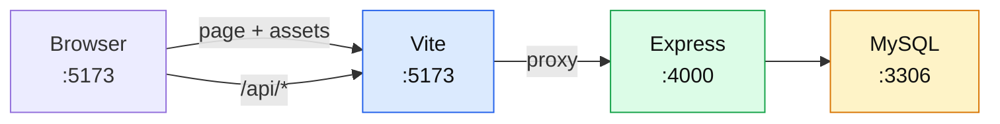
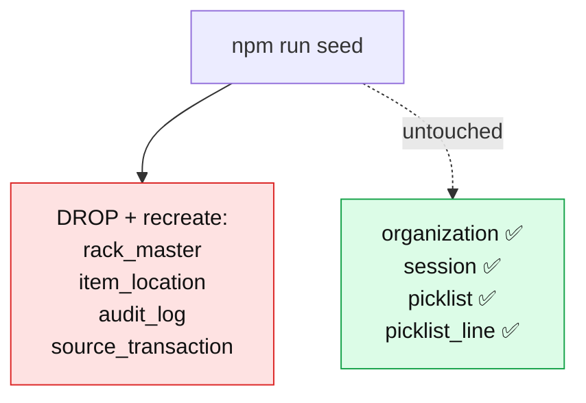
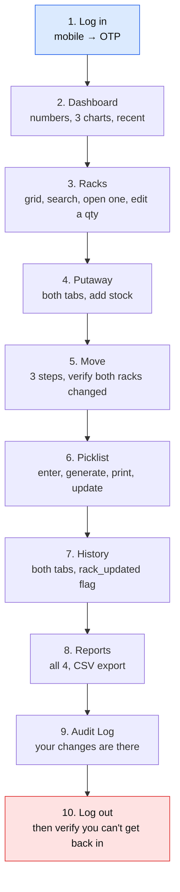
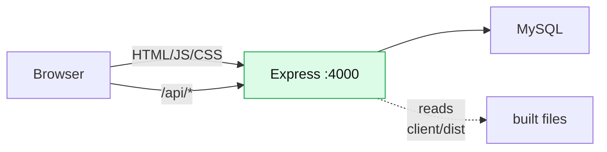

# 12 — Running & Testing

[← API Reference](11-api-reference.md) · [Next: How To Add A Feature →](13-how-to-add-a-feature.md)

---

## What you need installed

| Thing | Why | Check with |
|-------|-----|-----------|
| **Node.js 18+** | Runs the server and builds the client. 18+ specifically, because the code uses global `fetch` and `AbortSignal.timeout()`. | `node -v` |
| **MySQL 8** | The database. 8 specifically, for `CHECK` constraints and the `JSON` type. | `mysql --version` |
| **npm** | Installs libraries. Comes with Node. | `npm -v` |

---

## First-time setup

```bash
# 1. Install the server's libraries
cd server
npm install

# 2. Create your settings file
cp .env.example .env
#    then edit .env with your MySQL password

# 3. Build the database and fill it with demo data
npm run seed

# 4. Install the client's libraries
cd ../client
npm install
```

### What `.env` needs

📄 [`server/.env.example`](../server/.env.example) is the template. The minimum for local development:

```bash
DB_HOST=127.0.0.1
DB_PORT=3306
DB_USER=root
DB_PASSWORD=your-mysql-password
DB_NAME=rms
PORT=4000

VASTRA_API_BASE_URL=http://13.235.138.204:3000/api/v2
VASTRA_API_KEY=1
```

> ⚠️ **Without the two `VASTRA_*` lines, nobody can log in.** There's no local fallback — the login route returns 502. That's deliberate ([10 — Vastra Integration](10-vastra-integration.md#the-five-things-worth-noticing)).

**Pointing at a hosted database instead of a local one?** Managed MySQL (Aiven, Railway, PlanetScale) refuses plaintext connections, so you need two more lines. A local MySQL needs neither — leave them unset:

```bash
DB_SSL=true
# Optional but recommended: the provider's CA certificate, as one line with \n escapes.
# Without it the connection is encrypted but the certificate is NOT verified.
DB_CA="-----BEGIN CERTIFICATE-----\n…\n-----END CERTIFICATE-----"
```

That maps to the three modes in [`sslConfig()`](../server/src/db.js#L19-L22) — off, on-without-verification, on-with-CA — explained in [05 — Server Anatomy](05-server-anatomy.md#the-ssl-helper).

`.env` is in [`.gitignore`](../server/.gitignore) — it holds real credentials and must never be committed.

---

## Running it day to day

**Two terminals.**

```bash
# Terminal 1 — the API
cd server
npm run dev        # node --watch src/index.js — restarts on file change
```

```bash
# Terminal 2 — the browser app
cd client
npm run dev        # vite — hot-reloads instantly
```

Then open **http://localhost:5173**



> **Always open :5173, never :4000.** Port 4000 serves only the API in development — you'd get JSON, not the app. The proxy in [`vite.config.js:10`](../client/vite.config.js#L10) is what makes relative `/api` URLs work.

### What "hot reload" means

- **Vite (client)** — save a `.jsx` file and the browser updates in ~100ms, *keeping your current state*. Fill in a form, tweak the styling, and the form is still filled in.
- **`node --watch` (server)** — save a `.js` file and Node restarts the process (~1s). Any in-memory state, like the rate-limiter map, resets.

---

## The npm scripts

### Root — [`package.json`](../package.json)

| Command | What it does |
|---------|-------------|
| `npm run build` | Installs client deps, builds the client, installs server deps without dev extras |
| `npm start` | `node server/src/index.js` — production mode |
| `npm run seed` | `node server/seed.js` |

The build script in full:
```json
"build": "npm install --include=dev --prefix client && npm run build --prefix client && npm install --omit=dev --prefix server"
```

`--include=dev` for the client (Vite is a dev dependency but is needed to build), `--omit=dev` for the server (nothing dev-only is needed to run). That's tuned for a deployment platform that runs `npm run build` then `npm start`.

### Server — [`server/package.json`](../server/package.json)

| Command | What it does |
|---------|-------------|
| `npm start` | Run once |
| `npm run dev` | Run with auto-restart |
| `npm run seed` | Rebuild the demo database |

### Client — [`client/package.json`](../client/package.json)

| Command | What it does |
|---------|-------------|
| `npm run dev` | Dev server on :5173 with hot reload |
| `npm run build` | Compile to `client/dist/` |
| `npm run preview` | Serve the built output locally, to check it |

---

## Seeding — building the demo warehouse

📄 [`server/seed.js`](../server/seed.js) — 388 lines of deliberately realistic fake data.

```bash
cd server
npm run seed              # full demo warehouse
npm run seed -- --empty   # racks + documents only, no stock
```

### ⚠️ What it destroys and what it keeps



**Your login survives a reseed. Your picklist history survives a reseed.** That's the two-speed migration system from [03](03-the-database.md#the-two-speed-migration-system).

### What gets built

| Step | Result |
|------|--------|
| 100 racks | `R{1-5}-S{1-4}-B{1-5}`, capacity varying by shelf (150/120/100/60) |
| 72 documents | 18 each of Purchase Inward, Job Slip, Pack Design, Sales Return |
| ~14 challans | Built **from real stock**, so picklists resolve to real racks |
| Stock | 24 racks vacant, 18 at ≥85%, the rest partial |
| ~250 audit rows | 21 days of history, weighted toward recent |

### The bits worth understanding

**Occupancy is planned, not random** — [`seed.js:105-115`](../server/seed.js#L105-L115):

```js
// Spread racks across the three dashboard buckets: Vacant / Partial / ≥85% Full.
function planOccupancy(racks) {
  const shuffled = shuffle(racks);
  const vacantCount = 24;
  const fullCount = 18;
  ...
}
```

Purely random fill would cluster around 50% and the doughnut chart would look wrong. The seed *engineers* a realistic spread so every dashboard widget has something to show.

**Challans are built from actual stock** — [`seed.js:330-331`](../server/seed.js#L330-L331):

```js
// Challans reference real stock, so they are built once the stock exists.
await insertChallans(buildChallans(stock));
```

If challans were random, every picklist line would report "not in any rack" and the feature would look broken.

**~12% of challan lines deliberately over-ask** — [`challanFixtures.js:93-97`](../server/challanFixtures.js#L93-L97):

```js
// ~12% of lines over-ask on purpose so the shortage badge has something to render.
const qty = chance(0.12) ? s.qty + rndInt(3, 20) : Math.max(1, Math.min(s.qty, rndInt(1, 4)));
```

**The last 7 days always have activity** — [`seed.js:239-258`](../server/seed.js#L239-L258):

```js
// Guarantee every one of the last 7 days has activity, and that today shows
// both counters — the dashboard's trend chart and "today" tiles depend on it.
```

> **The lesson in all of this:** good seed data isn't random, it's *designed*. It should exercise every state your UI can display, including the error and edge states.

**Timestamps are never in the future** — [`seed.js:80-86`](../server/seed.js#L80-L86):

```js
function ago(days, hour = rndInt(9, 19), minute = rndInt(0, 59)) {
  const d = new Date(NOW);
  d.setDate(d.getDate() - days);
  d.setHours(hour, minute, rndInt(0, 59), 0);
  if (d > NOW) d.setTime(NOW.getTime() - rndInt(60, 3600) * 1000);
  return d;
}
```

Picking a random hour on "today" could land in the future. The guard clause pulls it back.

**Audit rows are sorted oldest-first before insert** — [`seed.js:261-262`](../server/seed.js#L261-L262):

```js
// Oldest first, so audit_log.id order matches chronological order (the API
// sorts by id DESC for "newest first").
rows.sort((a, b) => a[6] - b[6]);
```

The API sorts by `id DESC` as a cheap proxy for "newest". That only works if id order matches time order — so the seed enforces it.

---

## Adding challans without wiping anything

📄 [`server/makeChallans.js`](../server/makeChallans.js)

```bash
cd server
node makeChallans.js            # add 14 challans
node makeChallans.js 30         # add 30
node makeChallans.js --replace  # delete existing samples first
```

**Non-destructive.** Racks, stock and audit history are untouched.

It even self-migrates an old database — [`makeChallans.js:24-51`](../server/makeChallans.js#L24-L51):

```js
// The challan columns and the ENUM member arrived with the picklist feature, so
// a database seeded before it needs bringing up to date. Both are additive and
// safe to re-run.
async function ensureSchema() {
  // adds `party`, adds `doc_date`, widens the module_type ENUM if needed
}
```

It queries `information_schema` to see what already exists and only adds what's missing.

And it continues the numbering rather than colliding — [`lines 71-75`](../server/makeChallans.js#L71-L75):

```js
const [[{ last }]] = await pool.query(
  'SELECT MAX(id) AS last FROM source_transaction WHERE module_type = ?', [PICK_MODULE]
);
const startAt = last ? Number(String(last).split('#')[0].split('-').pop()) + 1 : 1;
```

Its output shows the size runs so you can see the feature is properly exercised:

```
Added 14 challans (52 lines), DC-2026-0001 onwards:

  DC-2026-0001  2 design(s), 5 size line(s), 11 units
  ...

Example — DC-2026-0001 (Keshav Textiles, 2026-07-28):
  Rayon Kurti          Blue           L          x2
  Rayon Kurti          Blue           M          x3
```

---

## Testing

There is **no test framework** — no Jest, no Vitest. Three plain Node scripts with `assert`.

```bash
cd server
node checkAuth.js             # the login path
node checkModules.js          # the Vastra read path
node checkSessionRecovery.js  # what happens when Vastra stops accepting our token
```

### `checkAuth.js` — needs MySQL (skips gracefully without it)

```
  ✓ status:false envelope → VastraRejection carrying Vastra's code + message
  ✓ first login creates the org, returns a session token, leaks no Vastra token
  ✓ second login updates the existing row and rotates the Vastra token
  ✓ second login deletes the first session token

All auth checks passed.
```

It starts a **real Express server** on a random port and makes **real HTTP requests** — only Vastra is faked. And it cleans up after itself:

```js
} finally {
  await cleanup();
  server.close();
  await pool.end();
}
```

Without MySQL it prints `– skipped DB checks: database unreachable (…)` and exits 0.

### `checkModules.js` — needs nothing

```
  ✓ request: rack-manager path, moduleType=1, search_string passed, raw token
  ✓ JOB-92 flattens to 2 rows (design + material) in the client row shape
  ✓ browse mode (no query) omits search_string entirely
  ✓ page.next followed across 3 pages, rows accumulated
  ✓ self-referential page.next terminates instead of looping
  ✓ all four MODULE_TYPES map to their documented moduleType numbers
  ✓ an unknown module name is rejected instead of silently querying moduleType=undefined
  ✓ Delivery Challan queries moduleType=5 and is excluded from MODULE_TYPES
  ✓ a multi-line DC flattens to one row per line, all sharing the challan no

All source-module checks passed.
```

No database, no network, no api-key. Runs in under a second.

### When to run which

| You changed | Run |
|-------------|-----|
| `routes/auth.js`, `requireAuth.js`, `auth.sql` | `node checkAuth.js` |
| `vastraClient.js`, `sourceModules.js` | `node checkModules.js` |
| Token/session expiry handling in `sourceModules.js` | `node checkSessionRecovery.js` |
| Anything at all, before committing | all three |

### What isn't covered

Be honest about this — someone will ask:

| Area | Tested? |
|------|---------|
| Login flow | ✅ `checkAuth.js` |
| Vastra reading | ✅ `checkModules.js` |
| Expired/rejected Vastra token → forced re-login | ✅ `checkSessionRecovery.js` |
| `rackService` (add/move/pick/update) | ❌ **no automated tests** |
| Picklist resolution | ❌ |
| The React client | ❌ |
| Dashboard aggregation | ❌ |

**The most business-critical code — `rackService.js` — has no automated tests.** Verification is manual, through the UI or curl.

> If you were asked "what's the biggest gap in this project?", that's a strong, honest answer. And the two existing check scripts show exactly the pattern a `checkRacks.js` would follow.

---

## Manual verification checklist

After a meaningful change, walk this:



Specific things to confirm:

- [ ] Adding an item that's already in a rack **merges** (qty grows, no new row)
- [ ] Overfilling a rack gives a clear 409 naming the numbers
- [ ] Moving to the same rack is rejected
- [ ] Setting a quantity to 0 removes the row
- [ ] **Generating a picklist changes no stock** ← the important one
- [ ] Over-requesting a size warns but is still allowed
- [ ] "Update Rack" deducts and clears the screen
- [ ] `rack_updated` flips to true in History
- [ ] The PDF opens with correct data and visible table borders
- [ ] Dark mode works on every page
- [ ] The sidebar collapses on a narrow window

---

## Building for production

```bash
npm run build       # from the repo root
npm start
```

Then open **http://localhost:4000** — one port, one process.



Express detects `client/dist` and serves it ([`app.js:54-61`](../server/src/app.js#L54-L61)). Same code, different mode.

To test the production build without a full deploy:

```bash
cd client && npm run build && npm run preview
```

---

## Troubleshooting

### "Cannot reach the database"

The startup message already tells you what to do. Decoding it:

| Code | Meaning | Fix |
|------|---------|-----|
| `ECONNREFUSED` | Nothing listening on 3306 | Start MySQL |
| `ENOTFOUND` | Hostname doesn't resolve | Check `DB_HOST` |
| `ER_ACCESS_DENIED_ERROR` | Wrong credentials | Check `DB_USER` / `DB_PASSWORD` |
| `ER_BAD_DB_ERROR` | Database doesn't exist | `npm run seed` |
| `HANDSHAKE_SSL_ERROR` | TLS handshake failed — usually a hosted DB that requires encryption | Set `DB_SSL=true` (see [What `.env` needs](#what-env-needs)) |
| `ETIMEDOUT` / `EHOSTUNREACH` | Host never answered — firewall, or the DB's IP allow-list doesn't include you | Allow your IP in the provider's dashboard |
| `ER_NOT_SUPPORTED_AUTH_MODE` | MySQL wants an auth plugin the driver won't do | Recreate the user with `mysql_native_password` |

The full list the server treats as "database unreachable" rather than "bad query" is [`CONNECTION_ERRORS` in `db.js:27-41`](../server/src/db.js#L27-L41). Anything in that set is logged server-side and never echoed to the browser — the message embeds the DB host, port and user.

```bash
curl localhost:4000/api/health
```

### "Login fails with 502"

`VASTRA_API_BASE_URL` or `VASTRA_API_KEY` is missing or wrong. Check the server log — the detailed message is there, deliberately kept out of the browser response.

> Don't "fix" the base URL to `webstaging.vastraapp.com` — [`.env.example:19-20`](../server/.env.example#L19-L20) explains that it 301s POSTs and drops the path.

### "The page loads but every request 401s"

Stale token. Clear it:

```js
localStorage.removeItem('wms-token'); location.reload();
```

Or log in on another device — that deletes the first session by design.

### "Nothing in the transaction dropdown"

Either the stub table is empty (`npm run seed`) or `USE_VASTRA_MODULES=true` without a valid api-key.

### "Picklist says everything is short"

The typed item/colour/size doesn't exactly match stored stock. Use the dropdown suggestions rather than free text — that's what they're for.

### "The Picklist tab has no challans"

```bash
cd server && node makeChallans.js
```

And make sure `USE_VASTRA_PICKLIST` isn't `true` — Vastra doesn't serve that module yet.

### "Port already in use"

```bash
lsof -ti:4000 | xargs kill      # or :5173
```

### "Changes to .env aren't taking effect"

`dotenv` reads the file **once at startup**. Restart the server. Same for `USE_VASTRA_*` — read at module load, as the comment at [`sourceModules.js:19`](../server/src/services/sourceModules.js#L19) says.

---

## Useful database queries

```bash
mysql -u root rms
```

```sql
-- Health check: does `used` match reality? Should return nothing.
SELECT rm.rack_id, rm.used, COALESCE(SUM(il.qty),0) AS actual
FROM rack_master rm LEFT JOIN item_location il ON il.fk_rack_id = rm.rack_id
GROUP BY rm.rack_id, rm.used HAVING rm.used != actual;

-- Picklists generated but never acted on
SELECT id, dc_no, party, total_qty, created_at
FROM picklist WHERE rack_updated = 0 ORDER BY created_at DESC;

-- Who's logged in
SELECT o.name, o.mobile, s.created_at
FROM session s JOIN organization o ON o.id = s.org_id;

-- Today's activity
SELECT action, COUNT(*) FROM audit_log
WHERE DATE(created_at) = CURDATE() GROUP BY action;

-- Fullest racks
SELECT rack_id, used, capacity, ROUND(used/capacity*100) AS pct
FROM rack_master ORDER BY pct DESC LIMIT 10;

-- Duplicate variants in one rack — should return nothing
SELECT fk_rack_id, item, color, size, COUNT(*) c
FROM item_location GROUP BY fk_rack_id, item, color, size HAVING c > 1;
```

The first and last are genuine invariant checks. If either returns rows, something wrote to the database without going through the service layer.

---

## Resetting everything

```bash
# Nuclear — including logins
mysql -u root -e "DROP DATABASE rms;"
cd server && npm run seed && npm run dev

# Softer — demo data only, keeps logins and picklist history
cd server && npm run seed
```

---

Next: **[13 — How To Add A Feature](13-how-to-add-a-feature.md)**
