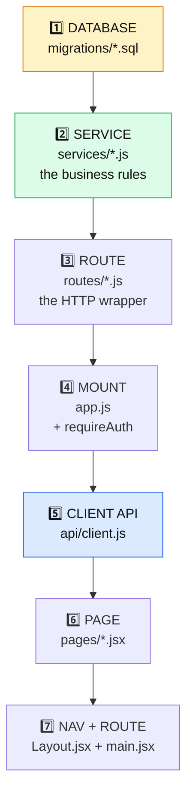
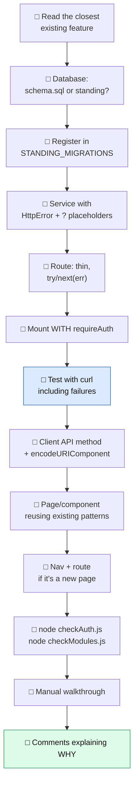
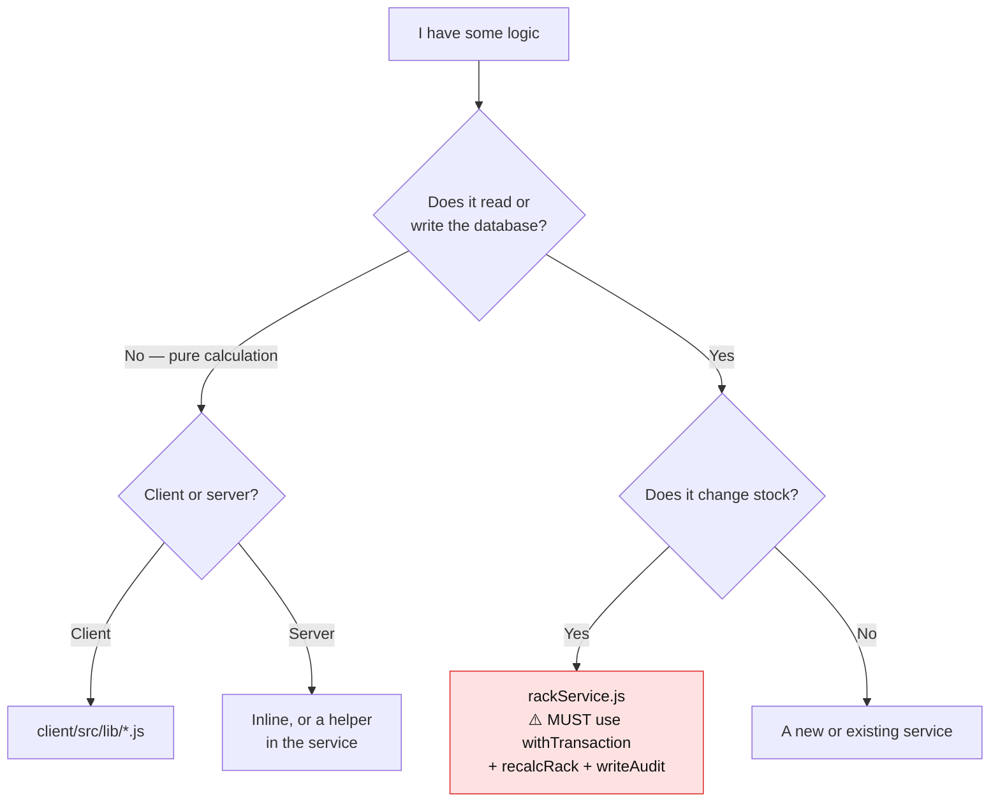

# 13 — How To Add A Feature

[← Running & Testing](12-running-and-testing.md) · [Next: Quiz & Cheatsheet →](14-quiz-and-cheatsheet.md)

---

> The Vastra dev asks for something new. This page is the recipe for building it **the way this codebase already works**, rather than bolting something foreign onto the side.

---

## The golden rule

> **Before you write anything, find the closest existing thing and read it end to end.**

Every feature in RMS follows the same skeleton. Adding a new one is mostly pattern-matching, not invention.

| You're building | Read this first |
|-----------------|-----------------|
| A screen that lists something | `ItemManagement.jsx` |
| A screen that writes something | `AddItem.jsx` |
| A multi-step form | `MoveItem.jsx` |
| A read endpoint | `racks.js` |
| A write endpoint | `itemLocations.js` |
| Business logic that changes stock | `rackService.js` |
| Anything touching Vastra | `vastraClient.js` |
| A new table | `picklist.sql` |

---

## The seven layers a feature passes through



**Build bottom-up.** Database → service → route → client. Each layer is testable with curl before the one above exists.

---

## Worked example: "Rack Notes"

Say the requirement is: *let a warehouse manager attach a free-text note to a rack — "top shelf, needs a ladder".*

### 1️⃣ Database

Ask first: **new column or new table?**

- One note per rack → a column on `rack_master`
- Many notes per rack, with history → a new table

Say it's one note per rack.

**Where does it go?** Not in `schema.sql` — that's dropped on every seed, and notes are real operational data. So a new standing migration, exactly like `picklist.sql`.

📄 `server/migrations/racknotes.sql`

```sql
-- Rack notes.
--
-- Deliberately NOT in schema.sql: that file drops and recreates its tables on
-- every `npm run seed`, and a note is operational data, not demo data.
-- Applied at boot from src/index.js, so an existing database picks it up
-- without a reseed.

CREATE TABLE IF NOT EXISTS rack_note (
  rack_id    VARCHAR(20) NOT NULL PRIMARY KEY,
  note       VARCHAR(500) NOT NULL DEFAULT '',
  updated_by VARCHAR(60) NOT NULL DEFAULT 'system',
  updated_at TIMESTAMP NOT NULL DEFAULT CURRENT_TIMESTAMP ON UPDATE CURRENT_TIMESTAMP,
  CONSTRAINT fk_note_rack FOREIGN KEY (rack_id)
    REFERENCES rack_master(rack_id) ON UPDATE CASCADE ON DELETE CASCADE
) ENGINE=InnoDB;
```

Register it — 📄 [`db.js:68`](../server/src/db.js#L68):

```js
const STANDING_MIGRATIONS = ['auth.sql', 'picklist.sql', 'racknotes.sql'];
```

Restart the server. The table appears. **No manual SQL, no separate migration command.**

> ⚠️ **The `ON DELETE CASCADE` matters.** Without it, deleting a rack would fail with a foreign-key error because a note still points at it.

### 2️⃣ Service

📄 `server/src/services/rackNotes.js`

```js
import { pool } from '../db.js';
import { HttpError } from './rackService.js';

// One note per rack. Upserted rather than inserted — the UI only ever offers
// "save this note", never "add another".

export async function getNote(rackId) {
  const [[row]] = await pool.query(
    'SELECT rack_id, note, updated_by, updated_at FROM rack_note WHERE rack_id = ?',
    [rackId]
  );
  return row || null;
}

export async function setNote({ rackId, note, userId = 'system' }) {
  const text = String(note ?? '').trim();
  if (text.length > 500) throw new HttpError(400, 'Note must be 500 characters or fewer');

  // Empty note means "remove it" — same rule as qty 0 removing a stock row,
  // so the table only ever holds notes that exist.
  if (!text) {
    await pool.query('DELETE FROM rack_note WHERE rack_id = ?', [rackId]);
    return { rack_id: rackId, note: '', removed: true };
  }

  const [[rack]] = await pool.query('SELECT rack_id FROM rack_master WHERE rack_id = ?', [rackId]);
  if (!rack) throw new HttpError(404, `Rack ${rackId} not found`);

  await pool.query(
    `INSERT INTO rack_note (rack_id, note, updated_by) VALUES (?, ?, ?)
     ON DUPLICATE KEY UPDATE note = VALUES(note), updated_by = VALUES(updated_by)`,
    [rackId, text, userId]
  );
  return { rack_id: rackId, note: text, removed: false };
}
```

**Every house convention observed:**

| Convention | Where |
|-----------|-------|
| `HttpError` for anything the user caused | 400, 404 |
| `?` placeholders always | both queries |
| `[[row]]` destructuring | `getNote` |
| Empty means delete | mirrors `updateItemQty(0)` |
| Comments explain *why* | the upsert rationale, the empty-note rule |

> **Why no transaction?** This is a single statement. `withTransaction` is for multi-step writes that must be all-or-nothing. Wrapping one statement adds ceremony without safety.

### 3️⃣ Route

📄 `server/src/routes/rackNotes.js`

```js
import { Router } from 'express';
import { getNote, setNote } from '../services/rackNotes.js';

const router = Router();

// GET /api/rack-notes/:rackId — the note, or null.
router.get('/:rackId', async (req, res, next) => {
  try {
    res.json(await getNote(req.params.rackId));
  } catch (err) { next(err); }
});

// PUT /api/rack-notes/:rackId — save it. An empty note removes it.
router.put('/:rackId', async (req, res, next) => {
  try {
    res.json(await setNote({
      rackId: req.params.rackId,
      note: req.body.note,
      userId: req.org.vastra_org_id,
    }));
  } catch (err) { next(err); }
});

export default router;
```

**Thin, exactly like every other route.** `try` / `next(err)`, `req.org.vastra_org_id` for attribution, no logic.

> `PUT` rather than `POST` because it's idempotent — sending the same note twice leaves the same result. `POST` implies creating something new each time.

### 4️⃣ Mount it

📄 [`app.js`](../server/src/app.js)

```js
import rackNotes from './routes/rackNotes.js';
...
app.use('/api/rack-notes', requireAuth, rackNotes);
```

⚠️ **Don't forget `requireAuth`.** Leaving it off makes the endpoint public. Put it next to the other guarded routes so the block stays scannable.

**Test before touching the client:**

```bash
TOKEN="…"
curl -s -X PUT localhost:4000/api/rack-notes/R01-S01-B01 \
  -H "Authorization: Bearer $TOKEN" -H 'Content-Type: application/json' \
  -d '{"note":"Top shelf — needs a ladder"}' | jq

curl -s localhost:4000/api/rack-notes/R01-S01-B01 -H "Authorization: Bearer $TOKEN" | jq

# no auth → 401
curl -s localhost:4000/api/rack-notes/R01-S01-B01 | jq

# missing rack → 404
curl -s -X PUT localhost:4000/api/rack-notes/NOPE \
  -H "Authorization: Bearer $TOKEN" -H 'Content-Type: application/json' \
  -d '{"note":"x"}' | jq
```

**Working backend before any UI.** If something's wrong you know exactly which layer.

### 5️⃣ Client API

📄 [`client/src/api/client.js`](../client/src/api/client.js)

```js
export const api = {
  // …existing…
  rackNote: (rackId) => request(`/rack-notes/${encodeURIComponent(rackId)}`),
  saveRackNote: (rackId, note) =>
    request(`/rack-notes/${encodeURIComponent(rackId)}`, { method: 'PUT', body: { note } }),
};
```

⚠️ **`encodeURIComponent` on anything interpolated into a URL.** Existing code does it — see [`getRack`](../client/src/api/client.js#L38). A rack id with a `/` or `#` would otherwise break the path.

### 6️⃣ The UI

The note belongs in the rack detail modal — 📄 [`RackList.jsx:138`](../client/src/pages/RackList.jsx#L138) `RackModal`.

```jsx
function RackModal({ rack, onClose, onChanged }) {
  const toast = useToast();
  const p = pct(rack.used, rack.capacity);
  const [note, setNote] = useState('');
  const [savingNote, setSavingNote] = useState(false);

  // Load the note whenever a different rack is opened.
  useEffect(() => {
    api.rackNote(rack.rack_id).then((n) => setNote(n?.note || '')).catch(() => setNote(''));
  }, [rack.rack_id]);

  const saveNote = async () => {
    setSavingNote(true);
    try {
      await api.saveRackNote(rack.rack_id, note);
      toast(note.trim() ? 'Note saved' : 'Note removed', 'success');
    } catch (e) {
      toast(e.message, 'error');
    } finally {
      setSavingNote(false);
    }
  };

  // …existing setQty…

  return (
    /* …existing modal-header, stats, progress bar… */

    <div className="form-group">
      <label className="form-label">Note</label>
      <input className="form-control" value={note} maxLength={500}
        placeholder="e.g. top shelf, needs a ladder"
        onChange={(e) => setNote(e.target.value)} />
      <button className="btn btn-outline btn-sm mt-2" onClick={saveNote} disabled={savingNote}>
        <i className={`fa-solid ${savingNote ? 'fa-spinner fa-spin' : 'fa-check'}`} />
        &nbsp; {savingNote ? 'Saving…' : 'Save note'}
      </button>
    </div>

    /* …existing items table… */
  );
}
```

**Patterns copied wholesale:**

| Pattern | Copied from |
|---------|-------------|
| `useEffect` keyed on the id | [`RackReport.jsx:14`](../client/src/pages/RackReport.jsx#L14) |
| `saving` state disabling the button | [`Picklist.jsx:39`](../client/src/pages/Picklist.jsx#L39) |
| Spinner icon swap | [`Picklist.jsx:505`](../client/src/pages/Picklist.jsx#L505) |
| `toast` on both paths | everywhere |
| `.catch(() => setNote(''))` for optional data | [`AddItem.jsx:29`](../client/src/pages/AddItem.jsx#L29) |
| Existing CSS classes only | no new stylesheet |

> **Notice: zero new CSS.** `form-group`, `form-control`, `btn btn-outline btn-sm`, `mt-2` all exist. A new feature that needs new CSS is usually a sign it doesn't match the existing design language yet.

### 7️⃣ Navigation

Not needed here — it lives inside an existing modal. If it *were* a new page:

📄 `Layout.jsx` — add to `NAV`:
```js
{ to: '/notes', icon: 'note-sticky', label: 'Rack Notes' },
```

📄 `main.jsx` — add the route inside `RequireAuth`:
```jsx
<Route path="notes" element={<RackNotes />} />
```

**Both.** A nav link with no route 404s; a route with no link is invisible.

---

## The checklist



---

## Decision guide

### Where does my logic go?



### Do I need a transaction?

| Situation | Transaction? |
|-----------|-------------|
| One `SELECT` | ❌ |
| One `INSERT`/`UPDATE`/`DELETE` | ❌ |
| Two or more writes that must all succeed | ✅ |
| Any write to `item_location` | ✅ **always** — you must also recalc and audit |
| Read-then-write where the read must stay valid | ✅ with `FOR UPDATE` |

### New table or new column?

| Situation | Choice |
|-----------|--------|
| One value per existing row | Column |
| Many values per existing row | Table |
| Needs its own history | Table |
| Optional and rarely used | Column, nullable |

### `schema.sql` or a standing migration?

| The data is… | Goes in |
|-------------|---------|
| Demo/fake, regenerated by the seed | `schema.sql` |
| Real operational data users create | A standing migration |
| Anything that would be painful to lose | A standing migration |

---

## Non-negotiable rules

### 🔴 Every write to `item_location` does three things

```js
await withTransaction(async (conn) => {
  // 1. change item_location
  // 2. await recalcRack(conn, rackId)          ← keeps rack_master.used correct
  // 3. await writeAudit(conn, { … })           ← keeps the trail complete
});
```

Skip #2 and rack occupancy is silently wrong forever. Skip #3 and a change becomes invisible to History, Reports and the Audit Log.

### 🔴 Every SQL value is a `?` placeholder

```js
// ✅
await pool.query('SELECT * FROM x WHERE id = ?', [id]);
// ❌ SQL injection
await pool.query(`SELECT * FROM x WHERE id = '${id}'`);
```

### 🔴 Every route is mounted with `requireAuth`

Unless it's genuinely public — and only two things are: `/api/health` and `/api/auth/*`.

### 🔴 Every route handler catches

```js
router.get('/', async (req, res, next) => {
  try { res.json(await thing()); } catch (err) { next(err); }
});
```

Forget it and the request hangs forever with no error.

### 🔴 Errors never leak infrastructure detail

Log the detail, return something bland. Follow [`app.js:68-73`](../server/src/app.js#L68-L73) and [`auth.js:47-54`](../server/src/routes/auth.js#L47-L54).

### 🔴 The user's input is never silently rewritten

Warn instead. See [`Picklist.jsx:341-344`](../client/src/pages/Picklist.jsx#L341-L344) — *"Clamping would quietly rewrite the customer's order."*

Clamping is only right when it enforces **physical reality** (you can't take 15 from a shelf holding 12), never when it changes **what someone asked for**.

---

## Style conventions

| Convention | Example |
|-----------|---------|
| ES modules everywhere | `import` / `export`, never `require` |
| `async/await`, not `.then` chains on the server | `const x = await y()` |
| Comments say **why**, not what | see any file |
| Section dividers | `// ── section ──────────` |
| Destructure params with defaults | `function f({ a, b = '' })` |
| `snake_case` from the DB, `camelCase` in JS | `fk_rack_id` vs `rackId` |
| Error messages carry the numbers | `Capacity exceeded for R05: 130/120` |
| Guard clauses over nesting | `if (!x) return;` |

### Comment style — the house standard

```js
// A challan can legitimately ask for more than we hold — that is what the
// shortage badge is for — so this warns rather than clamping. Clamping would
// quietly rewrite the customer's order.
```

Not:
```js
// Check if over
```

**Write the comment you'd want to find in six months when you've forgotten everything.** If a decision could reasonably have gone the other way, say why it didn't.

### The `ponytail:` marker

Used for deliberate, documented shortcuts — [`auth.js:20`](../server/src/routes/auth.js#L20):

```js
// ponytail: in-memory, per-process — move to a shared store if RMS ever runs multiple instances.
```

Say what the limitation is *and* what would trigger fixing it.

```bash
grep -rn "ponytail:" server/ client/    # find all known shortcuts
```

---

## Common mistakes

| Mistake | Symptom | Fix |
|---------|---------|-----|
| Forgot `recalcRack` | Rack occupancy drifts wrong | Call it in the same transaction |
| Forgot `writeAudit` | Change invisible in History | Call it in the same transaction |
| Forgot `requireAuth` | Endpoint publicly accessible | Add it in `app.js` |
| Forgot `next(err)` | Request hangs forever | Wrap in `try/catch` |
| Route order wrong | `/:id` swallows `/specific` | Register specific routes first |
| Put it in `schema.sql` | Data vanishes on reseed | Move to a standing migration |
| String-interpolated SQL | Injection vulnerability | Use `?` |
| Forgot `Number()` on a form value | 400 rejecting a valid number | Convert before sending |
| Nav link with no route | 404 | Add both |
| Compared a MySQL `SUM()` with `===` | Logic silently wrong | `Number(row.total)` |
| No timeout on an external call | Server hangs under failure | `AbortSignal.timeout()` |

### The `SUM()` one is worth repeating

```js
const total = Number(row.total); // SUM() comes back as a string; coerce for the === 0 check
```

MySQL returns `SUM()` and `COUNT()` as **strings**. `"0" === 0` is `false`. Miss this and an emptied rack stays "Occupied" forever with no error anywhere.

`dashboardService.js` handles it with a `num()` helper; `recalcRack` does it inline.

---

## Before you commit

```bash
cd server
node checkAuth.js       # if you touched auth
node checkModules.js    # if you touched Vastra

cd ../client
npm run build           # catches syntax errors and bad imports
```

Then the manual walkthrough from [12](12-running-and-testing.md#manual-verification-checklist).

And re-read your own diff:

```bash
git diff
```

Ask yourself:
- Would someone unfamiliar understand *why* from the comments?
- Did I follow the closest existing pattern, or invent a new one?
- Does every write to `item_location` recalc and audit?
- Is every error message actionable?
- Did I leave any debugging `console.log`?

---

## Scoping a request from the Vastra dev

When you get a new requirement, work out which layers it touches:

| The request | Layers |
|-------------|--------|
| "Change this label" | Page only |
| "Add a column to this table view" | Page (+ maybe the API response) |
| "New report" | One object in `Reports.jsx`'s `REPORTS` |
| "New sidebar page" | Page + `main.jsx` + `Layout.jsx` (+ API if it needs data) |
| "Store something new" | **All seven** |
| "New Vastra module" | `vastraClient.js` `MODULE_IDS` + wherever it's consumed |
| "Track who did what per person" | ⚠️ **Schema change** — the session model is org-level, not user-level |

That last one is worth flagging early. `session` points at an `organization`, and the audit log records `vastra_org_id`. Per-*user* attribution needs a `user` table and a change to what a session identifies — not a small task, and worth saying so before anyone assumes it is.

---

## When you're stuck

```bash
# Which files mention this?
grep -rn "searchTerm" --include="*.js" --include="*.jsx" client/src server/src

# What endpoints exist?
grep -rn "router\.\(get\|post\|patch\|put\|delete\)" server/src/routes/

# What can the client call?
grep -n "=>" client/src/api/client.js

# What did we change and when?
git log --oneline -- server/src/services/rackService.js

# Who wrote this line and why?
git log -p -S "recalcRack" -- server/src/services/rackService.js
```

That last one — `git log -S` — searches history for when a *string* was added or removed. It's the fastest way to find the commit that introduced a line, and its message usually explains why.

---

Next: **[14 — Quiz & Cheatsheet](14-quiz-and-cheatsheet.md)**
