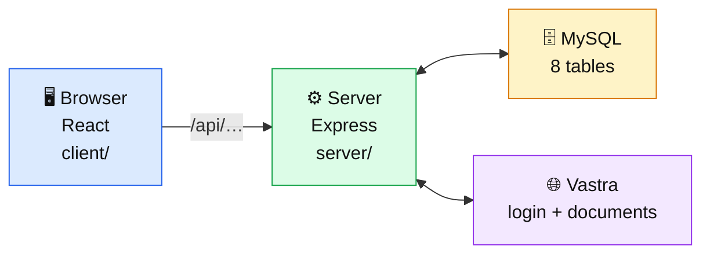

# CK — Learning RMS from zero

A complete, from-scratch guide to this codebase. Written for someone with **no programming background**, but accurate enough to be useful to someone with one.

> **Open these in VS Code with the "Markdown Preview Enhanced" extension** (`Ctrl/Cmd+K V`). Every diagram is a Mermaid chart and will render visually. Every file reference is a clickable link into the real source.

---

## Read in order

| # | File | You'll be able to… |
|---|------|-------------------|
| 00 | [Start Here](00-START-HERE.md) | Speak the vocabulary; hold the mental model |
| 01 | [The Big Picture](01-the-big-picture.md) | Draw the whole system on a whiteboard |
| 02 | [The File Map](02-the-file-map.md) | **Answer "where is that code?" for anything** |
| 03 | [The Database](03-the-database.md) | Explain all 8 tables and why each column exists |
| 04 | [Login & Auth](04-login-and-auth.md) | Explain how a user gets in and stays in |
| 05 | [Server Anatomy](05-server-anatomy.md) | Trace a request from arrival to response |
| 06 | [Client Anatomy](06-client-anatomy.md) | Read any React page in the project |
| 07 | [Flow A — Putaway](07-flow-A-putaway.md) | Trace "add stock" click → database |
| 08 | [Move & Edit](08-flow-B-move-and-edit.md) | Trace moving and correcting stock |
| 09 | [Flow C — Picklist](09-flow-C-picklist.md) | Explain the biggest feature in the app |
| 10 | [Vastra Integration](10-vastra-integration.md) | Explain the external system we depend on |
| 11 | [API Reference](11-api-reference.md) | Look up any of the 24 endpoints |
| 12 | [Running & Testing](12-running-and-testing.md) | Start, seed, test, and debug the app |
| 13 | [How To Add A Feature](13-how-to-add-a-feature.md) | Build something new the way this codebase does |
| 14 | [Quiz & Cheatsheet](14-quiz-and-cheatsheet.md) | Test yourself before someone else does |

---

## In a hurry?

| You need | Go to |
|----------|-------|
| "Where is the code for X?" | [02 — The File Map](02-the-file-map.md) |
| "What does this endpoint do?" | [11 — API Reference](11-api-reference.md) |
| "How do I run this?" | [12 — Running & Testing](12-running-and-testing.md) |
| "I need to build a feature" | [13 — How To Add A Feature](13-how-to-add-a-feature.md) |
| "Quiz me" | [14 — Quiz & Cheatsheet](14-quiz-and-cheatsheet.md) |

---

## The 30-second summary

**RMS tells a warehouse worker which shelf a garment is sitting on.**

Three flows:
- **A** — stock arrives with a Vastra document → Putaway
- **B** — stock arrives, typed by hand → Putaway
- **C** — stock leaves against a Delivery Challan → Picklist

One invariant, which explains most of the server code:

> **Every write to `item_location` must, in a single transaction:
> change the row → recalculate `rack_master.used` → write an `audit_log` entry.**

---

## A note on trust

Everything here was written by reading the actual source, not from memory. File and line references point at real code.

But **code moves**. If this guide and the code disagree, **the code is right**. The comments next to it are the best documentation in the project — they explain *why*, which is the part you can't reconstruct by reading the code alone.

---

*The project's own documentation is in [`../README.md`](../README.md).*
